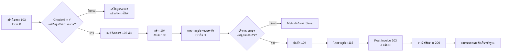

# SOP-01 การปฏิบัติงานบนระบบ Prosoft WINSpeed

| ข้อมูลควบคุมเอกสาร | รายละเอียด |
|---|---|
| รหัสเอกสาร | WF-SOP-WS-001 |
| ชื่อเอกสาร | การปฏิบัติงานขาย–ส่งมอบ–คูปอง–วางบิลบน Prosoft WINSpeed |
| ฉบับ / วันที่ | 1.0 / 25 สิงหาคม 2569 |
| สถานะ | ร่างพร้อมทบทวนและอนุมัติใช้งาน |
| เจ้าของกระบวนการ | ฝ่ายขาย / บัญชี / ผู้ดูแล WINSpeed |
| ผู้อนุมัติ | ผู้มีอำนาจตามระบบควบคุมเอกสารของบริษัท |
| ชั้นความลับ | ใช้ภายใน |

> เอกสารนี้มีผลเมื่อผ่านการทบทวนและอนุมัติตามระบบควบคุมเอกสารของบริษัทแล้วเท่านั้น ชื่อปุ่มหรือคำแปลบนหน้าจออาจต่างตามรุ่นและการตั้งค่า แต่ชนิดเอกสาร เลขชุด และจุดตรวจด้านล่างอ้างอิงพฤติกรรมที่ยืนยันแล้ว ณ วันที่ออกเอกสาร

## 1. วัตถุประสงค์

กำหนดวิธีสร้าง ตรวจ อนุมัติ ส่งมอบ ออกคูปอง ไถ่ถอนคูปอง ออกใบกำกับ/ใบแจ้งหนี้ และรับชำระบน Prosoft WINSpeed ให้เอกสารเชื่อมโยงครบ ใช้เลขชุดถูกต้อง ตรวจสอบย้อนหลังได้ และไม่แก้ข้อมูลในตารางฐานข้อมูลโดยตรง

## 2. ขอบเขต

ครอบคลุมเอกสารการจองขายชนิด `103` การอนุมัติเอกสารเดิม การส่งมอบ/ใบสั่งขายชนิด `104` การไถ่ถอนคูปองชนิด `116` การ Post Invoice ชนิด `203` และการรับชำระชนิด `206` ไม่ครอบคลุมการแก้ฐานข้อมูลแบบ ad-hoc หรือการเปลี่ยนการตั้งค่าระบบ

## 3. คำจำกัดความและเลขชุดที่ต้องใช้

| ขั้นตอน | ชนิดเอกสาร | หน้าจออ้างอิง | เลขชุดที่ถูกต้อง |
|---|---:|---:|---|
| จองขาย | 103 | 2098003048 | `I` หรือ `K` |
| อนุมัติใบจอง | เอกสาร 103 เดิม | 2098003080 | ไม่สร้างเอกสาร AI ใหม่ |
| ส่งมอบ / Sale Order | 104 | 2098003049 | `I` หรือ `K` ตามใบจอง |
| ไถ่ถอนคูปอง | 116 | 2098003052 | `C` เมื่อสาย `I`, `D` เมื่อสาย `K` |
| Post Invoice | 203 | 2098003084 | `J` เมื่อสาย `I`, `N` เมื่อสาย `K` |
| รับชำระ | 206 | 2098003050 | ตามเลขชุดรับชำระที่บริษัทกำหนด |

สายเอกสารที่ยืนยันแล้วคือ `I → I → C → J` และ `K → K → D → N` ตามลำดับ จองขาย → ส่งมอบ → ไถ่ถอนคูปอง → ใบกำกับ/ใบแจ้งหนี้

## 4. บทบาทและการแบ่งแยกหน้าที่

| บทบาท | หน้าที่หลัก | ห้ามทำ |
|---|---|---|
| ฝ่ายขาย / Counter Sales | จัดทำใบจอง ตรวจลูกค้า สินค้า ราคา ปริมาณ และเงื่อนไข | อนุมัติรายการตนเองเมื่อขัดนโยบาย SoD |
| ผู้อนุมัติ | ตรวจคิวอนุมัติและอนุมัติเอกสาร 103 เดิม | อนุมัติโดยไม่มีหลักฐานหรือข้ามเงื่อนไขเครดิต |
| คลัง / จัดส่ง | จัดทำ 104 ตรวจปริมาณ และข้อมูลส่งมอบ | บันทึก 104 หากเลขชุดหรือคูปองไม่ครบ |
| ผู้ควบคุมคูปอง | คำนวณ ตรวจ และไถ่ถอนคูปอง | ใช้เลขคูปองซ้ำหรือแก้ตาราง `dbo` โดยตรง |
| บัญชี | Post Invoice วางบิล รับชำระ และกระทบยอด | ออกเอกสารปลายทางเมื่อสายเอกสารไม่ครบ |
| ผู้ดูแลระบบที่ได้รับอนุญาต | แก้เหตุขัดข้องด้วย procedure ที่อนุมัติและเก็บหลักฐาน | ใช้ SQL ad-hoc เปลี่ยนสถานะ เลขที่ หรือยอดธุรกิจ |

## 5. ข้อกำหนดก่อนเริ่มงาน

- ผู้ใช้ได้รับสิทธิ์ตรงตามหน้าที่และเข้าสู่ฐานข้อมูล/บริษัท/งวดบัญชีที่ถูกต้อง
- Master ลูกค้า สินค้า หน่วยนับ บรรจุภัณฑ์ คลัง พนักงานขาย ราคา เครดิต และเลขชุดพร้อมใช้งาน
- เอกสารอ้างอิง เช่น ใบเสนอราคา คำสั่งซื้อ เงื่อนไขเครดิต และหลักฐานอนุมัติ พร้อมตรวจ
- ไม่มีเอกสารซ้ำในวัน ลูกค้า สินค้า ปริมาณ และเลขอ้างอิงเดียวกัน
- ก่อนกดบันทึก ผู้ปฏิบัติงานต้องทราบว่าจะใช้สาย `I` หรือ `K`; ห้ามเชื่อเลขชุดที่ปุ่ม Auto Number เลือกให้โดยไม่ตรวจ

## 6. ผังกระบวนการ

## 7. วิธีปฏิบัติ

### 7.1 สร้างใบจองขายชนิด 103

1. เปิดหน้าจอจองขายชนิด `103` และเลือกบริษัท/สาขา/วันที่เอกสารถูกต้อง
2. สร้างเอกสารใหม่ เลือกเลขชุด `I` หรือ `K` ตามประเภทงานที่บริษัทกำหนด
3. กรอกและตรวจลูกค้า ที่อยู่ส่งมอบ ผู้ติดต่อ พนักงานขาย เครดิต วันที่ส่ง รถ/การขนส่ง และเลขอ้างอิง
4. เพิ่มสินค้าทีละบรรทัด ตรวจรหัสสินค้า คลัง หน่วย ปริมาณ ราคา ส่วนลด ภาษี และยอดสุทธิ
5. หากใช้แท็บ Description ให้บันทึกเป็นข้อความธรรมดาตามลำดับ ห้ามใช้ bracket tag; ระบบจัดเก็บเป็นบรรทัดใน `dbo.SOHDRemark`
6. ตรวจยอดรวม เทียบเอกสารต้นทาง และค้นหารายการซ้ำ
7. บันทึก แล้วจดเลขที่ `103` ในทะเบียนติดตาม

**เกณฑ์ยอมรับ:** เลขชุดถูกต้อง เอกสารเปิดอ่านได้ ยอดและรายการตรงต้นทาง มีเลขที่ 103 และมีข้อมูลเพียงพอสำหรับผู้อนุมัติ

### 7.2 อนุมัติใบจอง

1. ผู้อนุมัติเปิดหน้าจออนุมัติชนิด `103` และค้นเอกสารตามเลขที่/ลูกค้า/วันที่
2. ตรวจว่ารายการเข้าเงื่อนไขคิวด้วย `CheckAll='Y'`; ค่า `ValidDays=0` ไม่ใช่ gate ของคิวอนุมัติ
3. ตรวจลูกค้า เครดิต ราคา ปริมาณ สินค้า วันส่ง เอกสารอ้างอิง และความเป็นอิสระของผู้อนุมัติ
4. อนุมัติเอกสาร `103` เดิม ตรวจ `AppvFlag`/เลขอนุมัติ และไม่สร้างเอกสาร AI แยก
5. บันทึกผู้อนุมัติ วันเวลา และผลในทะเบียน

**เกณฑ์ยอมรับ:** เอกสารเดิมมีสถานะอนุมัติครบ มีร่องรอยผู้อนุมัติ และพร้อมเลือกเป็นต้นทางของ 104

### 7.3 สร้างเอกสารส่งมอบชนิด 104 และคำนวณคูปอง

1. เปิดหน้าจอส่งมอบ/Sale Order ชนิด `104` และเลือกสร้างใหม่
2. เลือกใบจอง `103` ที่อนุมัติแล้วเป็นเอกสารอ้างอิง
3. ตรวจลูกค้า วันที่ส่ง รถ คลัง สินค้า ปริมาณ ราคา และยอดคงเหลือของการจอง
4. ตรวจเลขชุดของ `104` ให้ตรงใบจอง (`I` ต่อ `I`, `K` ต่อ `K`) หาก Auto Number แสดงชุดอื่น ให้พิมพ์ prefix ที่ถูกต้องเพื่อเลือกชุดก่อนบันทึก
5. เปิดรายละเอียดของสินค้าทุกบรรทัด เข้าแท็บ Coupon กรอกตันและจำนวนคูปอง เลือก `C` สำหรับสาย `I` หรือ `D` สำหรับสาย `K` แล้วสั่ง Calculate
6. ตรวจหนึ่งการจัดสรรคูปองต่อหนึ่งบรรทัด 104 เลขไม่ซ้ำ ชุดถูกต้อง และจำนวนสัมพันธ์กับบรรจุภัณฑ์
7. สำหรับสินค้าถุง 50 กก. ใช้สูตรควบคุม `จำนวนถุง = ตัน × 1,000 ÷ 50` หลังยืนยันข้อมูลบรรจุภัณฑ์จาก Master แล้วเท่านั้น
8. ทำซ้ำจนครบทุกบรรทัด ตรวจยอดรวมและ source trace แล้วจึง Save

**จุดควบคุมสำคัญ:** หลังบันทึก 104 ผู้ใช้ปกติไม่สามารถแก้รายการเดิมได้ จึงต้องตรวจแบบ four-eyes หรือ checklist ก่อน Save

### 7.4 ไถ่ถอนคูปองชนิด 116

1. เปิดหน้าจอไถ่ถอนคูปองชนิด `116` และค้นเอกสาร `104`/คูปองที่เกี่ยวข้อง
2. เลือกทุกบรรทัดและทุกคูปองที่อยู่ในการส่งมอบครั้งนั้น
3. ตรวจเลขชุด `C` หรือ `D` ให้สอดคล้องกับสายเอกสาร และตรวจปริมาณไม่เกินยอดที่ส่งมอบ
4. บันทึกและตรวจเลขอ้างอิง/Move Bill ที่ระบบสร้าง
5. แนบหรือบันทึกเลขดังกล่าวในทะเบียนส่งมอบเพื่อใช้กระทบยอดกับตาชั่งและใบกำกับ

### 7.5 Post Invoice ชนิด 203

1. เปิดหน้าจอ Post Invoice ชนิด `203`
2. เลือกเอกสารต้นทางที่ส่งมอบและไถ่ถอนคูปองครบแล้ว
3. ตรวจสายเอกสารทั้งหมด ลูกค้า สินค้า ปริมาณ ราคา ภาษี และยอดสุทธิ
4. เลือกเลขชุด `J` สำหรับสาย `I` หรือ `N` สำหรับสาย `K`
5. บันทึก ตรวจเลขที่ใบกำกับ/ใบแจ้งหนี้ และทำเครื่องหมายทะเบียนว่า Post สำเร็จ

### 7.6 วางบิล รับชำระ และปิดรายการ

1. จัดทำเอกสารวางบิล/รับชำระตามเครดิตและนโยบายบริษัท
2. อ้างอิงใบกำกับที่ถูกต้อง ตรวจยอดคงค้าง วิธีชำระ วันที่ และหลักฐานธนาคาร/เงินสด
3. บันทึกเอกสารรับชำระชนิด `206` ด้วยเลขชุดที่กำหนด
4. กระทบยอดสาย `103 → 104 → 116 → 203 → 206` และจัดเก็บหลักฐานตามนโยบายอายุเอกสารของบริษัท

## 8. การจัดการข้อผิดปกติและ Stop Work

| เหตุการณ์ | การควบคุมทันที | ผู้รับผิดชอบ/การยกระดับ |
|---|---|---|
| ใบจองไม่ขึ้นคิวอนุมัติ | ตรวจ `CheckAll`, สิทธิ์, ข้อมูลเครดิต และเงื่อนไขเอกสาร | ฝ่ายขาย → ผู้อนุมัติ/ผู้ดูแลระบบ |
| Auto Number เลือกชุดผิด | ห้าม Save; ป้อน prefix `I/K/C/D/J/N` ให้ตรงสาย | ผู้จัดทำ + ผู้ทวนสอบ |
| ปริมาณเกินใบจอง | หยุด 104 และทบทวนใบจอง/อนุมัติเพิ่ม | ฝ่ายขาย/ผู้อนุมัติ |
| คูปองหาย ซ้ำ หรือชุดผิดก่อน Save | แก้ในรายละเอียดแต่ละบรรทัดและคำนวณใหม่ | คลัง/ผู้ควบคุมคูปอง |
| พบ coupon gap หลัง Save | ผู้ใช้หยุดงานและเปิด incident; ผู้ได้รับอนุญาตตรวจ `wf.v_DeliveryCouponGaps` และพิจารณา `wf.usp_IssueSalesOrderCoupons` | เจ้าของระบบ/DBA ที่ได้รับอนุญาต |
| ต้องการแก้ข้อมูล `dbo` โดยตรง | ห้ามดำเนินการ | ยกระดับ Change/Incident ตามนโยบาย |
| สายเอกสารไม่ครบหรือยอดไม่ตรง | ห้าม Post Invoice/รับชำระ | บัญชี + เจ้าของกระบวนการ |

การซ่อมด้วย procedure ต้องมี ticket, backup/แผนย้อนกลับ, ผู้อนุมัติ, ผลก่อน–หลัง และการตรวจซ้ำ ห้ามผู้ปฏิบัติงานทั่วไปดำเนินการเอง

## 9. บันทึกและหลักฐานขั้นต่ำ

- เลขเอกสาร 103, ผลอนุมัติ และผู้อนุมัติ
- เลข 104 และรายการคูปองต่อบรรทัด
- เลข 116/Move Bill, 203 และ 206
- เอกสารต้นทาง ใบเสนอราคา คำสั่งซื้อ เครดิต และหลักฐานส่งมอบ
- รายงาน exception/incident, ผู้อนุมัติการซ่อม และผล reconciliation

เก็บรักษาตามตารางอายุเอกสารและข้อกำหนดภาษี/บัญชีที่บริษัทประกาศใช้ ห้ามกำหนดระยะเวลาใหม่จาก SOP ฉบับนี้

## 10. KPI และการทบทวน

| ตัวชี้วัด | นิยาม | เป้าหมาย |
|---|---|---|
| First-time-right ของ 104 | 104 ที่ไม่ต้องเปิด incident ÷ 104 ทั้งหมด | ตามเป้าหมายที่เจ้าของกระบวนการอนุมัติ |
| Coupon gap | บรรทัด 104 ที่ขาดคูปอง | 0 รายการค้าง |
| Wrong-series incident | เอกสารที่ใช้ชุดผิด | 0 |
| End-to-end traceability | ตัวอย่างที่ตามรอยครบ 103→104→116→203→206 | 100% ของตัวอย่างตรวจ |
| Aging exception | เหตุผิดปกติที่เกิน SLA | 0 รายการค้างเกิน SLA |

เจ้าของกระบวนการทบทวนอย่างน้อยตามรอบระบบบริหารคุณภาพ และทันทีเมื่อชนิดเอกสาร เลขชุด เงื่อนไขอนุมัติ procedure คูปอง หรือหน้าที่รับผิดชอบเปลี่ยน

## 11. Checklist ก่อนปิดงาน

- [ ] เลขชุดตรงสายเอกสาร
- [ ] ผู้อนุมัติและหลักฐานอนุมัติครบ
- [ ] 104 อ้างอิง 103 ที่ถูกต้อง และปริมาณไม่เกินยอด
- [ ] คูปองครบทุกบรรทัด เลขไม่ซ้ำ และคำนวณแล้วก่อน Save
- [ ] 116 และ Move Bill ตรงการส่งมอบ
- [ ] 203/206 ยอดตรงและตามรอยถึงต้นทางได้
- [ ] ไม่มี exception หรือ procedure ซ่อมที่ยังไม่ปิด
- [ ] หลักฐานจัดเก็บในตำแหน่งควบคุมแล้ว

## 12. ประวัติการแก้ไข

| ฉบับ | วันที่ | รายละเอียด |
|---|---|---|
| 1.0 | 25 สิงหาคม 2569 | จัดทำครั้งแรกจาก Source Code, migration, Memory ที่ตรวจความขัดแย้งแล้ว และหลักฐานปฏิบัติงานล่าสุด |
