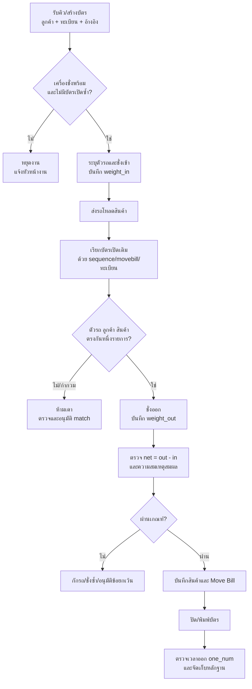

# SOP-02 การปฏิบัติงานบนระบบ TruckScale

| ข้อมูลควบคุมเอกสาร | รายละเอียด |
|---|---|
| รหัสเอกสาร | WF-SOP-TS-001 |
| ชื่อเอกสาร | การรับรถ ชั่งเข้า ชั่งออก และปิดบัตรชั่งบน TruckScale |
| ฉบับ / วันที่ | 1.0 / 25 สิงหาคม 2569 |
| สถานะ | ร่างพร้อมทบทวนและอนุมัติใช้งาน |
| เจ้าของกระบวนการ | หน่วยงานตาชั่ง / คลัง / โลจิสติกส์ |
| ผู้อนุมัติ | ผู้มีอำนาจตามระบบควบคุมเอกสารของบริษัท |
| ชั้นความลับ | ใช้ภายใน |

> หน้าจอ TruckScale แบบติดตั้งหน้างานอาจมีชื่อปุ่มต่างกัน เอกสารนี้จึงอ้างอิงชื่อฟิลด์และผลหลังบันทึกที่ยืนยันจาก schema และ integration ปัจจุบัน ห้ามตีความชื่อปุ่มที่ไม่ได้ระบุเป็นข้อเท็จจริง

## 1. วัตถุประสงค์

กำหนดวิธีควบคุมรถและน้ำหนักตั้งแต่เตรียมคิว ชั่งเข้า ชั่งออก คำนวณน้ำหนักสุทธิ บันทึกรายการสินค้า ปิด/พิมพ์บัตรชั่ง และแก้ข้อผิดปกติ เพื่อให้หนึ่งบัตรแทนหนึ่งรอบชั่ง ตรวจสอบย้อนกลับได้ และไม่ผูกผิดรถหรือผิดเอกสาร

## 2. ขอบเขต

ครอบคลุมการใช้ `tbl_keyone`, `tblscale` และ `tblproduct_detail` ผ่านหน้าจอ TruckScale ที่ได้รับอนุญาต รวมการรับคิวจากระบบอื่น การค้นด้วยทะเบียน/Move Bill การบันทึกผล และการปิดรอบชั่ง ไม่อนุญาตการแก้ตารางฐานข้อมูลโดยตรง

## 3. โครงสร้างข้อมูลสำคัญ

| ระเบียน | ความหมาย | จุดตรวจขั้นต่ำ |
|---|---|---|
| `tbl_keyone` | คิวก่อนชั่ง | ลูกค้า ผู้รับ ทะเบียน ประเภท คำอธิบาย App reference วันเวลา |
| `tblscale` | หนึ่งรอบชั่งเข้า–ออก | sequence, movebill, plate, เวลาเข้า/ออก, weight_in/out/net, scale/operator, one_num |
| `tblproduct_detail` | สินค้าในบัตรชั่ง | รหัส/ชื่อสินค้า กก./ถุง จำนวนถุง ตัน เอกสาร คลัง/ปลายทาง one_num |

`movebill` อาจซ้ำและไม่ใช่ unique key ทั้งฐานข้อมูล การจับคู่ต้องใช้สถานะบัตรเปิด ทะเบียน ลูกค้า เวลา สินค้า และเอกสารร่วมกัน

## 4. บทบาท

| บทบาท | ความรับผิดชอบ |
|---|---|
| เจ้าหน้าที่ตาชั่ง | ระบุตัวรถ ตรวจเครื่องชั่ง บันทึกน้ำหนัก ปิดและพิมพ์บัตร |
| คลัง/โหลดสินค้า | ยืนยันสินค้า ปริมาณ ลำดับโหลด และปล่อยรถเข้า–ออกพื้นที่โหลด |
| หัวหน้างาน/ผู้อนุมัติ | อนุมัติกรณีน้ำหนักผิดปกติ การยกเลิก/แก้ไข และการ match แบบกำกวม |
| ผู้ดูแลระบบ | ดูแล connection, master, สิทธิ์, outbox/sync และ incident โดยไม่แก้ข้อมูลธุรกิจแบบ ad-hoc |

ผู้ชั่ง ผู้อนุมัติข้อผิดปกติ และผู้แก้ incident ควรแยกคนเมื่อทำได้ตามหลักแบ่งแยกหน้าที่

## 5. ข้อกำหนดก่อนเริ่มงาน

- เครื่องชั่งผ่านการตรวจตามแผนสอบเทียบ ไม่มีข้อความผิดพลาด และค่าแสดงคงที่/เป็นศูนย์เมื่อไม่มีโหลด
- ผู้ขับขี่ รถ ลูกค้า ประเภทงาน เอกสารอ้างอิง และสินค้าที่จะโหลดตรงกับใบงาน
- ไม่มีบัตรเปิดซ้ำของทะเบียนเดียวกันโดยไม่ทราบสาเหตุ
- ระบบเครือข่าย ฐานข้อมูล เครื่องพิมพ์ และสิทธิ์ผู้ใช้พร้อม
- พื้นที่ชั่งปลอดภัย รถอยู่บนแท่นครบทุกเพลา และไม่มีการเคลื่อนไหวขณะจับค่าน้ำหนัก

## 6. ผังกระบวนการ

## 7. วิธีปฏิบัติ

### 7.1 รับรถและเตรียมบัตร

1. ตรวจเอกสารผู้ขับ รถ ทะเบียน ลูกค้า สินค้า ต้นทาง/ปลายทาง และประเภทการชั่ง
2. ค้นคิว `tbl_keyone` หรือบัตรเปิดด้วยทะเบียน/อ้างอิง ถ้าพบหลายรายการให้หยุดและตรวจ ห้ามเลือกจากทะเบียนเพียงอย่างเดียว
3. หากไม่มีคิว ให้สร้างบัตรตามสิทธิ์ด้วยข้อมูลขั้นต่ำ: ลูกค้า ทะเบียน ประเภท คำอธิบาย เลขอ้างอิง และเวลา
4. ตรวจว่าทะเบียนตรงป้ายจริง รวมรูปแบบเว้นวรรค/จังหวัดตามมาตรฐานหน้างาน
5. บันทึก sequence ของบัตรและแจ้งเส้นทางเข้าชั่งอย่างปลอดภัย

### 7.2 ชั่งเข้า

1. ตรวจแท่นว่าง ค่าเป็นศูนย์ และสัญญาณคงที่
2. ให้รถขึ้นแท่นตรงตำแหน่ง หยุดเครื่อง ปลดสิ่งที่นโยบายความปลอดภัยกำหนด และไม่มีบุคคลขึ้น/ลงรถ
3. ยืนยันทะเบียนและ sequence อีกครั้งก่อนจับค่า
4. บันทึก `weight_in` พร้อมวันที่/เวลาเข้าและเจ้าหน้าที่/เครื่องชั่ง
5. ตรวจค่าน้ำหนักไม่เป็นลบ ไม่เป็นศูนย์โดยผิดเหตุ และอยู่ในช่วงสมเหตุผลของรถ
6. ส่งรถไปโหลด พร้อมรักษา sequence เดิม ห้ามเปิดบัตรรอบที่สองเพื่อความสะดวก

### 7.3 โหลดและบันทึกรายการสินค้า

1. คลังเทียบเอกสารอ้างอิงกับรหัสสินค้า คลัง ปลายทาง หน่วย จำนวนถุง กก./ถุง และตัน
2. บันทึก/ยืนยันรายการใน `tblproduct_detail` ภายใต้ `one_num` ของบัตรเดียวกัน
3. กรอก Move Bill/เลขเอกสารเมื่อพร้อม และตรวจว่าไม่ใช่เอกสารของรถอื่น
4. หากสินค้าหรือปริมาณเปลี่ยน ต้องมีผู้มีอำนาจอนุมัติก่อนชั่งออกและเก็บหลักฐาน

### 7.4 ชั่งออกและคำนวณสุทธิ

1. เรียกบัตรเปิดเดิม โดยให้ sequence หรือ Move Bill เป็นหลัก และใช้ทะเบียน/ลูกค้า/เวลา/สินค้าเป็นหลักฐานประกอบ
2. ถ้าพบหลายบัตรเปิดของทะเบียนเดียวกัน ห้ามเดา ให้หัวหน้างานตรวจและยืนยันตัวบัตร
3. ให้รถขึ้นแท่นตามเงื่อนไขเดียวกับชั่งเข้า รอสัญญาณคงที่ แล้วบันทึก `weight_out`
4. ตรวจ `weight_net = weight_out - weight_in`; สำหรับงานส่งออกต้องได้ `weight_out > weight_in`, `weight_in ≥ 0` และ `weight_net > 0`
5. เปรียบเทียบน้ำหนักสุทธิกับตัน/จำนวนถุงตามเอกสารและ tolerance ที่บริษัทอนุมัติ
6. หากผิดปกติ ให้กักรถ ชั่งซ้ำ ตรวจสินค้า/รถ และบันทึกเหตุผล ผู้อนุมัติ และหลักฐาน ห้ามปิดบัตรจากความเคยชิน

### 7.5 ปิดและพิมพ์บัตร

1. ตรวจข้อมูลหัวบัตร สินค้า Move Bill เครื่องชั่ง ผู้ชั่ง น้ำหนัก และวันเวลา
2. บันทึก/ปิดรอบชั่ง ตรวจว่ามีวันเวลาออก `one_num` และค่าน้ำหนักครบ
3. พิมพ์บัตรตามจำนวนสำเนาที่นโยบายกำหนด ให้ผู้เกี่ยวข้องลงนาม/รับมอบเมื่อกำหนด
4. จัดเก็บบัตรและหลักฐานภาพ/การอนุมัติในตำแหน่งควบคุม
5. ตรวจหน้าจอหรือรายงานว่าบัตรไม่ค้าง OPEN โดยไม่ตั้งใจ

## 8. การเชื่อมต่อกับระบบอื่น

- ระบบอื่นอาจส่งคิวเข้า `tbl_keyone` พร้อม `one_App`; ผู้ชั่งยังต้องตรวจตัวรถจริง ไม่ถือว่าคิวเป็นหลักฐานชั่งสำเร็จ
- การเขียนกลับจาก App จะค้นบัตร OPEN ด้วย `movebill` ก่อน แล้วจึง exact plate; เมื่อมีหลายบัตรเปิดจะคืน `ambiguous_match` และห้ามเดา
- หากไม่มีบัตรเปิด integration อาจสร้าง sequence สำรองขึ้นต้น `WF`; ต้องกระทบยอดแยกจากบัตรหน้างาน
- การเข้าคิว retry/outbox หมายถึงยังเขียนกลับไม่สำเร็จ ต้องติดตามจนปิด ไม่ถือว่าจบงาน

## 9. Stop Work และการจัดการข้อผิดปกติ

| เงื่อนไขหยุด | การตอบสนอง |
|---|---|
| เครื่องชั่งไม่ศูนย์/ไม่คงที่/เกินกำหนดสอบเทียบ | หยุดใช้ ปิดกั้น และแจ้งผู้รับผิดชอบเครื่องมือวัด |
| Connection ขาดหรือบันทึกไม่ได้ | ห้ามสร้างข้อมูลซ้ำ; บันทึก incident และใช้แผนฉุกเฉินที่อนุมัติ |
| ทะเบียน ลูกค้า สินค้า หรือเอกสารไม่ตรง | กักรถและให้เจ้าของงานยืนยัน |
| บัตรเปิดซ้ำหรือผลค้นกำกวม | ห้ามเลือกโดยเดา; ยกระดับหัวหน้างาน |
| `gross <= tare` หรือ net ผิดปกติ | ชั่งซ้ำ ตรวจการโหลด และเปิด deviation |
| ไม่มีเวลาออก/one_num หลัง Save | ยังไม่ถือว่าปิดบัตร; ตรวจผลและ incident |
| ต้องแก้ข้อมูลฐานข้อมูลโดยตรง | ห้าม; ใช้ change/incident ที่ได้รับอนุมัติ |

กรณีระบบล่มที่จำเป็นต้องใช้บัตรชั่งฉุกเฉิน ต้องมีเลขรันควบคุม ผู้อนุมัติ เวลาเริ่ม–เลิก และนำเข้าระบบพร้อมกระทบยอดทันทีเมื่อระบบกลับมา ห้ามกำหนดวิธีลัดนอกแผนฉุกเฉินของบริษัท

## 10. หลักฐานและ KPI

หลักฐานขั้นต่ำ ได้แก่ คิว/ใบงาน บัตรชั่ง sequence/one_num Move Bill เวลาเข้า–ออก น้ำหนักเข้า–ออก–สุทธิ รายการสินค้า ผู้ชั่ง เครื่องชั่ง หลักฐานสอบเทียบ และ deviation/approval

| ตัวชี้วัด | เกณฑ์ควบคุม |
|---|---|
| บัตรที่ trace ถึงรถ/เอกสาร/สินค้าได้ | 100% ของตัวอย่างตรวจ |
| บัตร OPEN เกินเวลามาตรฐาน | 0 รายการที่ไม่มีผู้รับผิดชอบ |
| ambiguous/duplicate ticket | ต้องมี incident และผลปิดครบ |
| น้ำหนักสุทธิไม่สัมพันธ์เอกสาร | 0 รายการปล่อยรถโดยไม่มีอนุมัติ |
| เครื่องชั่งเกินกำหนดสอบเทียบ | 0 วันใช้งาน |

## 11. Checklist ปิดกะ

- [ ] คิวค้างและบัตร OPEN ทุกใบมีเจ้าของ/เหตุผล
- [ ] ไม่มีบัตรซ้ำของทะเบียนเดียวกันโดยไม่ตรวจสอบ
- [ ] บัตรปิดมีเวลาออก one_num และน้ำหนักครบ
- [ ] Move Bill และรายการสินค้าตรงบัตรจริง
- [ ] ข้อผิดปกติทั้งหมดมีเหตุผล ผู้อนุมัติ และหลักฐาน
- [ ] บัตรฉุกเฉินและ integration outbox กระทบยอดครบ
- [ ] สถานะเครื่องชั่งและกำหนดสอบเทียบพร้อมกะถัดไป

## 12. ประวัติการแก้ไข

| ฉบับ | วันที่ | รายละเอียด |
|---|---|---|
| 1.0 | 25 สิงหาคม 2569 | จัดทำครั้งแรกจาก schema และ source code การเชื่อมต่อ TruckScale ปัจจุบัน |
