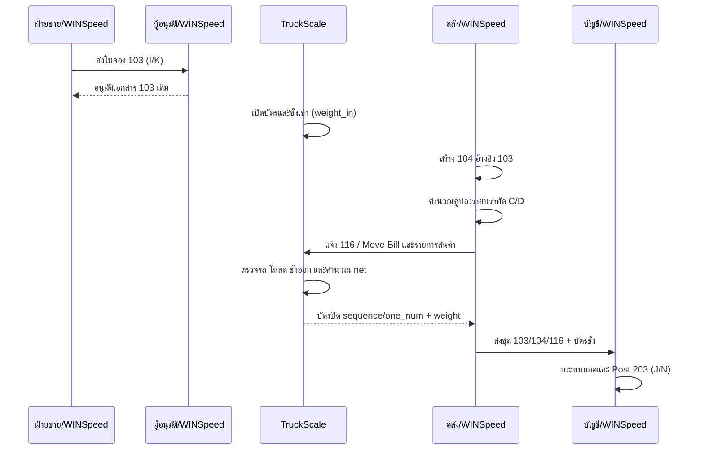

# SOP-03 การปฏิบัติงานร่วมกันระหว่าง Prosoft WINSpeed และ TruckScale

| ข้อมูลควบคุมเอกสาร | รายละเอียด |
|---|---|
| รหัสเอกสาร | WF-SOP-INT-001 |
| ชื่อเอกสาร | การส่งมอบสินค้าโดยเชื่อมเอกสาร WINSpeed กับบัตรชั่ง TruckScale |
| ฉบับ / วันที่ | 1.0 / 25 สิงหาคม 2569 |
| สถานะ | ร่างพร้อมทบทวนและอนุมัติใช้งาน |
| เจ้าของกระบวนการ | ฝ่ายขาย / คลัง / ตาชั่ง / บัญชี |
| ผู้อนุมัติ | ผู้มีอำนาจตามระบบควบคุมเอกสารของบริษัท |
| ชั้นความลับ | ใช้ภายใน |

## 1. วัตถุประสงค์

ควบคุมการส่งมอบที่ทำงานบน WINSpeed และ TruckScale ให้รถ เอกสาร สินค้า ปริมาณ คูปอง น้ำหนัก และใบกำกับเป็นธุรกรรมเดียวกัน ลดการจับคู่ด้วยทะเบียนเพียงอย่างเดียว และกำหนดจุดหยุดก่อนรถออกหรือบัญชี Post รายการ

## 2. ขอบเขตและหลักการ

ครอบคลุมตั้งแต่ใบจอง WINSpeed `103` การอนุมัติ การชั่งเข้า การสร้าง `104` และคูปอง การไถ่ถอน `116` การชั่งออก/ปิดบัตร และ Post Invoice `203` จนถึงการกระทบยอด

ลำดับหน้างานอาจจัดช่วงสร้าง 104/116 ก่อนหรือระหว่างการโหลดตามข้อกำหนดไซต์ แต่ต้องผ่าน gate ต่อไปนี้เสมอ:

1. 103 ต้องอนุมัติก่อนออก 104
2. บัตรชั่งเข้าและรถต้องระบุตัวได้ก่อนโหลด
3. 104 และคูปองต้องตรวจครบก่อน Save
4. Move Bill/116 ต้องสัมพันธ์กับบัตรชั่งก่อนปล่อยรถตามนโยบายไซต์
5. น้ำหนักสุทธิและสินค้าต้องผ่านก่อนปิดบัตร
6. สายเอกสารและบัตรชั่งต้องครบก่อน Post Invoice

## 3. กุญแจการกระทบยอด

| กุญแจ | ระบบ | วิธีใช้ |
|---|---|---|
| เลข 103 และเลขชุด I/K | WINSpeed | อ้างอิงการขายที่อนุมัติ |
| เลข 104 และเลขชุด I/K | WINSpeed | อ้างอิงรายการส่งมอบและปริมาณ |
| เลข 116 / Move Bill C/D | WINSpeed | ผูกคูปองและการเคลื่อนย้าย |
| sequence / one_num | TruckScale | ระบุตัวรอบชั่ง |
| movebill | TruckScale | ใช้ค้นบัตรเปิดเป็นลำดับแรก แต่ไม่ unique ทั้งฐาน |
| plate + ลูกค้า + เวลา + สินค้า | ทั้งสองระบบ | หลักฐานประกอบ ห้ามใช้ทะเบียนลำพังเมื่อกำกวม |
| เลข 203 J/N | WINSpeed | เอกสารบัญชีปลายทาง |

## 4. RACI ระดับกระบวนการ

| กิจกรรม | ฝ่ายขาย | ผู้อนุมัติ | คลัง | ตาชั่ง | บัญชี |
|---|---|---|---|---|---|
| จัดทำ/ตรวจ 103 | R | A | I | I | C |
| อนุมัติ 103 | C | A/R | I | I | C |
| ชั่งเข้าและเปิดบัตร | I | I | C | A/R | I |
| สร้าง 104/คูปอง/116 | C | I | R | C | A/C |
| โหลด ชั่งออก ปิดบัตร | I | C | R | A/R | I |
| Post 203 และกระทบยอด | I | I | C | C | A/R |

`R` ผู้ทำ, `A` ผู้รับผิดชอบสูงสุด, `C` ผู้ให้คำปรึกษา, `I` ผู้รับทราบ

## 5. ผังกระบวนการ

## 6. วิธีปฏิบัติ

### 6.1 เตรียมและอนุมัติการขายใน WINSpeed

1. ฝ่ายขายสร้าง `103` ด้วยชุด `I` หรือ `K` ตรวจลูกค้า สินค้า ปริมาณ ราคา เครดิต วันส่ง และการขนส่ง
2. บันทึกเลข 103 ในใบงานส่งมอบและส่งอนุมัติ
3. ผู้อนุมัติตรวจรายการที่เข้าเงื่อนไข `CheckAll='Y'`; `ValidDays=0` ไม่ใช่ gate คิว
4. อนุมัติเอกสาร 103 เดิม ตรวจร่องรอยอนุมัติ แล้วแจ้งคลัง/ตาชั่งว่าพร้อมดำเนินการ

### 6.2 รับรถและชั่งเข้าใน TruckScale

1. ตาชั่งตรวจตัวรถ ทะเบียน ลูกค้า ประเภทงาน ใบงาน และเลข 103
2. ค้นคิว/บัตรเปิด ถ้าพบหลายรายการของทะเบียนเดียวกันให้หยุดและยืนยันด้วยเลขเอกสาร เวลา ลูกค้า และสินค้า
3. ตรวจเครื่องชั่งเป็นศูนย์และคงที่ จากนั้นบันทึก `weight_in` พร้อม sequence/เวลาเข้า
4. ส่ง sequence และสถานะชั่งเข้าให้คลัง ห้ามสร้างบัตรใหม่เมื่อมีบัตรเปิดเดิม

### 6.3 สร้าง 104 และคูปองใน WINSpeed

1. คลัง/ผู้จัดทำเปิด `104` ใหม่ เลือก 103 ที่อนุมัติแล้ว และตรวจรถ/ลูกค้าให้ตรงบัตรชั่ง
2. เลือกชุด 104 ให้ตรง `I→I` หรือ `K→K`; ถ้า Auto Number แสดงผิด ให้ป้อน prefix ที่ถูกต้องก่อน Save
3. ตรวจสินค้า คลัง ปริมาณจริง และยอดคงเหลือของการจอง
4. เข้า Coupon ของทุกบรรทัด กรอกตัน/จำนวนคูปอง เลือก `C` สำหรับ I หรือ `D` สำหรับ K แล้ว Calculate
5. ตรวจคูปองครบ ไม่ซ้ำ และปริมาณสัมพันธ์กับบรรจุภัณฑ์ จากนั้นทำ four-eyes check ก่อน Save เพราะ 104 ที่บันทึกแล้วเป็น read-only ต่อผู้ใช้ปกติ

### 6.4 ไถ่ถอนคูปองและผูก Move Bill

1. เปิด `116` เลือกทุกบรรทัด/คูปองของ 104 นั้น ตรวจชุด C/D และปริมาณ
2. บันทึกและรับเลข Move Bill/เลขอ้างอิง
3. เจ้าหน้าที่ตาชั่งเรียกบัตรเปิดเดิมและบันทึก/ตรวจ Move Bill ให้ตรง 116
4. หาก Move Bill ซ้ำ ให้ใช้สถานะ OPEN, sequence, ทะเบียน, ลูกค้า, เวลา และสินค้าเป็นหลักฐานร่วม ห้ามถือ Move Bill เป็น unique key

### 6.5 โหลด ชั่งออก และปิดบัตร

1. คลังโหลดตาม 104 และยืนยันรายการใน `tblproduct_detail` ภายใต้ one_num เดียวกัน
2. ตาชั่งเรียกบัตรเดิม รอสัญญาณคงที่ บันทึก `weight_out` และตรวจ `weight_net = weight_out - weight_in`
3. เปรียบเทียบ net กับตัน/ถุงใน 104 และเกณฑ์ tolerance ที่อนุมัติ
4. เมื่อผิดปกติ ให้กักรถ ชั่งซ้ำ ตรวจสินค้า และเก็บเหตุผล ผู้อนุมัติ และหลักฐานก่อนพิจารณาปล่อย
5. ปิด/พิมพ์บัตร ตรวจเวลาออก one_num sequence Move Bill รถ ลูกค้า สินค้า และค่าน้ำหนักครบ

### 6.6 Post Invoice และกระทบยอด

1. บัญชีรับชุดหลักฐาน: 103 ที่อนุมัติ, 104, รายการคูปอง, 116/Move Bill และบัตรชั่งที่ปิดแล้ว
2. ตรวจสายเลขชุด `I→I→C→J` หรือ `K→K→D→N`
3. ตรวจปริมาณ 104/116 กับน้ำหนักสุทธิและสินค้าในบัตรชั่ง พร้อมบันทึกเหตุผลของส่วนต่างที่อนุมัติ
4. Post Invoice `203` ด้วย J/N ที่ถูกต้อง และจัดเก็บเลขเอกสารในทะเบียน cross-system
5. ทวนตัวอย่างตามรอยจาก 203 ย้อนกลับถึงบัตรชั่งและ 103

## 7. จุดควบคุมก่อนปล่อยรถ

- [ ] 103 อนุมัติและรถ/ลูกค้าตรงใบงาน
- [ ] ใช้บัตร TruckScale เดิม ไม่มีบัตรเปิดซ้ำที่ยังไม่อธิบาย
- [ ] 104 ใช้ชุดถูกและอ้างอิง 103 ถูก
- [ ] คูปองครบทุกบรรทัดและ 116/Move Bill ตรงรายการ
- [ ] one_num/sequence/plate/Move Bill เชื่อมกันได้
- [ ] น้ำหนักเข้า–ออก–สุทธิครบและสมเหตุผล
- [ ] สินค้า ตัน/ถุง คลัง และปลายทางตรงกัน
- [ ] กรณีผิดปกติมีเหตุผล ผู้อนุมัติ และหลักฐาน

## 8. Stop Work และ Escalation

| เหตุ | ห้ามทำ | การยกระดับ |
|---|---|---|
| 103 ยังไม่อนุมัติ | ห้ามออก 104/ส่งมอบ | ฝ่ายขาย → ผู้อนุมัติ |
| หลายบัตร OPEN/ทะเบียนกำกวม | ห้ามเลือกจากการคาดเดา | ตาชั่ง → หัวหน้างาน |
| ชุด I/K/C/D ผิด | ห้าม Save | ผู้จัดทำ → ผู้ทวนสอบ |
| คูปองขาดหลัง Save | ห้ามแก้ `dbo` | Incident → เจ้าของระบบ/DBA ที่ได้รับอนุญาต |
| gross ≤ tare หรือส่วนต่างสูง | ห้ามปล่อยรถ | ตาชั่ง/คลัง → ผู้อนุมัติ deviation |
| Move Bill/สินค้าไม่ตรง | ห้ามปิดบัตรและห้าม Post | คลัง + ตาชั่ง + บัญชี |
| สายเอกสารไม่ครบ | ห้าม Post 203 | บัญชี → เจ้าของกระบวนการ |

## 9. Reconciliation ประจำวัน

1. จับคู่ 103/104/116/203 กับ TruckScale sequence/one_num/Move Bill
2. ตรวจบัตร OPEN ค้าง บัตรไม่มีเวลาออก บัตรซ้ำ และน้ำหนักผิดปกติ
3. ตรวจ 104 ที่คูปองไม่ครบผ่านรายงานควบคุมที่ได้รับอนุญาต
4. บันทึกทุกข้อยกเว้นด้วย owner, due time, root cause, corrective action และหลักฐานปิด
5. รายงานรายการที่ยังจับคู่ไม่ได้แก่เจ้าของกระบวนการก่อนสิ้นรอบ

## 10. บันทึกและ KPI

เก็บ 103/approval, 104/coupon, 116/Move Bill, TruckScale ticket/product detail, 203, checklist และ exception ตามนโยบายอายุเอกสารของบริษัท

| KPI | เกณฑ์ |
|---|---|
| รายการที่ trace ข้ามสองระบบได้ครบ | 100% ของตัวอย่างตรวจ |
| รถออกโดยไม่มีบัตรปิด/อนุมัติ exception | 0 |
| Coupon gap และ wrong series | 0 รายการค้าง |
| บัตรกำกวมที่ถูกเลือกโดยไม่มีหลักฐาน | 0 |
| รายการกระทบยอดค้างเกิน SLA | 0 |

## 11. ประวัติการแก้ไข

| ฉบับ | วันที่ | รายละเอียด |
|---|---|---|
| 1.0 | 25 สิงหาคม 2569 | จัดทำ workflow และ control gate ร่วมของ WINSpeed–TruckScale |
