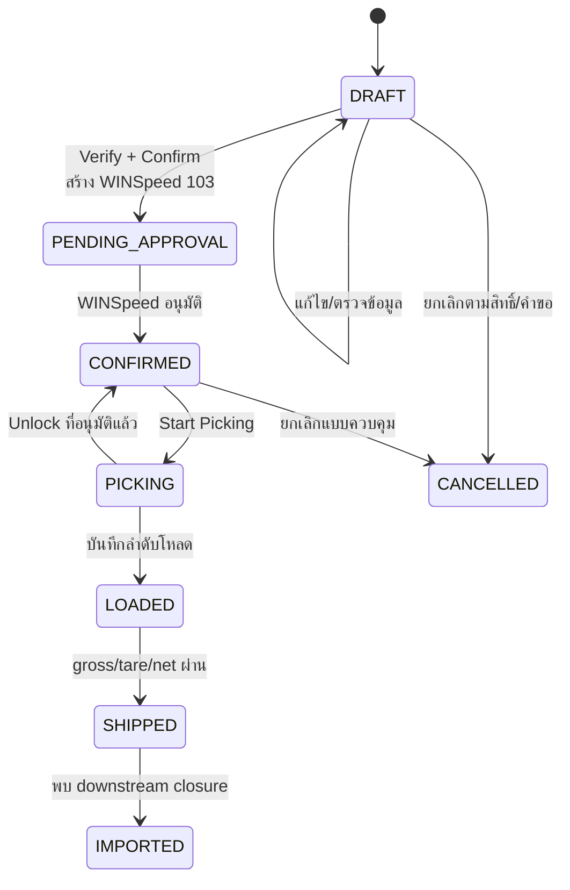

# SOP-04 การปฏิบัติงานบน WS-Sale-App

| ข้อมูลควบคุมเอกสาร | รายละเอียด |
|---|---|
| รหัสเอกสาร | WF-SOP-APP-001 |
| ชื่อเอกสาร | การสร้าง ตรวจยืนยัน อนุมัติหยิบ โหลด ชั่ง และติดตาม Sales Order บน WS-Sale-App |
| ฉบับ / วันที่ | 1.0 / 25 สิงหาคม 2569 |
| สถานะ | ร่างพร้อมทบทวนและอนุมัติใช้งาน |
| เจ้าของกระบวนการ | ฝ่ายขาย / Counter Sales / คลัง / ตาชั่ง / บัญชี |
| ผู้อนุมัติ | ผู้มีอำนาจตามระบบควบคุมเอกสารของบริษัท |
| ชั้นความลับ | ใช้ภายใน |

## 1. วัตถุประสงค์

กำหนดวิธีควบคุม Sales Order บน WS-Sale-App ตั้งแต่ร่าง ตรวจยืนยัน Confirm Picking Loading Shipping คำขอแก้ไข/ปลดล็อก/ยกเลิก และการติดตาม exception ให้ผู้ใช้ทำตามสิทธิ์ สถานะ และหลักฐานที่ตรวจสอบย้อนหลังได้

## 2. ขอบเขต

ครอบคลุม workflow หลักของ Sales Order และหน้าที่เกี่ยวข้องกับ Store/Scale, TruckScale/Weigh Inbox, Governance และ Audit ใน App ไม่ครอบคลุมขั้นตอนสร้าง WINSpeed 104 คูปอง 116 และ Invoice 203 ซึ่งต้องดำเนินการในระบบเจ้าของข้อมูลนั้น

## 3. บทบาทและสิทธิ์หลัก

| บทบาทระบบ | กิจกรรมหลักตาม route ปัจจุบัน |
|---|---|
| `SALES` | สร้าง/ดูแลร่าง และ Confirm ตาม gate |
| `COUNTER_SALES` | สร้าง ตรวจยืนยัน Confirm และช่วย match inbox ตามสิทธิ์ |
| `MANAGER` | ตรวจยืนยัน อนุมัติ/ตัดสินคำขอ และปลดล็อกตามสิทธิ์ |
| `APPROVER` | ปลดล็อก Picking ตามสิทธิ์และอนุมัติที่ได้รับมอบหมาย |
| `WAREHOUSE` | Picking, Loading, Shipping และจัดการงานตาชั่งตามสิทธิ์ |
| `WEIGHBRIDGE` | Shipping/Weigh Inbox และผลตาชั่งตามสิทธิ์ |
| `ACCOUNTING` | ปลดล็อก/ตรวจทางบัญชี รายงาน และ reconciliation ตามสิทธิ์ |
| `ADMIN`, `C_LEVEL` | สิทธิ์กว้างเพื่อดูแล/ยกเว้น แต่ต้องมีเหตุผลและ audit; ไม่ใช้เพื่อข้ามการควบคุมตามปกติ |

เมนูที่มองเห็นไม่ใช่หลักฐานว่ามีสิทธิ์ route ผู้ใช้ต้องปฏิบัติตามข้อความปฏิเสธจาก API และแจ้งผู้ดูแลเมื่อสิทธิ์ไม่ตรงหน้าที่

## 4. สถานะและเกณฑ์ผ่าน

| สถานะ | ความหมาย | ผู้ส่งต่อ/เงื่อนไขหลัก |
|---|---|---|
| `DRAFT` | ร่าง | ข้อมูลครบและผ่านการตรวจยืนยัน |
| `PENDING_APPROVAL` | รออนุมัติใน WINSpeed | มี native 103 และรอการอนุมัติ |
| `CONFIRMED` | รอจัดส่ง | เอกสาร native พร้อมและผ่าน gate |
| `PICKING` | รอรับสินค้า | คลังรับงานและ native PkgStatus ถูกอัปเดต |
| `LOADED` | โหลดสินค้า | มีลำดับโหลดรายบรรทัดและยืนยันโหลด |
| `SHIPPED` | ส่งออกจากตาชั่ง | gross/tare/net ผ่านและบันทึกผลตาชั่ง |
| `IMPORTED` | ปิด SO ใน WINSpeed | พบหลักฐาน downstream closure/import |
| `CANCELLED` | ยกเลิก | คำขอและผลยกเลิกผ่านการควบคุม |

## 5. ผังกระบวนการ

## 6. วิธีปฏิบัติ

### 6.1 สร้างร่าง Sales Order

1. เปิดเมนู Sales Order และเลือกสร้างรายการใหม่
2. เลือกลูกค้าและตรวจชื่อ/รหัส สถานะเครดิต พนักงานขาย และผู้รับผิดชอบยอด rebate
3. เลือก prefix `I`, `K` หรือ `AI` ตามประเภทงานที่อนุมัติ ห้ามเปลี่ยนเพื่อหลีกเลี่ยงกฎธุรกิจ
4. กรอกวันที่ส่ง/วันที่ร้องขอ ทะเบียนรถ การขนส่ง รถบริษัท/ไม่มีรถ Control Ticket และหมายเหตุที่จำเป็น
5. เพิ่มสินค้าทีละบรรทัด ตรวจ good, ตัน, ราคา, คลัง, giveaway, rebate, control ticket และลำดับโหลด
6. ตรวจยอด ราคา เครดิต และเอกสารอ้างอิง แล้วบันทึก `DRAFT`
7. หากระบบเตือนเรื่อง mapping พนักงานขายหรือข้อมูลเครดิต ให้บันทึกได้ตามผลระบบแต่ต้องเปิดรายการแก้และห้าม Confirm จนเจ้าของข้อมูลรับรอง

**เกณฑ์ยอมรับ:** มี App order ID, ไม่มีบรรทัดว่าง/ซ้ำโดยไม่ตั้งใจ, ลูกค้า–สินค้า–ตัน–ราคา–วันส่งตรวจได้ และ warning มีผู้รับผิดชอบ

### 6.2 ตรวจยืนยัน (Verify)

1. ผู้ตรวจที่ไม่ใช่ผู้จัดทำเมื่อทำได้ เปิดร่างและเทียบใบเสนอราคา/คำสั่งซื้อ/เครดิต
2. ตรวจลูกค้า สินค้า ตัน ราคา ส่วนลด giveaway rebate คลัง รถ วันส่ง และหมายเหตุ
3. ตรวจว่า giveaway ได้รับอนุมัติ quotation accepted และไม่มี credit hold ที่ยังไม่อนุมัติ
4. บันทึก Verify ด้วยบทบาท `COUNTER_SALES`, `MANAGER`, `ADMIN` หรือ `C_LEVEL` ตามสิทธิ์
5. แม้ Admin จะ bypass gate ได้ ให้ใช้ bypass เฉพาะเหตุฉุกเฉินที่ได้รับอนุมัติและบันทึกเหตุผล

### 6.3 Confirm และสร้าง native booking

1. ตรวจ Verify, quotation, giveaway, credit และ price floor ขั้นสุดท้าย
2. สั่ง Confirm ระบบจะเรียก `wf.sp_ConfirmSalesOrder` เพื่อสร้าง WINSpeed `103` เท่านั้น ไม่ได้สร้าง `104`
3. ตรวจผลที่ App แสดง: native WfRef/เลข 103, audit/counter และสถานะใหม่
4. ตรวจการส่ง pre-weigh ticket ไป TruckScale; หากล้มเหลวให้เปิด incident และห้ามถือว่าคิวตาชั่งพร้อม
5. หาก API ปฏิเสธ ให้แก้ gate ต้นเหตุ ห้ามใช้บัญชีสิทธิ์สูงเพื่อข้ามโดยไม่มีอนุมัติ

### 6.4 ติดตามการอนุมัติ WINSpeed

1. ติดตาม `PENDING_APPROVAL` และแจ้งผู้อนุมัติด้วยเลข 103
2. หลังอนุมัติเอกสาร 103 เดิม ให้ refresh/sync และตรวจ App เปลี่ยนเป็น `CONFIRMED`
3. ถ้าสถานะไม่เปลี่ยน ให้ตรวจ approval fields และ integration โดยไม่แก้สถานะในฐานข้อมูลโดยตรง

### 6.5 Picking และ Unlock

1. คลังเลือก order `CONFIRMED` ตรวจรถ ลูกค้า สินค้า ตัน คลัง และ Control Ticket
2. สั่ง Start Picking; ตรวจ App เป็น `PICKING` และ native `PkgStatus=Y`
3. หากต้องถอน Picking ให้บทบาท `APPROVER`, `ADMIN`, `MANAGER`, `ACCOUNTING` หรือ `C_LEVEL` ตรวจเหตุผลและสั่ง Unlock
4. Unlock ต้องย้อน reservation/rebate ที่เกี่ยวข้อง ตั้ง native `PkgStatus=N` และมี audit
5. ผู้ใช้ทั่วไปต้องส่งคำขอพร้อมเหตุผลอย่างน้อย 5 ตัวอักษร; ห้ามส่งคำขอซ้ำขณะมีรายการ pending

### 6.6 Loading

1. คลังเรียก order `PICKING` และตรวจสินค้าหน้างานกับแต่ละบรรทัด
2. บันทึกลำดับโหลดรายบรรทัดให้ครบ รหัสสินค้าต้อง resolve ได้และหมายเหตุเรียงลำดับถูกต้อง
3. ตรวจปริมาณจริงและเหตุผลกรณี overload ก่อนยืนยัน
4. สั่ง Load Complete และตรวจสถานะ `LOADED`

### 6.7 Shipping และน้ำหนัก

1. ใช้ Store/Scale flow ปกติ เลือก candidate จาก TruckScale โดยตรวจ sequence/movebill/plate/customer/time/product ร่วมกัน
2. กรอก/รับ `tare = WeightIn`, `gross = WeightOut`; ระบบต้องได้ gross > 0, tare ≥ 0 และ net > 0
3. ตรวจ expected kg จากตันใน order และผล `OK`, `UNDERWEIGHT` หรือ `OVERWEIGHT` ตาม tolerance configuration
4. หากผลผิดปกติ ให้หยุดปล่อยรถและเก็บเหตุผล ผู้อนุมัติ และภาพ/หลักฐานเป็นข้อควบคุมบังคับทาง SOP แม้ UI/API บางเส้นทางยังไม่ hard-block ครบ
5. สั่ง Ship; ตรวจ `wf.WeighTicket`, App status `SHIPPED`, ผล write-back TruckScale และ product detail
6. ถ้า write-back ล้มเหลวและเข้าคิว outbox ให้ติดตามจนสำเร็จ; คิว retry ไม่เท่ากับเขียน TruckScale สำเร็จ
7. ห้ามตั้ง native `clearflag='Y'` เพื่อปิดงานเอง เพราะทำให้เอกสารหายจาก Post Invoice

**ทางลัด Quick Ship:** ใช้เฉพาะกรณีที่ผู้มีอำนาจอนุมัติและเก็บหลักฐานเทียบเท่า normal flow เนื่องจากเส้นทางนี้อาจไม่มี candidate evidence และช่อง abnormal ครบ

### 6.8 Edit / Cancel / Governance

1. ก่อน invoice ผู้ใช้ส่งคำขอ edit/unlock/cancel พร้อมเหตุผลและหลักฐาน
2. ผู้จัดการ/ผู้มีสิทธิ์ตรวจผลกระทบเครดิต rebate คิวตาชั่ง และ WINSpeed ก่อนอนุมัติ/ปฏิเสธ
3. การยกเลิกที่อนุมัติอาจอัปเดต native `DocuStatus=C`; ต้องมี audit และเอา pre-weigh queue ที่ไม่ใช้แล้วออก
4. เมื่อพบ invoice downstream แล้ว App จะ lock edit/unlock/cancel; ให้ใช้กระบวนการบัญชี/เอกสารแก้ไขที่อนุมัติแทน
5. ห้ามลบหรือแก้ `dbo`/`wf` table แบบ ad-hoc

## 7. จุดควบคุมและ Stop Work

| จุดเสี่ยง | การควบคุม |
|---|---|
| warning พนักงานขาย/เครดิต | กำหนด owner และปิดก่อน Confirm |
| quotation/giveaway/credit/price ไม่ผ่าน | ระบบ block; แก้ต้นเหตุหรือใช้ exception ที่อนุมัติ |
| pre-weigh ส่งไม่สำเร็จ | Incident + ตรวจ TruckScale; ห้ามแจ้งรถว่าคิวพร้อม |
| order อยู่ผิดสถานะ | ตรวจ transition/audit; ห้ามแก้ฐานข้อมูลโดยตรง |
| candidate หลายรายการ | ห้ามเลือกด้วยทะเบียนลำพัง; manual match ด้วยหลักฐาน |
| น้ำหนักผิดปกติ | กักรถ เหตุผล ผู้อนุมัติ ภาพ/หลักฐาน ชั่งซ้ำตามจำเป็น |
| write-back/outbox fail | owner ติดตาม retry และกระทบยอดจนสำเร็จ |
| พบ invoice แล้วต้องแก้ | หยุด App edit; ใช้กระบวนการบัญชีที่ได้รับอนุมัติ |

## 8. Weigh Inbox และการ match

1. ตรวจ Sync Status และสั่ง Sync Now เมื่อได้รับอนุญาต
2. กรอง `MATCHED`, `MULTI`, `UNMATCHED` และตรวจรายการค้าง
3. `MATCHED` ยังต้องตรวจรถ/ลูกค้า/เวลา/น้ำหนักก่อนใช้
4. `MULTI`/`UNMATCHED` ให้บทบาทที่มีสิทธิ์ manual match โดยใช้ order ID, plate, customer, date/time, product และ weight score เป็นหลักฐาน
5. บันทึกผู้ match และเหตุผล; ห้าม match เพื่อให้คิวว่างโดยไม่มีหลักฐาน

## 9. บันทึกและ KPI

- App order ID, WfRef/103, actor/timestamp และ audit trail
- Verify/Confirm gate, warning resolution และ approval evidence
- Picking/Loading history และ load sequence รายบรรทัด
- WeighTicket, candidate evidence, gross/tare/net, evaluation, reason/approver/photo
- TruckScale write-back/outbox และ manual match evidence
- Edit/unlock/cancel request และผลพิจารณา

| KPI | เกณฑ์ |
|---|---|
| Confirm ที่สร้าง 103 และ audit ครบ | 100% |
| Order ข้ามสถานะโดยไม่มีหลักฐาน | 0 |
| Abnormal ship ไม่มีเหตุผล/ผู้อนุมัติ/หลักฐาน | 0 |
| Outbox/write-back ค้างเกิน SLA | 0 |
| Manual match ไม่มีหลักฐานรองรับ | 0 |

## 10. Checklist ก่อนปิด order

- [ ] ข้อมูลร่างและ warning ได้รับการตรวจ
- [ ] Verify/Confirm ผ่าน gate และได้ native 103
- [ ] WINSpeed approval ทำกับ 103 เดิมและ App สะท้อน CONFIRMED
- [ ] Picking/Loading มี actor และลำดับโหลดครบ
- [ ] Shipping มี gross/tare/net และ weight evaluation ถูกต้อง
- [ ] กรณีผิดปกติมีเหตุผล ผู้อนุมัติ และหลักฐาน
- [ ] TruckScale write-back/outbox ไม่มีรายการค้าง
- [ ] คำขอแก้/ยกเลิกหรือ incident ปิดครบ

## 11. ประวัติการแก้ไข

| ฉบับ | วันที่ | รายละเอียด |
|---|---|---|
| 1.0 | 25 สิงหาคม 2569 | จัดทำครั้งแรกจาก route, service, UI และ migration ปัจจุบันของ WS-Sale-App |
