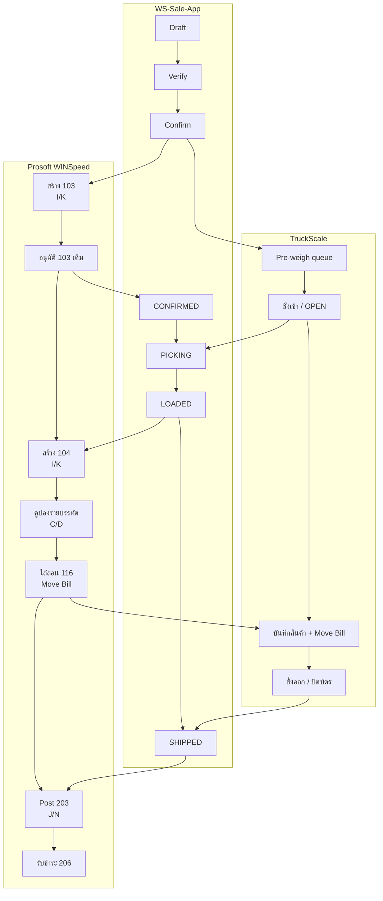

# SOP-05 การปฏิบัติงานร่วมกันระหว่าง WS-Sale-App, Prosoft WINSpeed และ TruckScale

| ข้อมูลควบคุมเอกสาร | รายละเอียด |
|---|---|
| รหัสเอกสาร | WF-SOP-ENT-001 |
| ชื่อเอกสาร | Enterprise Order-to-Cash และ Weigh-to-Ship แบบบูรณาการ |
| ฉบับ / วันที่ | 1.0 / 25 สิงหาคม 2569 |
| สถานะ | ร่างพร้อมทบทวนและอนุมัติใช้งาน |
| เจ้าของกระบวนการ | Sales-to-Cash Process Owner / Logistics Process Owner |
| ผู้อนุมัติ | ผู้มีอำนาจตามระบบควบคุมเอกสารของบริษัท |
| ชั้นความลับ | ใช้ภายใน |

## 1. วัตถุประสงค์

กำหนดวิธีทำงานแบบ end-to-end ตั้งแต่สร้าง Sales Order ใน App สร้างและอนุมัติ WINSpeed 103 ส่งคิว TruckScale Picking/Loading ออก WINSpeed 104/คูปอง/116 ชั่งออกและ Ship จนถึง Post Invoice/รับชำระ โดยกำหนด System of Action, gate, หลักฐาน และ reconciliation เดียวกัน

## 2. ขอบเขตและผลลัพธ์ที่ถือว่าสำเร็จ

ครอบคลุม WS-Sale-App, Microsoft SQL Server/WINSpeed และ MySQL TruckScale ในกระบวนการขาย–ส่งมอบ–ตาชั่ง–บัญชี

ธุรกรรมถือว่าจบเมื่อ:

- สถานะ App สอดคล้องกับงานจริงและมี audit
- WINSpeed 103 อนุมัติ, 104/คูปอง/116 และ 203/206 ครบตามประเภทงาน
- TruckScale ticket ปิด มี sequence/one_num/movebill และน้ำหนักครบ
- ลูกค้า รถ สินค้า ปริมาณ ราคา และน้ำหนักกระทบยอดได้
- ไม่มี outbox, coupon gap, manual match, change request หรือ deviation ที่ยังไม่ปิด

## 3. System of Action และ Single Source ตามช่วงงาน

| ช่วง | ระบบที่ใช้ทำรายการ | หลักฐานควบคุม |
|---|---|---|
| Draft / Verify / governance | WS-Sale-App | App ID, verifier, warning/request/audit |
| Booking / approval | App → WINSpeed | 103, I/K, approval fields, CheckAll |
| Pre-weigh / actual scale | App ↔ TruckScale | tbl_keyone, sequence, movebill, one_num, weights |
| Picking / Loading / Shipping | WS-Sale-App | status history, load sequence, WeighTicket |
| Delivery / coupon / redemption | WINSpeed | 104, coupon rows C/D, 116/Move Bill |
| Invoice / receipt | WINSpeed | 203 J/N, 206, reconciliation pack |

App Confirm สร้าง `103` เท่านั้น การสร้าง `104`, คูปอง, `116`, `203` และ `206` เป็นงานใน WINSpeed

## 4. บทบาทและ Gate Owner

| Gate | ผู้จัดทำ | ผู้ตรวจ/อนุมัติ | เกณฑ์ผ่าน |
|---|---|---|---|
| G1 Draft completeness | SALES/COUNTER_SALES | COUNTER_SALES/MANAGER | ลูกค้า สินค้า ตัน ราคา เครดิต เอกสารครบ |
| G2 Confirm to 103 | SALES/COUNTER_SALES | route + policy approver | quotation/giveaway/credit/price/verify ผ่าน |
| G3 Native approval | WINSpeed approver | ผู้มีอำนาจ | 103 เดิมอนุมัติ, CheckAll=Y |
| G4 Picking/Loading | WAREHOUSE | หัวหน้าคลังตามนโยบาย | รถ/สินค้า/คลัง/ลำดับโหลดตรง |
| G5 104/Coupon/116 | WINSpeed operator | ผู้ทวนสอบ/บัญชี | ชุด I/K/C/D และคูปองครบก่อน Save |
| G6 Weigh/Ship | WEIGHBRIDGE/WAREHOUSE | ผู้อนุมัติ deviation | gross/tare/net และ integration result ผ่าน |
| G7 Invoice/Close | ACCOUNTING | Process owner | 103/104/116/ticket/203/206 trace ครบ |

## 5. ผังกระบวนการบูรณาการ

> แผนภาพแสดงลำดับควบคุมมาตรฐานที่ทำให้ Move Bill พร้อมก่อนปล่อยรถ หากข้อกำหนดไซต์จัดช่วงสร้าง 104/116 ต่างออกไป ต้องรักษา gate ทั้งหมดและบันทึกเหตุผล/หลักฐานก่อน final dispatch

## 6. วิธีปฏิบัติ End-to-End

### 6.1 G1 — สร้างและ Verify ใน App

1. SALES/COUNTER_SALES สร้าง `DRAFT` ด้วยลูกค้า วันส่ง รถ/การขนส่ง Control Ticket สินค้า ตัน ราคา giveaway rebate คลัง ลำดับโหลด และหมายเหตุ
2. ตรวจ prefix `I`, `K` หรือ `AI` ตามประเภทงาน เอกสารอ้างอิง เครดิต และ mapping พนักงานขาย
3. ผู้ตรวจเทียบใบเสนอราคา/คำสั่งซื้อ ตรวจ giveaway approval, credit hold, price floor และข้อมูลทุกบรรทัด
4. บันทึก Verify; Admin bypass ได้ทางเทคนิคแต่ต้องใช้เฉพาะเหตุอนุมัติและมี audit

**Pass evidence:** App ID, actor/timestamp, verifier, warning resolution และเอกสารต้นทาง

### 6.2 G2 — Confirm: สร้าง WINSpeed 103 และ TruckScale pre-weigh

1. สั่ง Confirm เมื่อ gate ทั้งหมดผ่าน ระบบเรียก `wf.sp_ConfirmSalesOrder`
2. ตรวจผล WINSpeed `103` และเลขชุดที่ถูกต้อง ระบบไม่สร้าง `104` ในขั้นนี้
3. ตรวจ audit/counter และ WfRef ที่บันทึกใน App
4. ตรวจ pre-weigh ที่ส่งเข้า `tbl_keyone` ด้วย `one_App`, ลูกค้า และทะเบียน
5. ถ้าทะเบียนมีบัตร TruckScale OPEN อยู่ ระบบอาจไม่เพิ่ม pre-weigh ใหม่; ตาชั่งต้องตรวจบัตรเดิมอย่างควบคุม
6. หากฝั่งใดล้มเหลว เปิด incident และห้ามแก้สถานะ/เลขที่ด้วย SQL ad-hoc

### 6.3 G3 — อนุมัติ 103 ใน WINSpeed

1. ผู้อนุมัติค้นเลข 103 ตรวจ `CheckAll='Y'`; `ValidDays=0` ไม่ใช่ approval gate
2. ตรวจลูกค้า เครดิต ราคา ปริมาณ สินค้า วันส่ง และผู้สร้าง
3. อนุมัติเอกสาร 103 เดิม ตรวจ approval fields และเลขอนุมัติ
4. Refresh App ให้สถานะเป็น `CONFIRMED`; ถ้าไม่เปลี่ยนให้ตรวจ integration ไม่แก้ table โดยตรง

### 6.4 รับรถ ชั่งเข้า และเริ่ม Picking

1. ตาชั่งเลือกรายการ `tbl_keyone`/Weigh Inbox ด้วย App ID, WfRef, ลูกค้า และทะเบียน
2. ถ้าพบ `MULTI`/`UNMATCHED` ให้ผู้มีสิทธิ์ manual match ด้วยหลักฐานหลายฟิลด์ ห้ามเลือกเพียงเพื่อเคลียร์คิว
3. ตรวจเครื่องชั่งและบันทึก `weight_in`, sequence และเวลาเข้าในบัตร OPEN
4. คลังเปิด order `CONFIRMED` ตรวจรถ/ลูกค้า/สินค้า แล้ว Start Picking เป็น `PICKING`
5. ตรวจ native `PkgStatus=Y` และ audit

### 6.5 Loading และการบันทึกลำดับสินค้า

1. คลังโหลดตามบรรทัด App และบันทึกลำดับโหลด/รหัสสินค้าให้ครบ
2. ตรวจปริมาณ คลัง giveaway/control ticket และเหตุ overload ถ้ามี
3. ยืนยัน Loading ให้สถานะเป็น `LOADED`
4. หากต้องย้อน Picking ให้ส่งคำขอ/Unlock ตามบทบาท พร้อมเหตุผลและผลย้อน reservation/rebate; ห้ามย้อนหลัง invoice

### 6.6 G5 — สร้าง WINSpeed 104, คูปอง และ 116

1. เปิด `104` ใหม่ เลือก 103 ที่อนุมัติ และเทียบ App ID/WfRef รถ ลูกค้า สินค้า ตัน และคลัง
2. เลือกชุด `I` ต่อ `I` หรือ `K` ต่อ `K`; ป้อน prefix ที่ถูกต้องเมื่อ Auto Number เลือกผิด
3. เปิด Coupon ทุกบรรทัด กรอกตันและจำนวน เลือก `C` สำหรับ I หรือ `D` สำหรับ K แล้ว Calculate
4. ตรวจคูปองครบหนึ่ง allocation ต่อบรรทัด เลขไม่ซ้ำ และปริมาณสัมพันธ์บรรจุภัณฑ์
5. ทำ four-eyes check แล้ว Save 104; ผู้ใช้ปกติไม่สามารถแก้หลังบันทึก
6. สร้าง `116` เลือกทุกคูปอง บันทึกเลข Move Bill และส่งให้ตาชั่ง/บันทึกใน App reference ตามช่องทางที่กำหนด

### 6.7 G6 — ชั่งออกและ Ship ใน App

1. ตาชั่งเรียกบัตร OPEN ด้วย `movebill` ก่อนและตรวจ sequence/plate/customer/time/product; Move Bill ไม่ unique ทั้งฐาน
2. เมื่อมีหลายบัตรเปิดของทะเบียนเดียวกัน integration จะไม่เดาและคืน `ambiguous_match`; ให้แก้การระบุตัวบัตรก่อน
3. บันทึก `weight_out`, ตรวจ `net = out - in`, ปิดบัตร และยืนยัน one_num/เวลาออก/product detail
4. ใน Store/Scale เลือก candidate เดียวกัน กรอก/รับ tare และ gross ตรวจผล tolerance
5. น้ำหนักผิดปกติต้องมีเหตุผล ผู้อนุมัติ และภาพ/หลักฐานตาม SOP แม้ UI/API บางทางยังไม่บังคับครบ
6. สั่ง Ship ตรวจ App `SHIPPED`, `wf.WeighTicket`, TruckScale write-back และ product detail
7. ถ้า write-back ล้มเหลว ติดตาม outbox จนสำเร็จ ห้ามถือว่า cross-system complete ระหว่างยังค้าง
8. Rebate ต้องลงเจ้าของการขาย ไม่ใช่เจ้าหน้าที่ตาชั่งที่กด Ship

### 6.8 G7 — Post Invoice รับชำระ และปิดวงจร

1. บัญชีกระทบยอด App order/103/104/coupon/116 กับ TruckScale sequence/one_num/movebill/gross/tare/net
2. ตรวจชุด `I→I→C→J` หรือ `K→K→D→N` และ quantity/price/tax
3. Post Invoice `203`; ห้ามตั้ง `clearflag='Y'` เองเพราะอาจทำให้รายการหายจาก Post Invoice
4. วางบิลและรับชำระ `206` ตามนโยบายเครดิต
5. เมื่อพบ invoice downstream App จะ lock edit/unlock/cancel; ใช้เอกสารบัญชีแก้ไขตามกระบวนการแทน
6. ปิดรายการเมื่อไม่มี coupon gap, outbox, inbox ambiguity, deviation หรือ change request ค้าง

## 7. Cross-System Reconciliation Matrix

| ตรวจเทียบ | ต้องตรง | หากไม่ตรง |
|---|---|---|
| App ID ↔ WfRef/103 | หนึ่ง order ต่อ native booking ที่ตั้งใจ | หยุด downstream และ incident |
| 103 ↔ 104 | ลูกค้า ชุด สินค้า ปริมาณอ้างอิง | ห้าม Save 104 |
| 104 ↔ coupons/116 | ทุกบรรทัด ชุด C/D ปริมาณ Move Bill | ห้ามปล่อยรถ/Post |
| App ↔ TruckScale | plate, customer, sequence, movebill, time | manual match พร้อมหลักฐาน |
| Order tons ↔ net weight | ตาม tolerance ที่อนุมัติ | deviation + approver + evidence |
| 104/116/ticket ↔ 203 | สายเอกสาร สินค้า ปริมาณ ราคา | ห้าม Post |

## 8. Stop Work และ Incident Priority

| ระดับ | ตัวอย่าง | การตอบสนอง |
|---|---|---|
| Critical | ผิดรถ/ลูกค้า, gross≤tare, สิทธิ์หรือฐานผิด, แก้ native table โดยตรง | หยุดรถ/ระบบส่วนเกี่ยวข้อง แจ้ง Process Owner และ IT ทันที |
| High | 103 ไม่อนุมัติ, wrong series, coupon gap, ambiguous ticket, write-back fail | ห้ามผ่าน gate เปิด incident และกำหนด owner/SLA |
| Medium | warning master, sync delay, เอกสารแนบไม่ครบแต่ยังไม่ส่งมอบ | กักสถานะ แก้ก่อนขั้นถัดไป |
| Low | รูปแบบข้อความ/รายงานไม่กระทบข้อมูล | บันทึก backlog และติดตามตามรอบ |

การซ่อม coupon gap ใช้เฉพาะผู้ได้รับอนุญาตผ่าน `wf.v_DeliveryCouponGaps` และ `wf.usp_IssueSalesOrderCoupons` พร้อม ticket, backup/rollback, approval และผลก่อน–หลัง ห้ามผู้ปฏิบัติงานแก้ `dbo` โดยตรง

## 9. Daily Control Room

1. ฝ่ายขายทบทวน DRAFT warning และ PENDING_APPROVAL
2. ผู้อนุมัติทบทวน 103 ที่เข้า gate และอายุค้าง
3. คลังทบทวน CONFIRMED/PICKING/LOADED และรถที่หน้างาน
4. ตาชั่งทบทวน OPEN ticket, `MATCHED/MULTI/UNMATCHED` และบัตรไม่มีเวลาออก
5. IT/Operations ทบทวน integration error, outbox, sync watermark และ database target
6. บัญชีทบทวน 104 coupon gap, 116 Move Bill และรายการพร้อม Post 203
7. Process Owner ปิด exception ด้วย owner, root cause, corrective action, due time และ evidence

## 10. ข้อควบคุมสภาพแวดล้อมและการเปลี่ยนแปลง

- ระบุตัวฐานข้อมูลก่อน test/migration ทุกครั้ง: backend ปัจจุบันอาจ default remote ขณะที่ E2E/smoke-api บางชุด default local
- ตรวจ migration ledger ก่อนใช้ procedure ใหม่ โดยเฉพาะ migration `098`–`100`
- TruckScale production-host guard ต้องตั้งค่ารายชื่อ host; ค่า guard ว่างเป็นความเสี่ยง configuration
- การเปลี่ยน role, status transition, series, approval query, tolerance, matching หรือ write-back ต้องผ่าน change control และอัปเดต SOP/Context Pack
- ทดสอบด้วยข้อมูลที่อนุมัติและไม่ใช้ข้อมูลลูกค้าจริงเกินความจำเป็น

## 11. หลักฐานขั้นต่ำและ KPI

หลักฐานขั้นต่ำ: App ID/audit, Verify/Confirm, WfRef/103/approval, pre-weigh, TruckScale ticket/product detail, Picking/Loading, 104/coupons, 116/Move Bill, WeighTicket/deviation, write-back/outbox, 203/206 และ reconciliation checklist

| KPI | เป้าหมายควบคุม |
|---|---|
| End-to-end traceability | 100% ของตัวอย่างตรวจ |
| Wrong series / coupon gap | 0 รายการค้าง |
| Abnormal ship ไม่มีหลักฐานครบ | 0 |
| Ambiguous/manual match ไม่มีเหตุผล | 0 |
| Integration outbox เกิน SLA | 0 |
| Order/เอกสารข้าม gate | 0 |
| Critical incident จากฐานผิด | 0 |

## 12. Master Checklist ปิดธุรกรรม

- [ ] App Draft/Verify/Confirm มี actor และ gate evidence
- [ ] Confirm สร้าง WINSpeed 103 เท่านั้นและเลขชุดถูก
- [ ] 103 เดิมอนุมัติ และ App เปลี่ยน CONFIRMED
- [ ] TruckScale pre-weigh/OPEN ticket ระบุตัวรถได้
- [ ] Picking/Loading และ load sequence ครบ
- [ ] 104 อ้างอิง 103 ถูก; coupon C/D ครบก่อน Save
- [ ] 116/Move Bill เชื่อมบัตรชั่ง
- [ ] gross/tare/net, one_num, เวลาออก และ product detail ครบ
- [ ] App SHIPPED และ TruckScale write-back สำเร็จ ไม่มี outbox ค้าง
- [ ] 203 J/N และ 206 ตามสายเอกสาร
- [ ] ไม่มี coupon gap, inbox ambiguity, deviation, request หรือ incident ค้าง
- [ ] ชุดหลักฐานอยู่ในคลังเอกสารควบคุม

## 13. ประวัติการแก้ไข

| ฉบับ | วันที่ | รายละเอียด |
|---|---|---|
| 1.0 | 25 สิงหาคม 2569 | จัดทำ Enterprise SOP แบบบูรณาการจาก source code, migration และ operating evidence ปัจจุบัน |
