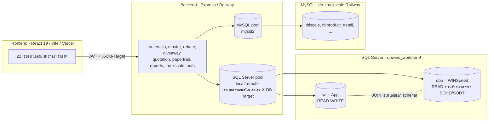
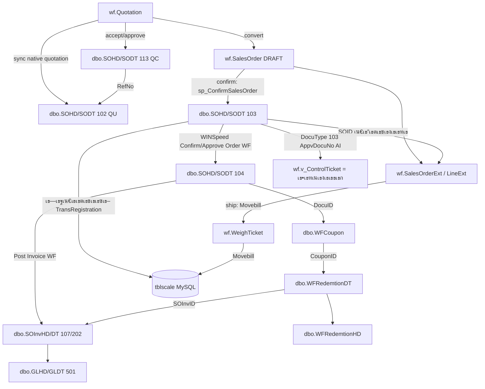

# 00 โ€” เธ เธฒเธžเธฃเธงเธกเธเธฒเธ™เธ‚เน‰เธญเธกเธนเธฅ & เธเธฒเธฃ Mapping (Database Overview & Mapping)

> WS-Sale-App ยท World Fert Co., Ltd. ยท เน€เธญเธเธชเธฒเธฃเธ„เธงเธšเธ„เธธเธกเธชเธณเธซเธฃเธฑเธš ISO 9001
> เธญเน‰เธฒเธ‡เธญเธดเธ‡ build v5.0.0 / SRS v6.2 ยท เธ›เธฃเธฑเธšเธ›เธฃเธธเธ‡ 8 เธ.เธ„. 2569

## เธชเธฒเธฃเธšเธฑเธ
1. [เธฃเธฐเธšเธšเธเธฒเธ™เธ‚เน‰เธญเธกเธนเธฅ 3 เนเธซเธฅเนˆเธ‡](#1-เธฃเธฐเธšเธšเธเธฒเธ™เธ‚เน‰เธญเธกเธนเธฅ-3-เนเธซเธฅเนˆเธ‡)
2. [เธชเธ–เธฒเธ›เธฑเธ•เธขเธเธฃเธฃเธกเธเธฒเธฃเน€เธŠเธทเนˆเธญเธกเธ•เนˆเธญ](#2-เธชเธ–เธฒเธ›เธฑเธ•เธขเธเธฃเธฃเธกเธเธฒเธฃเน€เธŠเธทเนˆเธญเธกเธ•เนˆเธญ)
3. [เธเธฒเธฃ Mapping: WINSpeed โ†” App โ†” TruckScale](#3-เธเธฒเธฃ-mapping-winspeed--app--truckscale)
4. [Data Dictionary โ€” schema wf](#4-data-dictionary--schema-wf-read-write)
5. [Data Dictionary โ€” dbo (WINSpeed, READ-ONLY)](#5-data-dictionary--dbo-winspeed-read-only)
6. [Data Dictionary โ€” TruckScale (MySQL, READ-ONLY)](#6-data-dictionary--truckscale-mysql-read-only)
7. [เธซเธฅเธฑเธเธเธฒเธฃเธชเธณเธ„เธฑเธ (Iron Rules)](#7-เธซเธฅเธฑเธเธเธฒเธฃเธชเธณเธ„เธฑเธ-iron-rules)

---

## 1. เธฃเธฐเธšเธšเธเธฒเธ™เธ‚เน‰เธญเธกเธนเธฅ 3 เนเธซเธฅเนˆเธ‡

| # | เธฃเธฐเธšเธš | Engine | เธ—เธตเนˆเธญเธขเธนเนˆ | เธชเธดเธ—เธ˜เธดเนŒเธˆเธฒเธ App | เนƒเธŠเน‰เธ—เธณเธญเธฐเน„เธฃ |
|---|------|--------|---------|---------------|-----------|
| 1 | **WINSpeed (dbo)** | SQL Server 2022 | `dbwins_worldfert9` (20.255.185.14 remote / SQLEXPRESS local) | **READ** (+เน€เธ‚เธตเธขเธ™ SOHD/SODT เธ•เธฃเธ‡เธ•เธญเธ™ confirm/ship โ€” เธ”เธน ยง7) | ERP เธซเธฅเธฑเธ: master, เนƒเธšเธชเธฑเนˆเธ‡เธ‚เธฒเธข, เนƒเธšเธเธณเธเธฑเธš, GL, WF Rebate Trail, เธ„เธนเธ›เธญเธ‡ |
| 2 | **App (wf schema)** | SQL Server 2022 (DB เน€เธ”เธตเธขเธงเธเธฑเธš dbo) | schema `wf` เนƒเธ™ `dbwins_worldfert9` | **READ-WRITE** | เธ‚เน‰เธญเธกเธนเธฅเธ—เธตเนˆ WINSpeed เน„เธกเนˆเธกเธต: SO state, Rebate Plan/Pool/Ledger, Giveaway, Paper Trail, WeighTicket, Quotation, Unlock |
| 3 | **TruckScale** | MySQL 5.7 | `db_truckscale` (Railway cloud: `reseau.proxy.rlwy.net:42508`) | **READ** | เน€เธ„เธฃเธทเนˆเธญเธ‡เธŠเธฑเนˆเธ‡เธ™เน‰เธณเธซเธ™เธฑเธเธฃเธ–: เธ™เน‰เธณเธซเธ™เธฑเธเน€เธ‚เน‰เธฒ/เธญเธญเธ/เธชเธธเธ—เธ˜เธด (403,908 เนƒเธšเธŠเธฑเนˆเธ‡) |

**เธ‚เน‰เธญเธชเธฑเธ‡เน€เธเธ•:**
- `wf` เธเธฑเธš `dbo` เธญเธขเธนเนˆเนƒเธ™ **SQL Server เธเธฒเธ™เน€เธ”เธตเธขเธงเธเธฑเธ™** โ†’ JOIN เธ‚เน‰เธฒเธก schema เน„เธ”เน‰เธ•เธฃเธ‡ เน„เธกเนˆเธ•เน‰เธญเธ‡ sync/cache
- `TruckScale` เน€เธ›เน‡เธ™ **MySQL เนเธขเธเธฃเธฐเธšเธš** โ†’ เน€เธŠเธทเนˆเธญเธกเธœเนˆเธฒเธ™ connection pool เธ—เธตเนˆ 2 (`mysql2`) เน„เธกเนˆเน€เธเธตเนˆเธขเธงเธเธฑเธš `DB_MODE`
- `DB_MODE` (.env) = `local` | `remote` เธ„เธธเธกเน€เธ‰เธžเธฒเธฐ SQL Server (WINSpeed+wf) ยท **เธซเน‰เธฒเธกเธ•เธฑเน‰เธ‡ `DB_MODE=mysql`**

---

## 2. เธชเธ–เธฒเธ›เธฑเธ•เธขเธเธฃเธฃเธกเธเธฒเธฃเน€เธŠเธทเนˆเธญเธกเธ•เนˆเธญ

**Pool เธเธฑเนˆเธ‡ SQL Server:** `backend/db.js` โ€” dual pool (local = Windows Auth/msnodesqlv8, remote = SQL Auth/ODBC 17) เน€เธฅเธทเธญเธเธ•เนˆเธญ request เธœเนˆเธฒเธ™ header `X-DB-Target` (AsyncLocalStorage) ยท helper: `query()` (reader), `wfQuery()` (owner โ€” เนƒเธŠเน‰เน€เธเธทเธญเธšเธ—เธธเธ endpoint เน€เธžเธทเนˆเธญเนƒเธซเน‰เธ•เธฒเธกเธ›เธธเนˆเธกเธชเธฅเธฑเธš DB)

**Pool เธเธฑเนˆเธ‡ MySQL:** `backend/services/truckscale-db.js` โ€” `mysql2/promise` pool ยท helper `tsQuery()`

---

## 3. เธเธฒเธฃ Mapping: WINSpeed โ†” App โ†” TruckScale

### 3.1 App โ†” WINSpeed (dbo)

| เธ„เธงเธฒเธกเธชเธฑเธกเธžเธฑเธ™เธ˜เนŒ | App (wf) | WINSpeed (dbo) | Key |
|--------------|----------|----------------|-----|
| Master เธฅเธนเธเธ„เน‰เธฒ | `v_Customer` | `EMCust` | CustID |
| Master เธชเธดเธ™เธ„เน‰เธฒ | `v_FertGood` | `EMGood` | GoodID |
| Native เนƒเธšเน€เธชเธ™เธญเธฃเธฒเธ„เธฒ | `wf.Quotation` | `SOHD/SODT` DocuType `102` (QU) เนเธฅเธฐ `113` (QC) | WinspeedQuoteSOID / WinspeedConfirmSOID |
| เธฃเธฒเธ„เธฒ NET | `v_CurrentPrice` | `EMSetPriceHD/DT` | GoodID + เน€เธ”เธทเธญเธ™ |
| เธžเธ™เธฑเธเธ‡เธฒเธ™เธ‚เธฒเธข | `AppUser.EmpId` | `EMEmp.EmpID` | EmpID |
| เธฅเธนเธเธ„เน‰เธฒ โ†” เธžเธ™เธฑเธเธ‡เธฒเธ™เธ‚เธฒเธขเธ—เธตเนˆเธ”เธนเนเธฅ | customer RBAC / filters | `EMCustMultiEmp.CustID` โ†” `EMCustMultiEmp.EmpID` | CustID+EmpID |
| SO เธ—เธตเนˆ confirm เนเธฅเน‰เธง | `SalesOrderExt.SOID` | `SOHD.SOID` (DocuType 103; WINSpeed WF menu เธญเธฒเธˆเธชเธฃเน‰เธฒเธ‡/เน‚เธขเธ‡ DocuType 104 เธ เธฒเธขเธซเธฅเธฑเธ‡) | **SOID** |
| เธšเธฃเธฃเธ—เธฑเธ”เธชเธดเธ™เธ„เน‰เธฒ | `SalesOrderLineExt.(SOID,ListNo)` | `SODT.(SOID,ListNo)` | SOID+ListNo |
| เธ•เธฑเน‹เธงเธ„เธธเธก | `v_ControlTicket` / `SalesOrderLine.RefControlTicketNo` | `SOHD.AppvDocuNo` (AI..., DocuType 103) | AppvDocuNo |
| WF Rebate Trail (เธ›เธฃเธฐเธงเธฑเธ•เธด) | `CnRebatePage` / `WF Rebate Trail` (เธญเนˆเธฒเธ™เธ•เธฃเธ‡) | `SOHD` 103/104 โ†’ `WFCoupon` โ†’ `WFRedemtionHD/DT` โ†’ `SOInvHD/DT` 107/202 | SOID/CouponID/RedemtionID/SOInvID |
| เธ„เธนเธ›เธญเธ‡ (Voucher) | `VoucherPage` (เธญเนˆเธฒเธ™เธ•เธฃเธ‡) | `WFCoupon` โ†’ `SOHD.SOID` โ†’ `EMEmp` | DocuID=SOID |

### 3.2 App โ†” TruckScale (MySQL)

| เธ„เธงเธฒเธกเธชเธฑเธกเธžเธฑเธ™เธ˜เนŒ | App (wf) | TruckScale | Key |
|--------------|----------|-----------|-----|
| เนƒเธšเธŠเธฑเนˆเธ‡ โ†” SO | `WeighTicket.Movebill` | `tblscale.movebill` | Movebill |
| เธˆเธฑเธšเธ„เธนเนˆเธซเธฒเธ™เน‰เธณเธซเธ™เธฑเธ | `SalesOrder.TruckPlate` | `tblscale.one_car_regis` | **เธ—เธฐเน€เธšเธตเธขเธ™เธฃเธ– (key เธซเธฅเธฑเธ)** |
| เธ™เน‰เธณเธซเธ™เธฑเธ | `WeighTicket.Gross/Tare/NetKg` | `tblscale.weight_out/in/net` | โ€” |
| เน€เธ„เธฃเธทเนˆเธญเธ‡เธŠเธฑเนˆเธ‡ | `WeighTicket.ScaleNo` | `tblscale.Computer_w` | โ€” |

### 3.3 WINSpeed โ†” TruckScale (เธ•เธฃเธ‡)

| WINSpeed | TruckScale | เธชเธ–เธฒเธ™เธฐ |
|----------|-----------|-------|
| `SOHD.TransRegistration` | `tblscale.one_car_regis` | โœ… เนƒเธŠเน‰เน„เธ”เน‰ (เธ—เธฐเน€เธšเธตเธขเธ™เธฃเธ– โ€” key เธซเธฅเธฑเธ) |
| `SOHD.DocuNo` | `tblproduct_detail.pd_pro_invoid` | โš ๏ธ **เน„เธกเนˆเธ™เนˆเธฒเน€เธŠเธทเนˆเธญเธ–เธทเธญ** (เธ‚เน‰เธญเธกเธนเธฅเธชเธเธ›เธฃเธ: "เธ‚เธฒเธข", "เน„เธกเนˆเธฃเธฐเธšเธธ") โ€” เน„เธกเนˆเนƒเธŠเน‰ |

---

## 4. Data Dictionary โ€” schema wf (READ-WRITE)

> 18 เธ•เธฒเธฃเธฒเธ‡ + 7 views ยท เธชเธฃเน‰เธฒเธ‡/เนเธเน‰เธœเนˆเธฒเธ™ migration (`backend/migrations/`) เน€เธ—เนˆเธฒเธ™เธฑเน‰เธ™

### 4.1 เธเธฅเธธเนˆเธก Sales Order
| เธ•เธฒเธฃเธฒเธ‡ | เธ„เธญเธฅเธฑเธกเธ™เนŒเธซเธฅเธฑเธ | migration |
|-------|-------------|-----------|
| `SalesOrder` | Id(PK), WfRef, SoPrefix, CustId, CustName, TruckPlate, ControlTicketNo, DeliveryDate, Status, SalesUserId, RebateDiscountAmt, **VerifiedBy, VerifiedAt**, CreatedAt | 001 (+018 verify) |
| `SalesOrderLine` | SoId, LineNum, GoodId, GoodCode, GoodName, QtyTon, QtyBag, PricePerTon, NetPricePerTon, IsGiveaway, RebateBooked, **RefControlTicketNo, IsControlTicketDrawn** | 001 (+008) |
| `SalesOrderExt` | SOID(PK=dbo.SOHD.SOID), WfRef, SoPrefix, SalesUserId, ControlTicketNo, ImportedDocuNo, **IsLoaded, WeighOutWeight** | 003 (+007) |
| `SalesOrderLineExt` | SOID, ListNo, NetPricePerTon, IsGiveaway, RebateBooked, **LoadSequence, RefControlTicketNo, IsControlTicketDrawn** | 003 (+007,009) |
| `SalesOrderAudit` | Id, SoId, UserId, Action, FromStatus, ToStatus, Note, IpAddress, CreatedAt | 001 |
| `AccessAsAudit` | ActorUserId, EffectiveUserId, Action, IpAddress, UserAgent, CreatedAt; records Access As START/STOP | 045 |
| `ApiAuditLog` | ActorUserId, EffectiveUserId, Method, Path, StatusCode, DurationMs, IpAddress, UserAgent, CreatedAt; records mutating/error API calls | 045 |

### 4.2 เธเธฅเธธเนˆเธก Rebate (เธฟ)
| เธ•เธฒเธฃเธฒเธ‡ | เธ„เธญเธฅเธฑเธกเธ™เนŒเธซเธฅเธฑเธ | migration |
|-------|-------------|-----------|
| `RebatePool` | Id, SalesUserId, PeriodYear, PeriodMonth, AccruedAmt, ClaimedAmt, AllocatedAmt | 001 |
| `RebateLedger` | Id, PoolId, SoId, SoLineId, CustId, GoodCode, QtyTon, PricePerTon, NetPricePerTon, RebatePerTon, RebateAmount, RemainingAmt, Status, ReversedFlag, **PlanId, Region** | 001 (+017) |
| `RebateClaim` | Id, PoolId, SalesUserId, CustId, ClaimAmt, RemainingAmt, Status, CnDocuNo, ApprovedAt, ApprovedBy | 001 |
| `RebateUsage` | Id, LedgerId, ... (เธฃเธตเน€เธšเธ—เธ—เธตเนˆเธ–เธนเธเนƒเธŠเน‰เน€เธ›เน‡เธ™เธชเนˆเธงเธ™เธฅเธ” FIFO) | 010 |
| `RebatePlan` | PlanId, PlanNo, Title, GoodCodePattern, Region, ReturnType, NetPrice, ValidFrom, ValidTo, AllocatedAmount, Priority, Status | 017 |
| `RebatePlanAllocation` | Id, PlanId, PoolId, SalesUserId, Amount, CreatedBy | 017 |

### 4.3 เธเธฅเธธเนˆเธก Giveaway
| เธ•เธฒเธฃเธฒเธ‡ | เธ„เธญเธฅเธฑเธกเธ™เนŒเธซเธฅเธฑเธ | migration |
|-------|-------------|-----------|
| `GiveawayBudget` | Id, SalesUserId, EmpId, Region, PeriodYear, Brand, ItemName, BudgetQty | 002 |
| `GiveawayItem` | Id, Brand, ItemName, ItemType | 002 |
| `GiveawayWithdrawal` | Id, SalesUserId, Region, PeriodYear, IssueMonth, Brand, ItemName, Qty, CustId, SoId, Source | 002 |
| `GiveawayIssue` | (legacy โ€” issue เธœเธนเธ SO; เธ›เธฑเธˆเธˆเธธเธšเธฑเธ™เนƒเธŠเน‰ Withdrawal) | 001 |

### 4.4 เธเธฅเธธเนˆเธก Paper Trail
| เธ•เธฒเธฃเธฒเธ‡ | เธ„เธญเธฅเธฑเธกเธ™เนŒเธซเธฅเธฑเธ | migration |
|-------|-------------|-----------|
| `PaperCopy` | Id, SoId, WfRef, DocType, CopyColor, CopyLabel, QrNonce(unique), Status(PRINTEDโ†’IN_TRANSITโ†’SIGNEDโ†’FILEDโ†’LOST), HolderUserId | 016 |
| `PaperScan` | Id, PaperCopyId, Action, FromStatus, ToStatus, ScannerUserId, Location, ScannedAt | 016 |
| `PaperTrail` | (legacy v1 โ€” board เธญเนˆเธฒเธ™ v_AllSalesOrders เนเธ—เธ™) | 002 |

### 4.5 เธเธฅเธธเนˆเธกเธญเธทเนˆเธ™
| เธ•เธฒเธฃเธฒเธ‡ | เธ„เธญเธฅเธฑเธกเธ™เนŒเธซเธฅเธฑเธ | migration |
|-------|-------------|-----------|
| `WeighTicket` | Id, SoId, WfRef, TruckPlate, GrossKg, TareKg, NetKg, ScaleNo, WeighInAt, WeighOutAt, Status, **Movebill** | 019 |
| `UnlockRequest` | Id, SoId, WfRef, Reason, Status(PENDING/APPROVED/REJECTED), RequesterId, ApproverId, RespondedAt | 018 |
| `Quotation` | Id, QuoteNo, CustId, CustName, ValidUntil, Status, ConvertedSoId, WinspeedQuoteSOID, WinspeedQuoteNo, WinspeedConfirmSOID, WinspeedConfirmNo | 002 + 044 |
| `QuotationLine` | QuotationId, LineNum, GoodId, QtyTon, PricePerTon, NetPricePerTon | 002 |
| `QuotationSourceSO` | QuoteId, SoId, SourceWfRef; เธœเธนเธ Quotation เธเธฅเธฑเธšเน„เธ›เธขเธฑเธ‡ SO draft เนƒเธ™ Sale Trip | 042 |
| `dbo.SOHD/SODT` DocuType `102/113` | Native WINSpeed Quotation (`QU...`) เนเธฅเธฐ Confirm Quotation (`QC...`); written by `/api/quotation` after structure validation | dbo + 044 link |
| `AppUser` | Id, Username, PasswordHash, DisplayName, Role(7), EmpId, IsActive | 001 |
| `GoodExtra` | GoodId, BagPerTon(20), WeightKgPerBag(50) | 001 |

### 4.6 Views (READ เธšเธ™ dbo)
| View | เธญเนˆเธฒเธ™เธˆเธฒเธ | เนƒเธŠเน‰เธ—เธตเนˆ |
|------|---------|--------|
| `v_AllSalesOrders` | UNION wf.SalesOrder (DRAFT) + dbo.SOHD (CONFIRMEDโ†’SHIPPED) | Dashboard, Paper Trail, SO list, Aging |
| `v_AllSalesOrderLines` | UNION wf.SalesOrderLine + dbo.SODT | SO detail, document |
| `v_Customer` | dbo.EMCust | เน€เธฅเธทเธญเธเธฅเธนเธเธ„เน‰เธฒ |
| `v_FertGood` | dbo.EMGood (FG StockFlag='Y') | เน€เธฅเธทเธญเธเธชเธดเธ™เธ„เน‰เธฒ |
| `v_CurrentPrice` | dbo.EMSetPriceDT | เธฃเธฒเธ„เธฒ NET (เธเธฒเธ™เธฃเธตเน€เธšเธ—) |
| `v_ControlTicket` | dbo.SOHD (DocuType=103, 'Y') | เธ•เธฑเน‹เธงเธ„เธธเธก |
| `v_GiveawayBudgetStatus` | wf.GiveawayBudget โˆ’ Withdrawal | เธ‚เธญเธ‡เนเธ–เธก |

---

## 5. Data Dictionary โ€” dbo (WINSpeed, READ-ONLY)

| เธ•เธฒเธฃเธฒเธ‡ | เธชเธฒเธฃเธฐ | DocuType / เธซเธกเธฒเธขเน€เธซเธ•เธธ |
|-------|------|---------------------|
| `EMCust` (790) | เธฅเธนเธเธ„เน‰เธฒ | CustID |
| `EMCustMultiEmp` | เธ•เธฒเธฃเธฒเธ‡เน€เธŠเธทเนˆเธญเธกเธฅเธนเธเธ„เน‰เธฒ โ†” เธžเธ™เธฑเธเธ‡เธฒเธ™เธ‚เธฒเธข | CustID+EmpID; เนƒเธŠเน‰เธˆเธณเธเธฑเธ”เธชเธดเธ—เธ˜เธดเนŒ SALES เนเธฅเธฐ filter salesperson |
| `EMGood` (417) | เธชเธดเธ™เธ„เน‰เธฒ | FG = StockFlag='Y' (193) |
| `EMEmp` | เธžเธ™เธฑเธเธ‡เธฒเธ™ | EmpID โ†” AppUser.EmpId |
| `EMSetPriceHD/DT` (4,054) | เธฃเธฒเธ„เธฒ NET เธฃเธฒเธขเน€เธ”เธทเธญเธ™ | GoodPriceNet |
| `SOHD/SODT` | เนƒเธšเธˆเธญเธ‡/เนƒเธšเธชเธฑเนˆเธ‡เธ‚เธฒเธข | 103=SO Data Entry/booking เธ—เธตเนˆ WINSpeed WF เน€เธซเน‡เธ™เน„เธ”เน‰ ยท 104=เน€เธญเธเธชเธฒเธฃเธˆเธฒเธ Confirm/Approve Order (WF) |
| `SOInvHD/SOInvDT` | เนƒเธšเธเธณเธเธฑเธš/CN/DN | 107=เธ‚เธฒเธขเน€เธŠเธทเนˆเธญ ยท 109=CN legacy ยท 110=DN ยท 202=flow เธฅเธฑเธ” |
| `WFCoupon` (94,540) | เธ„เธนเธ›เธญเธ‡/เธชเธดเธ—เธ˜เธดเนŒ WF Rebate เธ—เธตเนˆเธœเธนเธเธเธฑเธš SO | DocuID=SOHD.SOID |
| `WFRedemtionHD/DT` | เธเธฒเธฃเนƒเธŠเน‰เธชเธดเธ—เธ˜เธดเนŒ/เธ•เธฑเธ”เธ„เธนเธ›เธญเธ‡ WF Rebate | RedemtionID/CouponID/SOInvID |
| `EMcnremarkType` | เน€เธซเธ•เธธเธœเธฅ CN | 6001=เธฅเธ”เธซเธ™เธตเน‰/เธชเนˆเธงเธ™เธฅเธ” ยท 1001=เธชเนˆเธงเธ™เธฅเธ”เธžเธดเน€เธจเธฉ (=เธฃเธตเน€เธšเธ—) |
| `GLHD/GLDT` | เธšเธฑเธเธŠเธตเนเธขเธเธ›เธฃเธฐเน€เธ เธ— | 501 ยท FromFlag=107 |

---

## 6. Data Dictionary โ€” TruckScale (MySQL, READ-ONLY)

| เธ•เธฒเธฃเธฒเธ‡ | เธ„เธญเธฅเธฑเธกเธ™เนŒเธซเธฅเธฑเธ | เธชเธฒเธฃเธฐ |
|-------|-------------|------|
| `tblscale` (403,908) | sequence, **movebill**, **one_car_regis**(เธ—เธฐเน€เธšเธตเธขเธ™), one_cus_name, weight_in/out/net, Date_In/Out, one_w_type, Computer_w(เน€เธ„เธฃเธทเนˆเธญเธ‡เธŠเธฑเนˆเธ‡), one_num | เธฃเธฒเธขเธเธฒเธฃเธŠเธฑเนˆเธ‡ (เธซเธฅเธฑเธ) |
| `tblproduct_detail` (550,161) | pd_pro_name, pd_pro_wantWeight, pd_Destination, one_num, pd_pro_invoidโš ๏ธ | เธชเธดเธ™เธ„เน‰เธฒเธ•เนˆเธญเนƒเธšเธŠเธฑเนˆเธ‡ |

---

## Current Addendum - 2026-07-08

Schema changes `031-035` are implemented in source code and were applied to the restored local `dbwins_worldfert9` database on 2026-07-08.

| Object | Current columns / purpose | Migration |
|---|---|---|
| `wf.SalesOrder`, `wf.SalesOrderExt` | `RequestedAt`, `IsOwnTruck`, `NoTruckRequired`, `PSling` | 031 |
| `wf.RebatePlan` | `RefDoc` | 032 |
| `wf.SalesOrderLine`, `wf.SalesOrderLineExt` | `GiveawayApprovalStatus`, `GiveawayApprovedBy`, `GiveawayApprovedAt`, `GiveawayApprovalNote` | 033 |
| `wf.CustomerRequest` | app-owned new customer request flow via Sale Admin; no automatic write to `dbo.EMCust` | 034 |
| `wf.AppUser` | `LineUserId`, `LineDisplayName`, `LinePictureUrl`, `LineLinkedAt` for LINE Login binding | 035 |
| `wf.AccessAsAudit` | Access As START/STOP audit trail with real actor and selected effective user | 045 |
| `wf.ApiAuditLog` | API audit trail for POST/PUT/PATCH/DELETE and error responses, preserving actor/effective user | 045 |

Operational note: after migration/config changes, restart the backend so schema checks and LINE Login env values are refreshed.

## Current Addendum - 2026-07-13

Access As uses the same `wf.AppUser` identity table but preserves two identities:

- `ActorUserId`: the real logged-in user.
- `EffectiveUserId`: the selected user being accessed as.

The backend token carries both identities. Business permission checks use the effective role/user, while audit tables keep both values for traceability.
| `tbl_keyone` (407,973) | one_cus_id/name, one_car_regis, one_type | เธ‚เน‰เธญเธกเธนเธฅเธเนˆเธญเธ™เธŠเธฑเนˆเธ‡ |
| `tblorder` (5,890) | O_numId, O_num, O_numBalance | เธขเธญเธ”เธชเธฑเนˆเธ‡/เธ„เธ‡เน€เธซเธฅเธทเธญ |
| `tblproduct / tblcustomer / tblstore / tblweighttype` | โ€” | master |

**เธซเธ™เนˆเธงเธข:** TruckScale = **เธเธดเน‚เธฅเธเธฃเธฑเธก** (kg) ยท App เนเธ›เธฅเธ‡เน€เธ›เน‡เธ™เธ•เธฑเธ™ (รท1000) เน€เธกเธทเนˆเธญเนเธชเธ”เธ‡ ยท เธ„เธงเธฒเธกเธˆเธธเน€เธ„เธฃเธทเนˆเธญเธ‡เธŠเธฑเนˆเธ‡ 80,000 kg/เน€เธ„เธฃเธทเนˆเธญเธ‡ (2 เน€เธ„เธฃเธทเนˆเธญเธ‡)

---

## 7. เธซเธฅเธฑเธเธเธฒเธฃเธชเธณเธ„เธฑเธ (Iron Rules)

1. **schema wf = เนเธเน‰เธœเนˆเธฒเธ™ migration เน€เธ—เนˆเธฒเธ™เธฑเน‰เธ™** (`backend/migrations/0xx.sql`) โ€” เธฃเธฑเธ™ `npm run migrate:local` + `migrate:remote`
2. **TruckScale (MySQL) = READ-ONLY** เธˆเธฒเธ App โ€” เน„เธกเนˆเน€เธ‚เธตเธขเธ™เธเธฅเธฑเธš
3. **dbo = เธญเนˆเธฒเธ™เธœเนˆเธฒเธ™ view เน€เธ›เน‡เธ™เธซเธฅเธฑเธ** ยท เธ‚เน‰เธญเธขเธเน€เธงเน‰เธ™เธ—เธตเนˆเธ•เธฑเธ”เธชเธดเธ™เนƒเธˆเธฃเธฑเธš (v6.1 ยง17.3): confirm/picking/ship/cancel **เน€เธ‚เธตเธขเธ™ `dbo.SOHD/SODT` เธ•เธฃเธ‡** (`sp_ConfirmSalesOrder` + UPDATE PkgStatus/clearflag/DocuStatus) โ€” เนเธ•เนˆ **GL เธขเธฑเธ‡เนƒเธซเน‰ WINSpeed post เน€เธญเธ‡** (WINSpeed = เน€เธˆเน‰เธฒเธ‚เธญเธ‡เธšเธฑเธเธŠเธต)
4. **เธฃเธฐเธšเธšเธฃเธตเน€เธšเธ—/เธชเนˆเธงเธ™เธฅเธ”เนเธขเธเธเธฑเธ™เธŠเธฑเธ”เน€เธˆเธ™:** App Rebate Plan/Pool (wf) ยท WF Rebate Trail เธ‚เธญเธ‡ WINSpeed (`WFCoupon`/`WFRedemtion`/`SOInv`, dbo) ยท Voucher/WFCoupon (เธ•เธฑเธ™, dbo) ยท เธ•เธฑเน‹เธงเธ„เธธเธก (AI, dbo)
5. **Realtime:** Socket.IO (event `so_updated`, `paper_updated`) + polling fallback

---
*เน€เธญเธเธชเธฒเธฃเธ–เธฑเธ”เน„เธ›: [01-PAGES-SQL-MAP.md](01-PAGES-SQL-MAP.md) ยท [02-TEST-CASES.md](02-TEST-CASES.md) ยท [03-USER-GUIDE.md](03-USER-GUIDE.md) ยท [04-SOP.md](04-SOP.md)*

