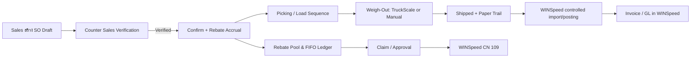

# Business Analysis Document — Sales Execution & Rebate Platform

| รายการ | รายละเอียด |
|---|---|
| Document ID | `WF-BAD-001` |
| Product | WS-Sale-App — Sales Order, Warehouse Execution & Rebate Management |
| Client | World Fert Co., Ltd. |
| Version | v1.0 |
| Date | 28 มิถุนายน 2569 (28 June 2026) |
| Owner | Solution Architect / BA·SA |
| Status | Review — merged candidate; source verification required |
| Classification | Confidential — Client / Authorized Partner Use Only |

> **Merge provenance — 21 July 2026:** เอกสารต้นทาง v8.0 ถูกคงไว้เป็น v1.0 review candidate ตามนโยบาย `latest-document-wins`; หากขัดกับเอกสารที่ใหม่กว่าหรือ source code ปัจจุบัน ให้ยึดหลักฐานล่าสุด และต้อง review/approve ก่อน baseline.

---

## Executive statement

World Fert ต้องการลดงานคีย์ซ้ำ ลดเอกสารสูญหาย ควบคุมการจ่ายสินค้าให้ตรงคำสั่งขาย และทำให้ rebate ตรวจสอบย้อนหลังได้ระดับรายการ โดยไม่กระทบการลงบัญชีเดิมของ Prosoft WINSpeed v9.0

WS-Sale-App จึงเป็น **Sales Execution & Control Layer** ไม่ใช่การทดแทน ERP ทั้งหมดในระยะแรก

## Business context

- บริษัทผลิตและจำหน่ายปุ๋ยหลายสูตร ขายเป็นตันและรับสินค้าในโรงงาน
- คำสั่งซื้อผ่านฝ่ายขายและ Counter Sales ก่อนเข้าสู่คลัง/โรงงาน
- รถอาจรับสินค้าหลายจุด เช่น สายพาน คลัง และ bulk
- Rebate ตั้งตามสูตร พื้นที่ ระยะเวลา และราคา NET แต่การเคลมเดิมตรวจเอกสารมาก
- WINSpeed ต้องคงความเป็นเจ้าของเอกสารบัญชีและ GL

## AS-IS process

## Pain points ที่ยืนยันแล้ว

| ID | ปัญหา | ผลกระทบ | เป้าหมาย v7 |
|---|---|---|---|
| BP-01 | คีย์ order ซ้ำจากแชตไป ERP | ช้าและเกิด error | POS/tablet-first, validation, draft |
| BP-02 | เอกสาร 4 สีติดตามยาก/สูญหาย | audit gap | QR, paper trail, alert |
| BP-03 | แก้ SO หลังเริ่มจ่ายสินค้าไม่มี workflow | audit หาย | Unlock + reversible ledger |
| BP-04 | Rebate ตรวจทีละ invoice | งาน Accounting สูง | ledger line-level + FIFO |
| BP-05 | ตัด rebate แบบก้อนรวม | trace ต้นทางไม่ได้ | pool + ledger + allocation |
| BP-06 | ราคา NET/promotion เปลี่ยนบ่อย | execution ไม่ทัน | Price Book + Plan version |
| BP-07 | คลังตีความลำดับแม่/ลูก | โหลดผิด/ช้า | load sequence ต่อ line |
| BP-08 | ของแถมอยู่ในหมายเหตุ | ไม่เห็นงบ/สต็อก | giveaway workflow |
| BP-09 | ตั๋วคุมรายชุดดูยาก | ตรวจยอดยาก | drill-down balance |
| BP-10 | TruckScale แยกและ data quality ไม่สม่ำเสมอ | integration risk | completed-weigh read-only + controlled `tbl_keyone` pre-weigh contract/match policy |

## To-Be operating model

## Business outcomes and KPI

| Outcome | KPI |
|---|---|
| ลดเวลาคีย์/ตรวจ SO | median create-to-confirm time, rework rate |
| ลดภาระ rebate | claim-review time, % traceable automatically |
| ลดเอกสารสูญหาย | open/lost paper-copy count and aging |
| ควบคุมการจ่าย | % shipped SO with verification, weight and audit |
| รักษาบัญชี | reconciliation pass rate with WINSpeed |
| ควบคุม promotion | plan budget variance / giveaway exception |
| ตัดสินใจเร็ว | dashboard freshness / queue aging |

## Scope baseline

### In scope

1. Sales order, quotation-to-SO and Verification workflow
2. Mother/baby load sequencing
3. Rebate plan, allocation, accrual, FIFO, claim and CN evidence
4. Giveaway budget/withdrawal
5. Control-ticket balance and report
6. Weigh-out capture, TruckScale lookup and manual fallback
7. Paper Trail, QR and audit
8. Dashboard, reports, RBAC, security and operations

### Out of scope unless separately approved

- full factory production/MRP
- Gate Pass replacement
- TruckScale hardware/serial controller replacement
- full LINE LIFF application
- lot/expiry traceability
- changes to WINSpeed GL/accounting logic

## Critical decision gates

| Gate | Decision required | Owner |
|---|---|---|
| DG-01 | WINSpeed write boundary | Executive + IT + Accounting |
| DG-02 | Canonical TruckScale source | IT + Factory |
| DG-03 | Credit Hold: build/defer | Sales + Accounting |
| DG-04 | Stock source and reservation method | Warehouse + Finance |
| DG-05 | Approval authority thresholds | Management |
| DG-06 | Privacy/document retention | Management + QMR |
