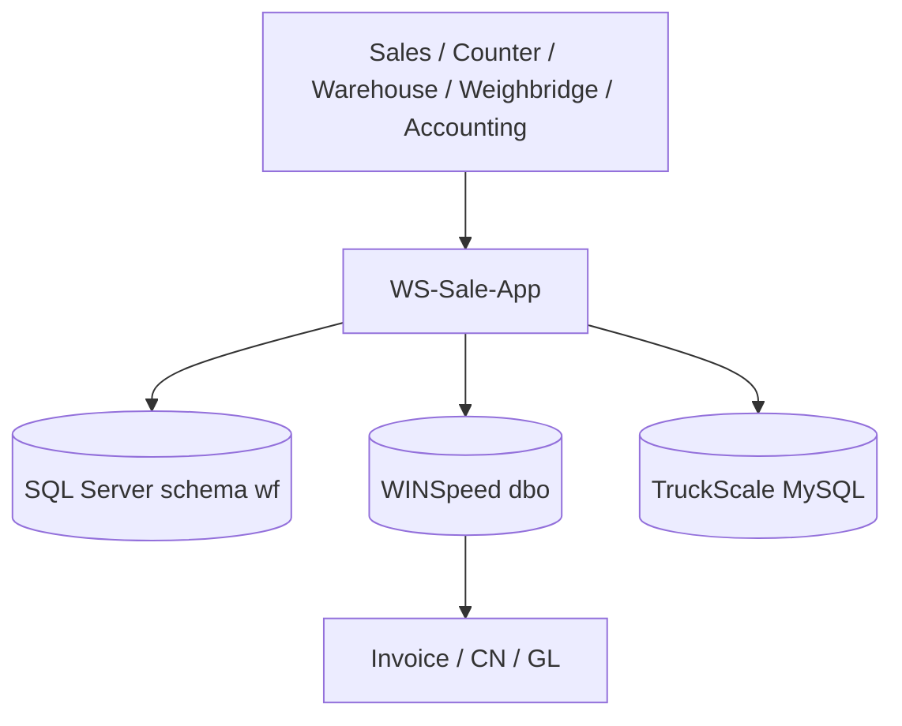
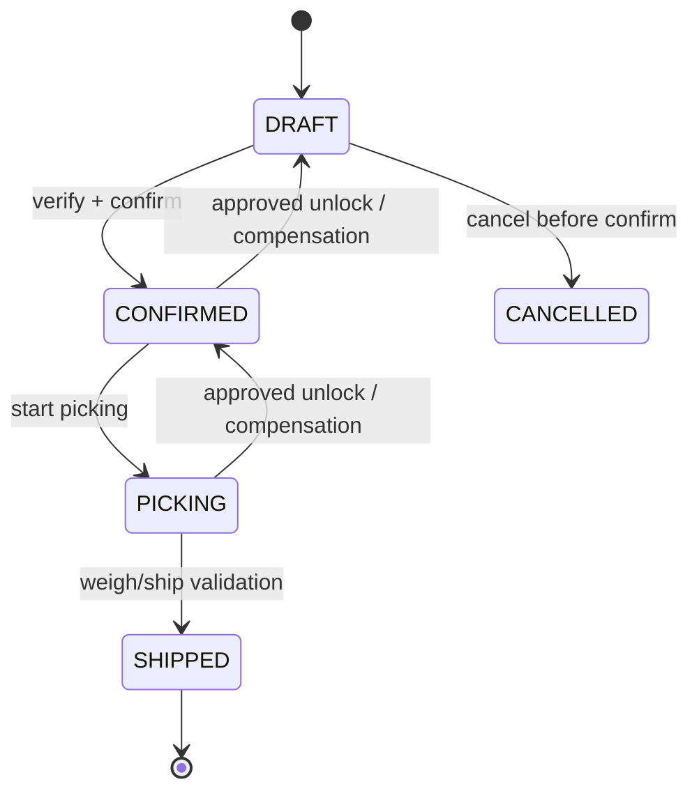

# Software Requirements Specification — Enterprise Production Baseline

| รายการ | รายละเอียด |
|---|---|
| Document ID | `WF-SRS-008` |
| Product | WS-Sale-App — Sales Order, Warehouse Execution & Rebate Management |
| Client | World Fert Co., Ltd. |
| Version | v1.0 |
| Date | 28 มิถุนายน 2569 (28 June 2026) |
| Owner | Product Owner / Solution Architect |
| Status | Review — merged candidate; source verification required |
| Classification | Confidential — Client / Authorized Partner Use Only |

> **Merge provenance — 21 July 2026:** เอกสารต้นทาง v8.0 ถูกคงไว้เป็น v1.0 review candidate ตามนโยบาย `latest-document-wins`; หากขัดกับเอกสารที่ใหม่กว่าหรือ source code ปัจจุบัน ให้ยึดหลักฐานล่าสุด และต้อง review/approve ก่อน baseline.

---

## 1. Purpose

เอกสารนี้กำหนด functional requirements, interface behavior, acceptance criteria และ production constraints สำหรับ WS-Sale-App v8.0 เพื่อใช้เป็น baseline เดียวกันของฝ่ายธุรกิจ ทีมพัฒนา QA, DBA, IT และผู้อนุมัติ

## 2. Product perspective

WS-Sale-App เป็น web application แบบ tablet-first ที่เพิ่ม operational control บน WINSpeed และ TruckScale โดยไม่รับบทแทนระบบบัญชีของ WINSpeed

## 3. Roles and permission principle

สิทธิ์ต้องตรวจทั้ง frontend และ backend; UI ที่ซ่อนเมนูไม่ถือเป็น security control. ทุก API ต้องตรวจ token, role, context และ object-level authorization ที่เกี่ยวข้อง

## 4. Functional requirements

### 4.1 Sales, quotation and verification

| ID | Requirement | Acceptance summary |
|---|---|---|
| FR-001 | ระบบ MUST รองรับ DRAFT, CONFIRMED, PICKING, SHIPPED และ controlled cancellation/unlock | illegal transition ไม่ผ่าน; audit ครบ |
| FR-002 | ระบบ MUST สร้าง/แก้ SO พร้อม customer, truck, line, quantity, price, delivery attributes | validation ครบ, response ตาม NFR |
| FR-005 | ระบบ SHOULD รองรับ quotation DRAFT → SENT → ACCEPTED และ convert เป็น SO DRAFT | source/target linkage ครบ |
| FR-019 | ระบบ MUST เก็บ mother/baby และ load sequence ต่อ line | เอกสาร/queue แสดงตรงกัน |
| FR-022 | ระบบ MUST มี Verification Gate ก่อน confirm | unverified SO confirm ไม่ได้ ยกเว้น bypass ที่อนุญาต |

### 4.2 Documents, paper trail and unlock

| ID | Requirement | Acceptance summary |
|---|---|---|
| FR-004 | ระบบ MUST สร้างเอกสารจ่ายสินค้า/รับสินค้า 4 สี พร้อม QR ต่อ copy | QR ไม่ซ้ำ, reprint controlled |
| FR-012 | ระบบ MUST บันทึก PaperCopy | color, nonce, status, generatedAt |
| FR-013 | ระบบ SHOULD scan และติดตาม transfer/signed/filed/lost | scan history immutable; alert aging |
| FR-006 | ระบบ MUST ให้ขอ unlock พร้อมเหตุผลตาม policy | one pending request/SO |
| FR-007 | ระบบ MUST reverse business effects เมื่อ unlock approved | compensating entries; no hard delete |

### 4.3 Warehouse and weigh-out

| ID | Requirement | Acceptance summary |
|---|---|---|
| FR-024 | ระบบ MUST ตรวจ health TruckScale | `UP/DEGRADED/DOWN` และ timestamp |
| FR-025 | ระบบ MUST search TruckScale ด้วย plate/movebill | candidate ranking + evidence |
| FR-026 | ระบบ MUST บันทึก WeighTicket/validate ก่อน ship | gross/tare/net/time/scale/source/ref ครบ |
| FR-027 | ระบบ MUST reconcile ship กับ WINSpeed/TruckScale | exception/retry/owner visible |

### 4.4 Rebate, price and giveaway

| ID | Requirement | Acceptance summary |
|---|---|---|
| FR-023 | ระบบ MUST จัดการ monthly NET Price Book โดยมี version/effective period | clone/approve/activate/audit |
| FR-008 | ระบบ MUST สร้าง/activate/close Rebate Plan | overlap policy |
| FR-009 | ระบบ MUST allocate plan budget เป็น sales pools | allocation ไม่เกิน plan |
| FR-010 | ระบบ MUST book line-level accrual และ FIFO ledger | amount/source/plan/pool/sequence trace |
| FR-011 | ระบบ MUST create/approve claim และผูก CN evidence | no overclaim; CN trace |
| FR-020 | ระบบ MUST track giveaway budget/withdrawal | balance/overrun control |
| FR-021 | ระบบ MUST report control-ticket balance and draws | drill-down ticket/customer/line |

### 4.5 Administration and reporting

| ID | Requirement | Acceptance summary |
|---|---|---|
| FR-014 | ระบบ MUST read approved WINSpeed master/read model | no uncontrolled ad hoc table dependency |
| FR-017 | ระบบ MUST provide dashboard/report/export | freshness/authorization governed |
| FR-018 | ระบบ MUST RBAC/auth/audit | access denied logged |
| FR-028 | ระบบ SHOULD use configurable approval policy | threshold, authority, effective period |
| FR-029 | ระบบ SHOULD record outbox/integration event attempt | idempotency, retry, reconcile |
| FR-030 | ระบบ MUST expose operational telemetry/alerts | health/error/release signals |
| FR-031 | ระบบ MUST use controlled migration/release workflow | migration ledger, rollback/forward-fix |
| FR-032 | ระบบ SHOULD support retention/DSAR per policy | approved privacy policy required |

## 5. State model

### State invariants

- `DRAFT`: editable subject to role policy
- `CONFIRMED`: price/plan snapshot and accrual immutable except controlled compensation
- `PICKING`: commercial edits blocked
- `SHIPPED`: immutable execution record; corrections follow controlled corrective workflow

## 6. Error handling

| Condition | API/UI behavior | Audit/operations |
|---|---|---|
| Invalid state transition | 409 Conflict | log deny with state/action |
| Permission denied | 403 Forbidden | security audit |
| Duplicate request | idempotent prior outcome or 409 | return reference |
| TruckScale unavailable | degraded/manual fallback if allowed | health alert |
| WINSpeed integration failure | pending/retry/reconcile | no duplicate write |
| Financial mismatch | block close/flag exception | Accounting escalation |

## 7. Exclusions

- App does not post GL entries directly.
- App does not replace serial scale/hardware control.
- App does not infer financial posting from UI status.
