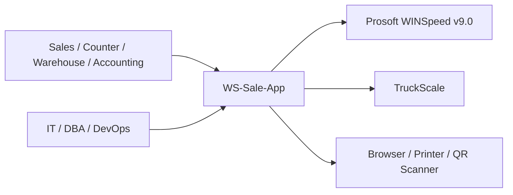
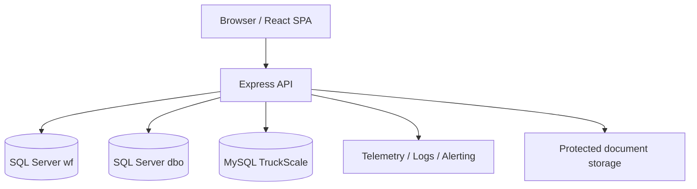

# C4 Architecture Views

| รายการ | รายละเอียด |
|---|---|
| Document ID | `WF-SAD-002` |
| Product | WS-Sale-App — Sales Order, Warehouse Execution & Rebate Management |
| Client | World Fert Co., Ltd. |
| Version | v1.0 |
| Date | 28 มิถุนายน 2569 (28 June 2026) |
| Owner | Solution Architect |
| Status | Review — merged candidate; source verification required |
| Classification | Confidential — Client / Authorized Partner Use Only |

> **Merge provenance — 21 July 2026:** เอกสารต้นทาง v8.0 ถูกคงไว้เป็น v1.0 review candidate ตามนโยบาย `latest-document-wins`; หากขัดกับเอกสารที่ใหม่กว่าหรือ source code ปัจจุบัน ให้ยึดหลักฐานล่าสุด และต้อง review/approve ก่อน baseline.

---

## Level 1 — System Context

## Level 2 — Containers

## Level 3 — Backend components

| Component | Responsibility | Boundary |
|---|---|---|
| Auth middleware | token/RBAC/context | protected endpoints |
| Sales service | lifecycle, verification, audit | wf + controlled contract |
| Rebate service | plan/pool/ledger/FIFO/claim | wf |
| Weigh service | lookup/normalize/ticket persistence | TruckScale read + wf |
| Paper service | copies/QR/scans/custody | wf/storage |
| Integration service | outbox/import/reconcile/idempotency | WINSpeed + wf |
| Reporting service | read models/export | views/read models |
| Admin service | users/roles/policy/master | wf/contracts |
| Health/telemetry | dependency status/error metrics | runtime |

## Level 4 — Code constraints

- routes must not hold financial/business rules that belong in services
- every mutable workflow emits audit event through shared service
- parameterized SQL only
- cross-database calls require timeout and explicit contract
- write operations support idempotency where retry can duplicate outcome
