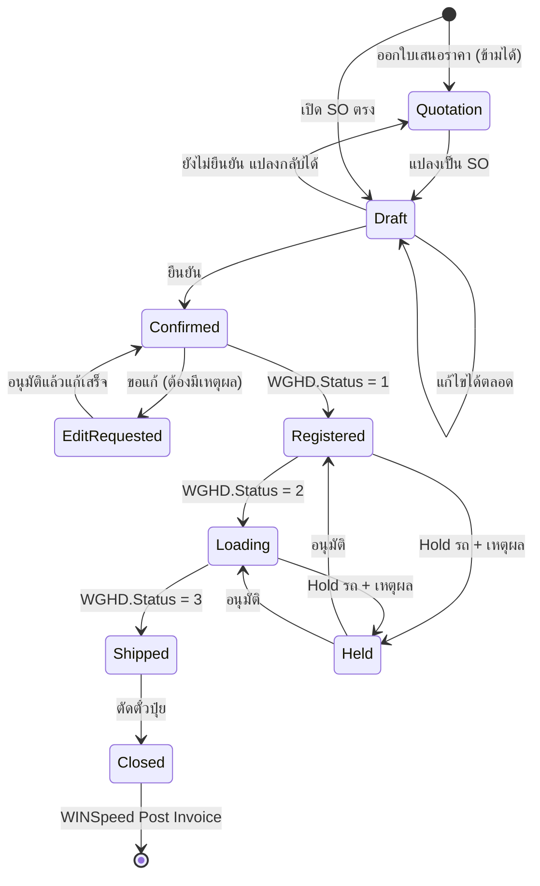

# แบบ Re-Design รอบ 2 — Sale Trip เป็นแกนกลาง

> **ร่างเพื่อตรวจ ยังไม่ลงมือ** — งานนี้รื้อ UI ทั้งแอป ถ้าโครงผิดต้องรื้อซ้ำ
> ขอให้ตรวจ §3 (สิ่งที่ตัด) และ §5 (state machine) เป็นพิเศษ เพราะสองส่วนนี้ย้อนยาก

---

## 1. สามข้อที่ผมเข้าใจผิดมาก่อน และแก้แล้ว

การออกแบบรอบนี้ตั้งอยู่บนข้อเท็จจริงที่เพิ่งตรวจใหม่ ไม่ใช่ความเข้าใจเดิม

### 1.1 ตั๋วคุมมียอดคงเหลืออยู่แล้ว — ไม่ต้องสร้างตารางใหม่

| | |
|---|---|
| ยอดคงเหลือ | **`dbo.WFCoupon.RemaQty`** |
| ตัวอย่างจริง | `C6902239` ออก **500 ตัน** เหลือ **487.9** · `C6903713` ออก 1,000 เหลือ 201.25 |
| สถานะปัจจุบัน | ตั๋วที่ยังมียอดเหลือทั้งระบบ **10 ใบ** รวม 1,154 ตัน |

### 1.2 `TransRegistration = 'ตั๋วคุม'` เชื่อไม่ได้

| ตรวจ | ผล |
|---|---|
| ใบ 103 ที่ติดป้าย `ตั๋วคุม` | 2,210 ใบ |
| ในนั้นที่ยังมียอดเหลือจริง | **2 ใบ** |
| ตั๋วที่มียอดเหลือทั้งหมด | 10 ใบ — **อีก 8 ใบช่องนั้นเป็นทะเบียนรถ** |

**`TransRegistration` เป็นข้อความอิสระ** บางใบพิมพ์ว่าตั๋วคุม บางใบพิมพ์ทะเบียนรถ
→ **ตัวชี้ขาดคือ `RemaQty > 0`** ไม่ใช่ป้ายข้อความ

### 1.3 วันหมดอายุต้องคำนวณเอง

`SOHD.ExpireDate` **เป็น NULL ทุกใบ** แต่ `ValidDays` มีค่าจริง

```
วันหมดอายุ = SOHD.DocuDate + SOHD.ValidDays     (ValidDays = 0 แปลว่าไม่กำหนด)
```

ค่าที่ใช้จริงกระจายมาก — `0` (525 ใบ) · `90` (338) · `43` (137) · `30` (130) · `60` (105) · `45` (83)
**ไม่ใช่ 60 วันตายตัว** ต้องอ่านรายใบ

---

## 2. โครงข้อมูล — เพิ่มใน `wf` เท่าที่จำเป็นจริง

`dbo` แก้ไม่ได้ · สิ่งที่ `dbo` มีอยู่แล้วให้อ่าน ไม่ทำสำเนา

| ต้องการ | มีอยู่แล้วที่ | ต้องเพิ่มใน `wf` |
|---|---|---|
| ยอดตั๋วคงเหลือ | `dbo.WFCoupon.RemaQty` | — |
| วันหมดอายุตั๋ว | คำนวณจาก `DocuDate + ValidDays` | — |
| **ล็อกห้ามส่งเมื่อตั๋วหมดอายุ** | ไม่มี | `wf.SystemSetting` คีย์ใหม่ |
| **สถานะแจ้งเตือนใกล้หมดอายุ** | ไม่มี | `wf.ControlTicketAlert` (กันเตือนซ้ำ) |
| เที่ยวรถ | `wf.SalesTrip` | เพิ่ม `CapacityTon` `TolerancePct` `PickupDueDate` `PreSlingRequired` |
| แม่/ลูก รายรายการ | **`wf.SalesOrderLine.MasterQty` / `ChildQty` มีอยู่แล้ว** | — (แค่ทำ UI ให้ใช้จริง) |
| กำหนดเข้ารับสินค้า | ไม่มี | `wf.SalesOrder.PickupDueDays` (7/15/30/45/อื่น) |
| **เหตุผลการขอแก้หลังยืนยัน** | ไม่มี | `wf.EditReason` (master) + `wf.EditRequest` |
| Pricelist รายเดือนรายเขต | `wf.PriceBook` + `dbo.EMSetPriceHD/DT` | เพิ่มการเตือนใกล้หมดอายุ |

> **ยังไม่แตะ `wf.RebatePool` / `RebateLedger`** — โครงรองรับสัดส่วนอยู่แล้ว
> (`CustomerRatio` · `CompanyRatio` · `IsSelfClaim`) แค่ค่าเริ่มต้นเป็น 100/0

---

## 3. สิ่งที่ตัดออก — ขอตรวจข้อนี้ก่อน

### 3.1 ตัดแน่นอน (เจ้าของยืนยันแล้ว)

| เมนู | เหตุผล |
|---|---|
| **TruckScale** | อ่าน MySQL ที่ยกเลิกแล้ว · endpoint ตอบ 404 อยู่แล้ว |
| **Weigh Inbox** | ตัวป้อนคือ sync จาก MySQL ซึ่งปิดไปแล้ว · `wf.WeighInbox` เป็นข้อมูลตาย |

### 3.2 ผมเสนอให้ **ซ่อน** ไม่ลบ (ไม่แน่ใจว่ายังใช้)

| เมนู | ทำไมสงสัย |
|---|---|
| **CN Rebate** | อ่าน RB ฝั่ง WINSpeed · RB หยุดออกตั้งแต่ 5 มี.ค. 2569 |
| **Incentive & Retained** | ขึ้นกับสัดส่วน 50/50 ซึ่งยัง**ไม่ได้ใช้** (ตอนนี้ 100/0) |
| **Budget Expenditure** | `wf.BudgetPlan` มี **0 แถว** |
| **กำกับข้อมูล (PDPA)** | `wf.DsarLog` มี 0 แถว |

### 3.3 คงไว้แน่นอน

Dashboard · ขาย · เสนอราคา · คลัง · Paper Trail · ตั๋วคงค้าง · รีเบท · Rebate Plan ·
ของแถม · บัญชี · กระทบยอด · รายงาน · **สถานะการชั่งรถ** · ชุดตั๋วคุม ·
ข้อมูลหลัก · นโยบายอนุมัติ · สถานะระบบ · User Management · **ผังองค์กร**

### 3.4 หน้าใหม่

| หน้า | ทำอะไร |
|---|---|
| **Sale Trip Board** 🆕 | หน้าหลักใหม่ — เที่ยวรถเป็นแกน ดูทั้งทริปในจอเดียว |
| **ผังการจัดของ** 🆕 | แสดงลำดับขึ้นของอัตโนมัติ + Pre-Sling + ของแถม + หมายเหตุ |
| **คำขอแก้หลังยืนยัน** 🆕 | ขอแก้ · เลือกเหตุผล · รออนุมัติ · Hold รถ |

---

## 4. Sale Trip — โครงหน้าจอ

```
Sale Trip #TR69-0001                    [50 ตัน +5% = 52.5]  ●●●●●●●○○ 44.2/52.5
ทะเบียน นม71-1234/5678 · คนขับ …        กำหนดเข้ารับ 10 ก.ย. (7 วัน)  ☑ Pre-Sling
├─ ลูกค้า ก.                            เครดิต ✅ 1.2M/2.0M
│  ├─ I69-02501  (ใบจองเล่ม I)
│  │   ├─ 18-8-8      12 ตัน   แม่ 60% / ลูก 40%
│  │   ├─ 21-0-0       8 ตัน   แม่ 100%
│  │   └─ ของแถม กระเป๋า ×2
│  └─ K69-01920  (ใบจองเล่ม K)
│      └─ 46-0-0      10 ตัน   ลูก 100%   🎫 ตัดจากตั๋ว C6902239 (เหลือ 477.9)
├─ ลูกค้า ข.                            เครดิต ⚠ 1.9M/2.0M
│  └─ I69-02502
│      └─ 15-15-15    14 ตัน
└─ + เพิ่มลูกค้า / ดึงจากใบเสนอราคา
```

**หลักที่ยึด**

1. **1 SO = 1 เล่ม** ตามเดิม — Sale Trip เป็นแค่การรวบหลาย SO มาทำเป็นชุด
   ทุกกระบวนการหลังจากนั้นยังเดินราย `DocuNo` 1:1 เหมือนเดิม
2. ลูกค้าหนึ่งรายมีได้ทั้งใบ I และใบ K — เป็นคนละ SO
3. **พิกัดน้ำหนักนับรวมทั้งคัน** 50 ตัน +5% = 52.5 · แถบเตือนเมื่อเกิน
4. แม่/ลูก กำหนด **รายรายการ** ไม่ใช่รายทริป

---

## 5. State Machine — ขอตรวจข้อนี้ให้ละเอียด



### 5.1 จุดที่ต้องยืนยัน

**ก. `WGHD.Status` ไม่ได้ผูกกับ SO โดยตรง**

จุดเชื่อมเดียวที่เชื่อได้คือ `WGHD.SPID = SOHD.SOID` และ **`SPID` ชี้ที่ใบสั่งจอง 103 เสมอ**
แต่ Sale Trip มีหลาย SO ต่อหนึ่งคันรถ — และ **`WGHD` หนึ่งแถวมี `SPID` ได้ตัวเดียว**

> ❓ **คำถาม** — รถหนึ่งคันบรรทุกของ 3 ลูกค้า 5 SO เครื่องชั่งจะบันทึกกี่แถว
> ถ้าแถวเดียว `SPID` จะชี้ SO ไหน · ถ้าหลายแถว เรารวมยังไงให้เป็นทริปเดียว
> **ข้อนี้ตอบไม่ได้จากข้อมูลที่มี เพราะยังไม่เคยมีการชั่งจริงแบบหลาย SO**

**ข. "ปิด SO แล้วตัดตั๋วปุ๋ย"**

ตามที่ยืนยัน: เห็น `Status=3` แล้วแอปเริ่มปิดตั๋วเอง
แอปมี `usp_IssueSalesOrderCoupons` (migration 098) ที่ออกตั๋วได้แล้ว
แต่ **การตัดตั๋ว** (`WFRedemtionHD/DT`) แอปยังไม่เคยเขียน

> ❓ **คำถาม** — ให้แอปเขียน `WFRedemtionHD` + `WFRedemtionDT` เองเลยไหม
> นั่นคือการเพิ่มจุดเขียน `dbo` ใหม่ ซึ่งต้องอนุมัติเป็นรายการเหมือน `WFCoupon`

---

## 6. Rebate — ยืนยันสูตรตามที่อธิบาย

```
Rebate ต่อตัน = ราคาที่ขายจริง − ราคาตาม Pricelist
```

ตัวอย่าง 18-8-8 · Pricelist 15,400 · ขายได้ 16,000 → **สะสม 600 บาท/ตัน**

| | ตอนนี้ | อนาคต |
|---|---|---|
| สัดส่วน | ลูกค้า **100** / บริษัท **0** | ปรับได้ เช่น 50/50 |
| ส่วนของบริษัท | — | ตั้ง Promotion Budget · Incentive พนักงานขาย |

**การเคลม** — สรุปแบบ FIFO ตามสูตร/ราคา/กระสอบ **แต่ตอนใช้จริงใช้เป็นตัวเงินรวมเท่านั้น**
ไม่ต้องผูกกับสูตรเดิม · **ต้องใช้กับลูกค้ารายเดิม** หรือยกให้บริษัท

### 6.1 ตรวจแล้ว — สูตรปัจจุบันถูกต้อง ไม่ใช่บั๊ก

โค้ดคิดจาก `PricePerTon − NetPricePerTon` และตอนเพิ่มรายการ **ทั้งสองค่าถูกตั้งเป็นราคา Pricelist เท่ากัน**

```js
const net = best.price || getNetPrice(good.GoodID, 1);   // ราคาจาก Pricelist
pricePerTon:    defaultPrice,   // พนักงานขายแก้ขึ้นได้
netPricePerTon: defaultPrice,   // ฐานราคาคงไว้
```

พนักงานขายแก้ `pricePerTon` ขึ้น ส่วนต่างจึงกลายเป็นรีเบท — **ตรงกับที่อธิบายไว้ทุกประการ**

> ⚠ **ข้อที่ยังเสี่ยงอยู่** — ถ้า `getNetPrice` หาราคาไม่เจอจะได้ `0`
> ทำให้ฐานราคาเป็นศูนย์ และรีเบทกลายเป็นเต็มราคาขาย
> เคยเกิดจริง: คืนเต็ม 163,400 บาท แทนที่จะเป็น 14,400
> **UI ใหม่ต้องบล็อกไม่ให้เพิ่มรายการที่หาราคา Pricelist ไม่เจอ** ไม่ใช่ปล่อยให้เป็นศูนย์

---

## 7. ล้างข้อมูลทดสอบ WGxx

เจ้าของอนุญาตให้ลบ · **ห้ามแตะโครงสร้าง**

| ตาราง | แถว |
|---|---|
| `dbo.WGHD` | 181 |
| `dbo.WGDT` | 311 |
| `dbo.WGDTReport` | 29 |

**ขั้นตอนที่จะใช้**

1. สำรองลง `wf.WGxxBackup_20260903` ก่อน (`SELECT * INTO`)
2. `DELETE` ตามลำดับลูก → แม่ (`WGDTReport` → `WGDT` → `WGHD`)
3. ยืนยันนับเป็น 0 ทั้งสามตาราง

> ❓ **คำถาม** — ล้างทั้ง PROD-A และ PROD-B หรือเฉพาะที่ใดที่หนึ่ง
> ⚠ นี่เป็นการ `DELETE` บน `dbo` ซึ่งขัดกติกาเหล็กข้อ 4 ที่เราตั้งไว้เอง
> ผมจะทำก็ต่อเมื่อยืนยันอีกครั้ง และจะสำรองก่อนเสมอ

---

## 8. ลำดับงานที่เสนอ

| เฟส | ทำอะไร | ทำไมลำดับนี้ |
|---|---|---|
| **0** | ตอบคำถามค้าง 3 ข้อใน §5.1 และ §7 | ตอบไม่ได้ = ออกแบบต่อไม่ได้ |
| ~~1~~ | ~~ตรวจสูตรรีเบท~~ **ทำแล้ว — ถูกต้อง** | เหลือแค่บล็อกกรณีหาราคาไม่เจอ |
| **2** | migration: `wf` ตารางใหม่ + คอลัมน์เพิ่ม | โครงข้อมูลต้องนิ่งก่อนทำหน้าจอ |
| **3** | ตัด/ซ่อนเมนูตาม §3 | ลดพื้นที่ก่อนสร้างของใหม่ |
| **4** | Sale Trip Board + ผังการจัดของ | แกนหลัก |
| **5** | คำขอแก้หลังยืนยัน + Hold | ผูกกับ state machine |
| **6** | ล้างข้อมูลทดสอบ WGxx + ทดสอบทั้งเส้น | ต้องมี UI ก่อนถึงทดสอบได้จริง |

---

## 9. ความเสี่ยงที่ต้องรู้ก่อนเริ่ม

| # | ความเสี่ยง | ผลถ้าเกิด |
|---|---|---|
| 1 | **ไม่รู้ว่าเครื่องชั่งบันทึกกี่แถวต่อทริปหลาย SO** | state machine ทั้งเส้นอาจผูกผิด |
| 2 | **ไม่มีข้อมูลชั่งจริงเลยตั้งแต่ 28 พ.ค.** | ทดสอบ flow จริงไม่ได้จนกว่าโรงงานจะเริ่มชั่ง |
| 3 | ~~สูตรรีเบทคิดผิดฐาน~~ **ตรวจแล้วถูกต้อง** | เหลือความเสี่ยงเดียว: หาราคาไม่เจอแล้วได้ 0 (ดู §6.1) |
| 4 | การตัดตั๋วต้องเขียน `dbo` เพิ่ม | ต้องอนุมัติเป็นรายการ · เสี่ยงกระทบ WINSpeed |
| 5 | รื้อ UI ทั้งแอป | งานใหญ่ · ควรทำเป็นเฟส ไม่ใช่รวดเดียว |
