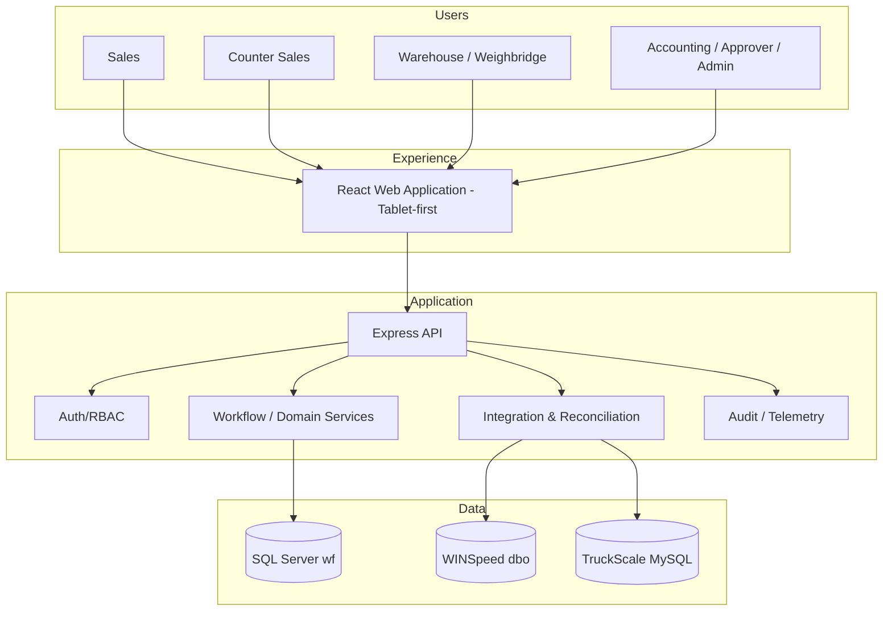
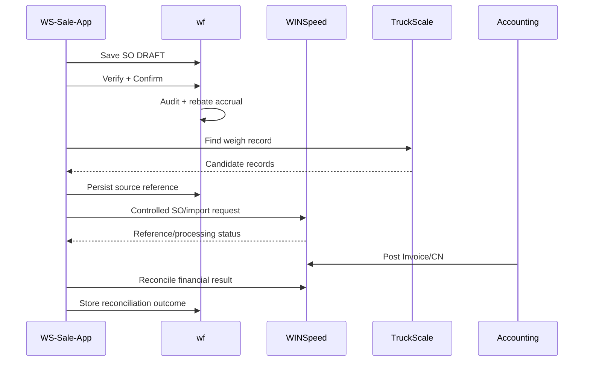

# Solution Architecture Document

| รายการ | รายละเอียด |
|---|---|
| Document ID | `WF-SAD-001` |
| Product | WS-Sale-App — Sales Order, Warehouse Execution & Rebate Management |
| Client | World Fert Co., Ltd. |
| Version | v1.0 |
| Date | 28 มิถุนายน 2569 (28 June 2026) |
| Owner | Solution Architect |
| Status | Review — merged candidate; source verification required |
| Classification | Confidential — Client / Authorized Partner Use Only |

> **Merge provenance — 21 July 2026:** เอกสารต้นทาง v8.0 ถูกคงไว้เป็น v1.0 review candidate ตามนโยบาย `latest-document-wins`; หากขัดกับเอกสารที่ใหม่กว่าหรือ source code ปัจจุบัน ให้ยึดหลักฐานล่าสุด และต้อง review/approve ก่อน baseline.

---

## Architecture intent

ออกแบบเพื่อให้ operational workflow เปลี่ยนเร็วโดยไม่แทรกแซง finance/GL ของ WINSpeed และสร้างหลักฐานที่ตรวจสอบได้ระดับ event/record

## Logical architecture

## Architecture principles

1. **Accounting boundary** — WINSpeed owns invoice/CN/GL posting.
2. **Controlled write boundary** — direct dbo writing is explicit exception, never implicit.
3. **Append-only evidence** — audit, ledger and source references preserved; corrections compensate.
4. **Read-model isolation** — heavy report/control-ticket queries use approved views/indexes/pagination.
5. **Integration resilience** — idempotency, retry/reconciliation and manual fallback explicit.
6. **Least privilege** — no `sa`/`root` in runtime.
7. **Observe before mutate** — completed-weigh TruckScale records are read-only; controlled pre-weigh queue writes are limited to `tbl_keyone`; ambiguity is surfaced.
8. **Configuration over hardcode** — policy/threshold/period/environment controlled.
9. **Operational transparency** — health, version, release, failures visible.

## Bounded contexts

| Context | Owned data | Key responsibility |
|---|---|---|
| Sales Execution | SO, lines, states, verify, load sequence | lifecycle control |
| Rebate | plan, allocation, pool, ledger, claim | traceable promotion |
| Warehouse/Weighing | pick status, WeighTicket | loading/ship evidence |
| Paper Trail | copies, QR, scans | document custody |
| Integration | outbox/reconcile | safe external operations |
| Identity/Admin | user/role/policy | access/config |
| Reporting | read models/export | operational visibility |

## Data ownership

| Data class | Owner | App authority |
|---|---|---|
| WINSpeed master | WINSpeed | controlled read |
| WINSpeed invoice/CN/GL | WINSpeed | read/reconcile |
| operational workflow/audit | wf | write |
| Rebate/claim | wf + CN evidence | write/read |
| Weigh source | TruckScale | completed records read-only; `tbl_keyone` pre-weigh queue write |
| Paper custody | wf | write |

## Integration sequence

## Production topology target

- Frontend through managed static hosting/CDN or on-prem Nginx
- Backend as immutable container
- SQL Server via private network/VPN/allowlist
- TruckScale via private connectivity or managed replica
- centralized secret management
- monitoring/alerting/backup validation before Full Production
