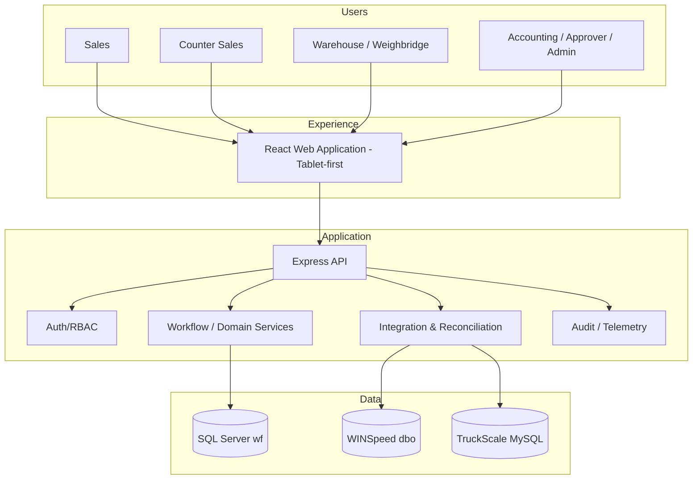
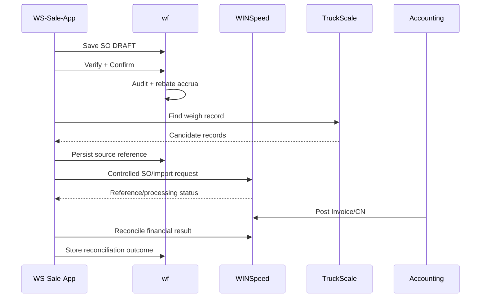

# Solution Architecture Document

| รายการ | รายละเอียด |
|---|---|
| Document ID | `WF-SAD-001` |
| Product | WS-Sale-App — Sales Order, Warehouse Execution & Rebate Management |
| Client | World Fert Co., Ltd. |
| Version | v1.0 |
| Date | 23 กรกฎาคม 2569 (23 July 2026) |
| Owner | Solution Architect |
| Status | Review — source-aligned architecture candidate; approval required |
| Classification | Confidential — Client / Authorized Partner Use Only |
| Source snapshot | runtime 1.0.1 · commit `79a10a28` · 17 route mounts / 160 endpoints / 22 portals / 55 migrations |

> **Merge provenance — 21 July 2026:** เอกสารต้นทาง v8.0 ถูกคงไว้เป็น v1.0 review candidate ตามนโยบาย `latest-document-wins`; หากขัดกับเอกสารที่ใหม่กว่าหรือ source code ปัจจุบัน ให้ยึดหลักฐานล่าสุด และต้อง review/approve ก่อน baseline.

---

## Architecture intent

ออกแบบเพื่อให้ operational workflow เปลี่ยนเร็วโดยไม่แทรกแซง finance/GL ของ WINSpeed และสร้างหลักฐานที่ตรวจสอบได้ระดับ event/record

## Logical architecture

## Architecture principles

1. **Accounting boundary** — WINSpeed owns invoice/CN/GL posting.
2. **Controlled write boundary** — direct dbo writing is explicit exception, never implicit.
3. **Append-only evidence** — audit, ledger and source references preserved; corrections compensate.
4. **Read-model isolation** — heavy report/control-ticket queries use approved views/indexes/pagination.
5. **Integration resilience** — idempotency, retry/reconciliation and manual fallback explicit.
6. **Least privilege** — no `sa`/`root` in runtime.
7. **Observe before mutate** — completed-weigh TruckScale records are read-only; controlled pre-weigh queue writes are limited to `tbl_keyone`; ambiguity is surfaced.
8. **Configuration over hardcode** — policy/threshold/period/environment controlled.
9. **Operational transparency** — health, version, release, failures visible.

## Bounded contexts

| Context | Owned data | Key responsibility |
|---|---|---|
| Sales Execution | SO, lines, states, verify, load sequence | lifecycle control |
| Rebate | plan, allocation, pool, ledger, claim | traceable promotion |
| Warehouse/Weighing | pick status, WeighTicket | loading/ship evidence |
| Paper Trail | copies, QR, scans | document custody |
| Integration | outbox/reconcile | safe external operations |
| Identity/Admin | user/role/policy | access/config |
| Reporting | read models/export | operational visibility |

## Data ownership

| Data class | Owner | App authority |
|---|---|---|
| WINSpeed master | WINSpeed | controlled read |
| WINSpeed invoice/CN/GL | WINSpeed | read/reconcile |
| operational workflow/audit | wf | write |
| Rebate/claim | wf + CN evidence | write/read |
| Weigh source | TruckScale | completed records read-only; `tbl_keyone` pre-weigh queue write |
| Paper custody | wf | write |

## Integration sequence

## Production topology target

- Frontend through managed static hosting/CDN or on-prem Nginx
- Backend as immutable container
- SQL Server via private network/VPN/allowlist
- TruckScale via private connectivity or managed replica
- centralized secret management
- monitoring/alerting/backup validation before Full Production

## Current implementation view

| View | Source-aligned fact |
|---|---|
| Runtime | frontend, backend and root packages declare version 1.0.1 |
| Application surface | 22 portal keys, 8 roles, 17 mounted API route modules and 160 detected endpoints |
| Persistence | SQL Server `wf` operational extension, controlled WINSpeed `dbo`, TruckScale MySQL |
| Schema evolution | 55 sequenced migration files through sequence 055 with no duplicate sequence |
| Controlled external writes | 33 detected `dbo` write statements require contract review; TruckScale writes are limited to 2 statements targeting `tbl_keyone` |
| Automated evidence | E2E run `2026-07-23T09-56-59-217Z`: 10/10 passed, source stable, SQL Server/MySQL health `up` |

## Architecture concerns and verification gates

- Production connectivity, scale hardware, printing, QR scanning and manual recovery remain manual/integration test gates.
- Direct WINSpeed writes are exceptions governed by ADR-003 and the approved integration contract; detection count is an inventory signal, not an approval.
- Deployment secrets, backup restore, alert delivery and network failover require environment-specific evidence before go-live.
- Architecture descriptions follow ISO/IEC/IEEE 42010:2022 concepts: stakeholder concerns, viewpoints, views, decisions and correspondence to implementation evidence.
- Life-cycle deliverables and reviews are organized against ISO/IEC/IEEE 12207:2026 and information-item control follows ISO/IEC/IEEE 15289:2019; these references do not by themselves certify the solution.