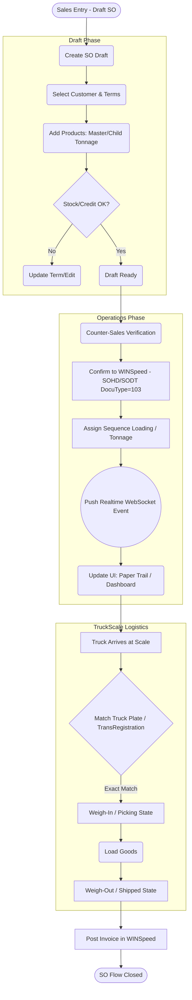
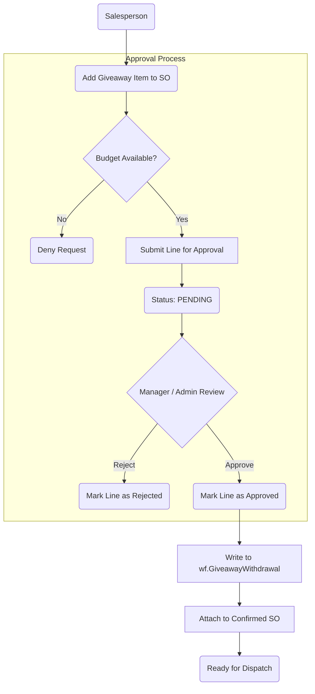

> **World Fert · WS-Sale-App — Enterprise Documentation v1.0**
> Document ID: `WF-ARCH-010` · Version: v1.0 · Date: 21 กรกฎาคม 2569 (21 July 2026) · Status: Released
> Classification: Confidential — Client / Authorized Partner Use Only
> Source of truth: operational build v1.0 · verified against `dbwins_worldfert9`

---
# 11 - Workflow and Workprocess Diagrams

This document contains structured data in [Mermaid.js](https://mermaid.js.org/) format. 

## How to use with Draw.io

1. Open [draw.io](https://app.diagrams.net/).
2. From the top menu, select **Arrange** > **Insert** > **Advanced** > **Mermaid...**.
3. Copy the Mermaid code blocks below (excluding the ````mermaid```` backticks) and paste them into the text box.
4. Click **Insert** to generate the flowchart instantly.

---

## 1. End-to-End Sales Order Flow



---

## 2. Quotation Conversion Process

```mermaid
flowchart LR
    SaleTrip(Sales Trip) --> CreateMultiDrafts(Create Multiple Draft SOs)
    
    subgraph Quotation Preparation
    CreateMultiDrafts --> SelectDrafts(Select Drafts for Quotation)
    SelectDrafts --> CompileQuote[Compile into 1 wf.Quotation]
    CompileQuote --> LockDrafts[Lock Source SOs to QUOTATION Status]
    LockDrafts --> SyncNative[Sync to WINSpeed DocuType=102]
    SyncNative --> WaitDecision{Customer Decision}
    end
    
    WaitDecision -- Rejected/Expired --> CancelQuote(Cancel Quote)
    CancelQuote --> UnlockDrafts(Draft SOs unlocked back to DRAFT)
    
    WaitDecision -- Accepted --> ConfirmQuote[Confirm Quote - DocuType=113]
    ConfirmQuote --> RestoreMetadata[Restore Metadata & Split back to Multi-Bills]
    RestoreMetadata --> DeleteOldDrafts[Delete Original Locked Draft SOs]
    DeleteOldDrafts --> SO1(New SO Draft 1)
    DeleteOldDrafts --> SO2(New SO Draft 2)
    
    SO1 --> ConfirmWIN[Confirm to WINSpeed 103]
    SO2 --> ConfirmWIN
```



---

## 3. Giveaway Approval Flow


