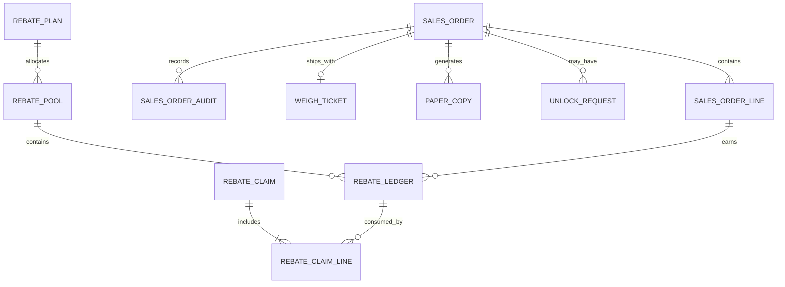

# Data Design, Ownership and Canonical Model

| รายการ | รายละเอียด |
|---|---|
| Document ID | `WF-INT-001` |
| Product | WS-Sale-App — Sales Order, Warehouse Execution & Rebate Management |
| Client | World Fert Co., Ltd. |
| Version | v1.0 |
| Date | 28 มิถุนายน 2569 (28 June 2026) |
| Owner | Data Architect / DBA |
| Status | Review — merged candidate; source verification required |
| Classification | Confidential — Client / Authorized Partner Use Only |

> **Merge provenance — 21 July 2026:** เอกสารต้นทาง v8.0 ถูกคงไว้เป็น v1.0 review candidate ตามนโยบาย `latest-document-wins`; หากขัดกับเอกสารที่ใหม่กว่าหรือ source code ปัจจุบัน ให้ยึดหลักฐานล่าสุด และต้อง review/approve ก่อน baseline.

---

## Data ownership

| Domain | Primary owner | Write mode | Retention/audit |
|---|---|---|---|
| Customer/good/account master | WINSpeed | controlled external | WINSpeed policy |
| SO operational workflow | wf | app owned | target 7 years |
| Rebate/claim | wf + CN reference | app owned / external evidence | target 7 years |
| Price Book | WINSpeed/source contract | controlled | versioned |
| Weigh source | TruckScale | `tblscale`/reference read-only; `tbl_keyone` controlled queue write | source policy + wf ref |
| Paper copies/scans | wf | app owned | target 7 years |
| User/role mapping | wf | admin controlled | access policy |
| Outbox/reconcile | wf | app owned | until resolved + policy |

## Logical entities

### Sales execution

| Entity | Key fields | Notes |
|---|---|---|
| `SalesOrder` | `SoId`, `SoNo`, `CustomerId`, `Status`, `TruckPlate`, `VerifiedBy`, `VerifiedAt` | header |
| `SalesOrderLine` | `SoId`, `LineNo`, `GoodId`, `QtyTon`, `UnitPrice`, `LoadSequence` | commercial/warehouse line |
| `SalesOrderAudit` | actor, action, before/after JSON, IP, time, correlation | append-only |
| `UnlockRequest` | `SoId`, reason, status, requester, approver | correction |
| `WeighTicket` | `SoId`, source ref, tare/gross/net, scale, time, method | ship evidence |

### Rebate and giveaway

| Entity | Key fields | Notes |
|---|---|---|
| `PriceBook` | formula/good, month, NET, version, state | effective price |
| `RebatePlan` | dates, formula, region, return type, priority | policy |
| `RebatePool` | sales, plan, allocated/used/frozen | aggregation |
| `RebateLedger` | source line, pool, type, amount, FIFO, reversed flag | subledger |
| `RebateClaim` | customer, sales, totals, state, CN number | request |
| `RebateClaimLine` | claim/ledger, amount, return type | trace |
| `GiveawayBudget` | region/sales/item/brand/period | budget |
| `GiveawayWithdrawal` | SO/budget/item/qty/reason | issue |

### Controls and platform

| Entity | Key fields | Notes |
|---|---|---|
| `PaperCopy` | SO, color, QR nonce, status, holder | custody |
| `PaperScan` | copy, status, actor, timestamp | append-only |
| `AppUser` | identity, role, EmpID, active | named account |
| `ApprovalPolicy` | scenario, threshold, authority, effective dates | v7 target |
| `IntegrationOutbox` | type, idempotency key, payload hash, state | v7 target |
| `ReconciliationCase` | entity/ref, expected/actual, state, owner | v7 target |

## Data constraints

- money uses decimal and explicit rounding; no floating point
- quantity stores canonical ton/kg plus UOM conversion
- datetime uses explicit timezone/UTC policy
- raw and normalized data both retained for matching/search
- audit JSON includes schema/version
- PII is not written to general logs/export by default

## Conceptual ER

