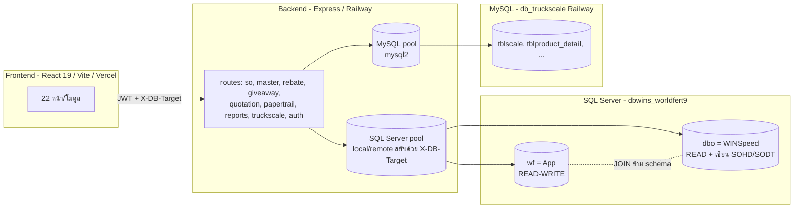
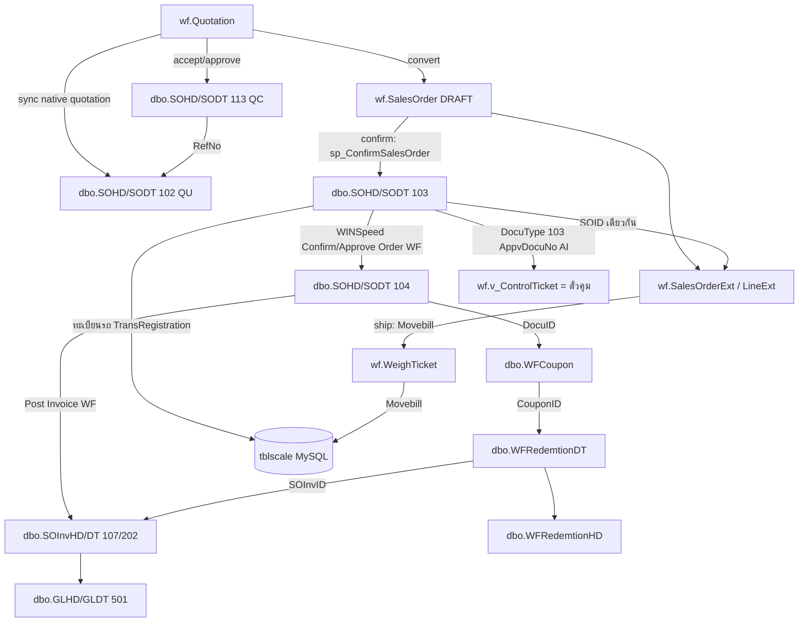

> **World Fert · WS-Sale-App — Enterprise Documentation v1.0**
> Document ID: `WF-DATA-010` · Version: v1.0 · Date: 21 กรกฎาคม 2569 (21 July 2026) · Status: Released
> Classification: Confidential — Client / Authorized Partner Use Only
> Source of truth: operational build v1.0 · verified against `dbwins_worldfert9`

---
# 00 — ภาพรวมฐานข้อมูล & การ Mapping (Database Overview & Mapping)

> WS-Sale-App · World Fert Co., Ltd. · เอกสารควบคุมสำหรับ ISO 9001
> อ้างอิง build v1.0 / SRS v6.3 · ปรับปรุง 19 ก.ค. 2569

## สารบัญ
1. [ระบบฐานข้อมูล 3 แหล่ง](#1-ระบบฐานข้อมูล-3-แหล่ง)
2. [สถาปัตยกรรมการเชื่อมต่อ](#2-สถาปัตยกรรมการเชื่อมต่อ)
3. [การ Mapping: WINSpeed ↔ App ↔ TruckScale](#3-การ-mapping-winspeed--app--truckscale)
4. [Data Dictionary — schema wf](#4-data-dictionary--schema-wf-read-write)
5. [Data Dictionary — dbo (WINSpeed, READ-ONLY)](#5-data-dictionary--dbo-winspeed-read-only)
6. [Data Dictionary — TruckScale (MySQL, controlled boundary)](#6-data-dictionary--truckscale-mysql-controlled-boundary)
7. [หลักการสำคัญ (Iron Rules)](#7-หลักการสำคัญ-iron-rules)

---

## 1. ระบบฐานข้อมูล 3 แหล่ง

| # | ระบบ | Engine | ที่อยู่ | สิทธิ์จาก App | ใช้ทำอะไร |
|---|------|--------|---------|---------------|-----------|
| 1 | **WINSpeed (dbo)** | SQL Server 2022 | `dbwins_worldfert9` (20.255.185.14 remote / SQLEXPRESS local) | **READ** (+เขียน SOHD/SODT ตรงตอน confirm/ship — ดู §7) | ERP หลัก: master, ใบสั่งขาย, ใบกำกับ, GL, WF Rebate Trail, คูปอง |
| 2 | **App (wf schema)** | SQL Server 2022 (DB เดียวกับ dbo) | schema `wf` ใน `dbwins_worldfert9` | **READ-WRITE** | ข้อมูลที่ WINSpeed ไม่มี: SO state, Rebate Plan/Pool/Ledger, Giveaway, Paper Trail, WeighTicket, Quotation, Unlock |
| 3 | **TruckScale** | MySQL 5.7 | `db_truckscale` (Railway cloud: `reseau.proxy.rlwy.net:42508`) | **READ** | เครื่องชั่งน้ำหนักรถ: น้ำหนักเข้า/ออก/สุทธิ (403,908 ใบชั่ง) |

**ข้อสังเกต:**
- `wf` กับ `dbo` อยู่ใน **SQL Server ฐานเดียวกัน** → JOIN ข้าม schema ได้ตรง ไม่ต้อง sync/cache
- `TruckScale` เป็น **MySQL แยกระบบ** → เชื่อมผ่าน connection pool ที่ 2 (`mysql2`) ไม่เกี่ยวกับ `DB_MODE`
- `DB_MODE` (.env) = `local` | `remote` คุมเฉพาะ SQL Server (WINSpeed+wf) · **ห้ามตั้ง `DB_MODE=mysql`**

---

## 2. สถาปัตยกรรมการเชื่อมต่อ

**Pool ฝั่ง SQL Server:** `backend/db.js` — dual pool (local = Windows Auth/msnodesqlv8, remote = SQL Auth/ODBC 17) เลือกต่อ request ผ่าน header `X-DB-Target` (AsyncLocalStorage) · helper: `query()` (reader), `wfQuery()` (owner — ใช้เกือบทุก endpoint เพื่อให้ตามปุ่มสลับ DB)

**Pool ฝั่ง MySQL:** `backend/services/truckscale-db.js` — `mysql2/promise` pool · helper `tsQuery()`

---

## 3. การ Mapping: WINSpeed ↔ App ↔ TruckScale

### 3.1 App ↔ WINSpeed (dbo)

| ความสัมพันธ์ | App (wf) | WINSpeed (dbo) | Key |
|--------------|----------|----------------|-----|
| Master ลูกค้า | `v_Customer` | `EMCust` | CustID |
| Master สินค้า | `v_FertGood` | `EMGood` | GoodID |
| Native ใบเสนอราคา | `wf.Quotation` | `SOHD/SODT` DocuType `102` (QU) และ `113` (QC) | WinspeedQuoteSOID / WinspeedConfirmSOID |
| ราคา NET | `v_CurrentPrice` | `EMSetPriceHD/DT` | GoodID + เดือน |
| พนักงานขาย | `AppUser.EmpId` | `EMEmp.EmpID` | EmpID |
| ลูกค้า ↔ พนักงานขายที่ดูแล | customer RBAC / filters | `EMCustMultiEmp.CustID` ↔ `EMCustMultiEmp.EmpID` | CustID+EmpID |
| SO ที่ confirm แล้ว | `SalesOrderExt.SOID` | `SOHD.SOID` (DocuType 103; WINSpeed WF menu อาจสร้าง/โยง DocuType 104 ภายหลัง) | **SOID** |
| บรรทัดสินค้า | `SalesOrderLineExt.(SOID,ListNo)` | `SODT.(SOID,ListNo)` | SOID+ListNo |
| ตั๋วคุม | `v_ControlTicket` / `SalesOrderLine.RefControlTicketNo` | `SOHD.AppvDocuNo` (AI..., DocuType 103) | AppvDocuNo |
| WF Rebate Trail (ประวัติ) | `CnRebatePage` / `WF Rebate Trail` (อ่านตรง) | `SOHD` 103/104 → `WFCoupon` → `WFRedemtionHD/DT` → `SOInvHD/DT` 107/202 | SOID/CouponID/RedemtionID/SOInvID |
| คูปอง (Voucher) | `VoucherPage` (อ่านตรง) | `WFCoupon` → `SOHD.SOID` → `EMEmp` | DocuID=SOID |

### 3.2 App ↔ TruckScale (MySQL)

| ความสัมพันธ์ | App (wf) | TruckScale | Key |
|--------------|----------|-----------|-----|
| ใบชั่ง ↔ SO | `WeighTicket.Movebill` | `tblscale.movebill` | Movebill |
| จับคู่หาน้ำหนัก | `SalesOrder.TruckPlate` | `tblscale.one_car_regis` | **ทะเบียนรถ (key หลัก)** |
| น้ำหนัก | `WeighTicket.Gross/Tare/NetKg` | `tblscale.weight_out/in/net` | — |
| เครื่องชั่ง | `WeighTicket.ScaleNo` | `tblscale.Computer_w` | — |

### 3.3 WINSpeed ↔ TruckScale (ตรง)

| WINSpeed | TruckScale | สถานะ |
|----------|-----------|-------|
| `SOHD.TransRegistration` | `tblscale.one_car_regis` | ✅ ใช้ได้ (ทะเบียนรถ — key หลัก) |
| `SOHD.DocuNo` | `tblproduct_detail.pd_pro_invoid` | ⚠️ **ไม่น่าเชื่อถือ** (ข้อมูลสกปรก: "ขาย", "ไม่ระบุ") — ไม่ใช้ |

---

## 4. Data Dictionary — schema wf (READ-WRITE)

> 18 ตาราง + 7 views · สร้าง/แก้ผ่าน migration (`backend/migrations/`) เท่านั้น

### 4.1 กลุ่ม Sales Order
| ตาราง | คอลัมน์หลัก | migration |
|-------|-------------|-----------|
| `SalesOrder` | Id(PK), WfRef, SoPrefix, CustId, CustName, TruckPlate, ControlTicketNo, DeliveryDate, Status, SalesUserId, RebateDiscountAmt, **VerifiedBy, VerifiedAt**, CreatedAt | 001 (+018 verify) |
| `SalesOrderLine` | SoId, LineNum, GoodId, GoodCode, GoodName, QtyTon, QtyBag, PricePerTon, NetPricePerTon, IsGiveaway, RebateBooked, **RefControlTicketNo, IsControlTicketDrawn** | 001 (+008) |
| `SalesOrderExt` | SOID(PK=dbo.SOHD.SOID), WfRef, SoPrefix, SalesUserId, ControlTicketNo, ImportedDocuNo, **IsLoaded, WeighOutWeight** | 003 (+007) |
| `SalesOrderLineExt` | SOID, ListNo, NetPricePerTon, IsGiveaway, RebateBooked, **LoadSequence, RefControlTicketNo, IsControlTicketDrawn** | 003 (+007,009) |
| `SalesOrderAudit` | Id, SoId, UserId, Action, FromStatus, ToStatus, Note, IpAddress, CreatedAt | 001 |
| `AccessAsAudit` | ActorUserId, EffectiveUserId, Action, IpAddress, UserAgent, CreatedAt; records Access As START/STOP | 045 |
| `ApiAuditLog` | ActorUserId, EffectiveUserId, Method, Path, StatusCode, DurationMs, IpAddress, UserAgent, CreatedAt; records mutating/error API calls | 045 |

### 4.2 กลุ่ม Rebate (฿)
| ตาราง | คอลัมน์หลัก | migration |
|-------|-------------|-----------|
| `RebatePool` | Id, SalesUserId, PeriodYear, PeriodMonth, AccruedAmt, ClaimedAmt, AllocatedAmt | 001 |
| `RebateLedger` | Id, PoolId, SoId, SoLineId, CustId, GoodCode, QtyTon, PricePerTon, NetPricePerTon, RebatePerTon, RebateAmount, RemainingAmt, Status, ReversedFlag, **PlanId, Region** | 001 (+017) |
| `RebateClaim` | Id, PoolId, SalesUserId, CustId, ClaimAmt, RemainingAmt, Status, CnDocuNo, ApprovedAt, ApprovedBy | 001 |
| `RebateUsage` | Id, LedgerId, ... (รีเบทที่ถูกใช้เป็นส่วนลด FIFO) | 010 |
| `RebatePlan` | PlanId, PlanNo, Title, GoodCodePattern, Region, ReturnType, NetPrice, ValidFrom, ValidTo, AllocatedAmount, Priority, Status | 017 |
| `RebatePlanAllocation` | Id, PlanId, PoolId, SalesUserId, Amount, CreatedBy | 017 |

### 4.3 กลุ่ม Giveaway
| ตาราง | คอลัมน์หลัก | migration |
|-------|-------------|-----------|
| `GiveawayBudget` | Id, SalesUserId, EmpId, Region, PeriodYear, Brand, ItemName, BudgetQty | 002 |
| `GiveawayItem` | Id, Brand, ItemName, ItemType | 002 |
| `GiveawayWithdrawal` | Id, SalesUserId, Region, PeriodYear, IssueMonth, Brand, ItemName, Qty, CustId, SoId, Source | 002 |
| `GiveawayIssue` | (legacy — issue ผูก SO; ปัจจุบันใช้ Withdrawal) | 001 |

### 4.4 กลุ่ม Paper Trail
| ตาราง | คอลัมน์หลัก | migration |
|-------|-------------|-----------|
| `PaperCopy` | Id, SoId, WfRef, DocType, CopyColor, CopyLabel, QrNonce(unique), Status(PRINTED→IN_TRANSIT→SIGNED→FILED→LOST), HolderUserId | 016 |
| `PaperScan` | Id, PaperCopyId, Action, FromStatus, ToStatus, ScannerUserId, Location, ScannedAt | 016 |
| `PaperTrail` | (legacy v1 — board อ่าน v_AllSalesOrders แทน) | 002 |

### 4.5 กลุ่มอื่น
| ตาราง | คอลัมน์หลัก | migration |
|-------|-------------|-----------|
| `WeighTicket` | Id, SoId, WfRef, TruckPlate, GrossKg, TareKg, NetKg, ScaleNo, WeighInAt, WeighOutAt, Status, **Movebill** | 019 |
| `UnlockRequest` | Id, SoId, WfRef, Reason, Status(PENDING/APPROVED/REJECTED), RequesterId, ApproverId, RespondedAt | 018 |
| `Quotation` | Id, QuoteNo, CustId, CustName, ValidUntil, Status, ConvertedSoId, WinspeedQuoteSOID, WinspeedQuoteNo, WinspeedConfirmSOID, WinspeedConfirmNo | 002 + 044 |
| `QuotationLine` | QuotationId, LineNum, GoodId, QtyTon, PricePerTon, NetPricePerTon | 002 |
| `QuotationSourceSO` | QuoteId, SoId, SourceWfRef; ผูก Quotation กลับไปยัง SO draft ใน Sale Trip | 042 |
| `dbo.SOHD/SODT` DocuType `102/113` | Native WINSpeed Quotation (`QU...`) และ Confirm Quotation (`QC...`); written by `/api/quotation` after structure validation | dbo + 044 link |
| `AppUser` | Id, Username, PasswordHash, DisplayName, Role(7), EmpId, IsActive | 001 |
| `GoodExtra` | GoodId, BagPerTon(20), WeightKgPerBag(50) | 001 |

### 4.6 Views (READ บน dbo)
| View | อ่านจาก | ใช้ที่ |
|------|---------|--------|
| `v_AllSalesOrders` | UNION wf.SalesOrder (DRAFT) + dbo.SOHD (CONFIRMED→SHIPPED) | Dashboard, Paper Trail, SO list, Aging |
| `v_AllSalesOrderLines` | UNION wf.SalesOrderLine + dbo.SODT | SO detail, document |
| `v_Customer` | dbo.EMCust | เลือกลูกค้า |
| `v_FertGood` | dbo.EMGood (FG StockFlag='Y') | เลือกสินค้า |
| `v_CurrentPrice` | dbo.EMSetPriceDT | ราคา NET (ฐานรีเบท) |
| `v_ControlTicket` | dbo.SOHD (DocuType=103, 'Y') | ตั๋วคุม |
| `v_GiveawayBudgetStatus` | wf.GiveawayBudget − Withdrawal | ของแถม |

---

## 5. Data Dictionary — dbo (WINSpeed, READ-ONLY)

| ตาราง | สาระ | DocuType / หมายเหตุ |
|-------|------|---------------------|
| `EMCust` (790) | ลูกค้า | CustID |
| `EMCustMultiEmp` | ตารางเชื่อมลูกค้า ↔ พนักงานขาย | CustID+EmpID; ใช้จำกัดสิทธิ์ SALES และ filter salesperson |
| `EMGood` (417) | สินค้า | FG = StockFlag='Y' (193) |
| `EMEmp` | พนักงาน | EmpID ↔ AppUser.EmpId |
| `EMSetPriceHD/DT` (4,054) | ราคา NET รายเดือน | GoodPriceNet |
| `SOHD/SODT` | ใบจอง/ใบสั่งขาย | 103=SO Data Entry/booking ที่ WINSpeed WF เห็นได้ · 104=เอกสารจาก Confirm/Approve Order (WF) |
| `SOInvHD/SOInvDT` | ใบกำกับ/CN/DN | 107=ขายเชื่อ · 109=CN legacy · 110=DN · 202=flow ลัด |
| `WFCoupon` (94,540) | คูปอง/สิทธิ์ WF Rebate ที่ผูกกับ SO | DocuID=SOHD.SOID |
| `WFRedemtionHD/DT` | การใช้สิทธิ์/ตัดคูปอง WF Rebate | RedemtionID/CouponID/SOInvID |
| `EMcnremarkType` | เหตุผล CN | 6001=ลดหนี้/ส่วนลด · 1001=ส่วนลดพิเศษ (=รีเบท) |
| `GLHD/GLDT` | บัญชีแยกประเภท | 501 · FromFlag=107 |

---

## 6. Data Dictionary — TruckScale (MySQL, controlled boundary)

| ตาราง | คอลัมน์หลัก | สาระ |
|-------|-------------|------|
| `tblscale` (403,908) | sequence, **movebill**, **one_car_regis**(ทะเบียน), one_cus_name, weight_in/out/net, Date_In/Out, one_w_type, Computer_w(เครื่องชั่ง), one_num | รายการชั่ง (หลัก) |
| `tblproduct_detail` (550,161) | pd_pro_name, pd_pro_wantWeight, pd_Destination, one_num, pd_pro_invoid⚠️ | สินค้าต่อใบชั่ง (read-only) |
| `tbl_keyone` | one_cus_id/name, one_car_regis, one_datetime, one_App | pre-weigh queue; App ทำเฉพาะ parameterized INSERT/DELETE ตาม SO lifecycle |

---

## 7. หลักการสำคัญ (Iron Rules)

1. **schema wf = แก้ผ่าน migration เท่านั้น** (`backend/migrations/0xx.sql`) — รัน `npm run migrate:local` + `migrate:remote`
2. **TruckScale (MySQL) = controlled boundary** — `tblscale` และ reference tables read-only; เขียนเฉพาะ parameterized INSERT/DELETE `tbl_keyone` สำหรับ pre-weigh queue
3. **dbo = อ่านผ่าน view เป็นหลัก** · ข้อยกเว้นที่ตัดสินใจรับ (v6.1 §17.3): confirm/picking/ship/cancel **เขียน `dbo.SOHD/SODT` ตรง** (`sp_ConfirmSalesOrder` + UPDATE PkgStatus/clearflag/DocuStatus) — แต่ **GL ยังให้ WINSpeed post เอง** (WINSpeed = เจ้าของบัญชี)
4. **ระบบรีเบท/ส่วนลดแยกกันชัดเจน:** App Rebate Plan/Pool (wf) · WF Rebate Trail ของ WINSpeed (`WFCoupon`/`WFRedemtion`/`SOInv`, dbo) · Voucher/WFCoupon (ตัน, dbo) · ตั๋วคุม (AI, dbo)
5. **Realtime:** Socket.IO (event `so_updated`, `paper_updated`) + polling fallback

---
*เอกสารถัดไป: [01-PAGES-SQL-MAP.md](PAGES-SQL-MAP.md) · [02-TEST-CASES.md](../06-QUALITY-OPERATIONS/TEST-CASES-DETAIL.md) · [03-USER-GUIDE.md](../06-QUALITY-OPERATIONS/USER-GUIDE-DETAIL.md) · [04-SOP.md](../06-QUALITY-OPERATIONS/SOP-DETAIL.md)*

---

## Current Addendum - 2026-07-19

Schema changes `046-050` have been fully applied and tested. 

| Object | Current columns / purpose | Migration |
|---|---|---|
| `wf.TruckType` | Nolock performance improvements for reference views | 046 |
| `wf.GiveawayItem` | Seeded master data for giveaway items (Shirts, Bags, etc.) | 047 |
| `wf.GiveawayWithdrawal` | Extracted and mapped historical Excel records into the structural withdrawal table | 048 |
| `wf.GiveawayItemMapping`, `wf.AppUser` | Seeded employee links and detailed item mappings | 049 |
| `wf.AppUser` | Cleanup of hardcoded users and roles alignment | 050 |
| `sp_ConfirmSalesOrder` | Bugfix to strictly read exact `TruckPlate` from `wf.SalesOrder` without overwriting based on legacy prefix rules | 050 |
