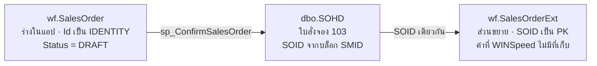
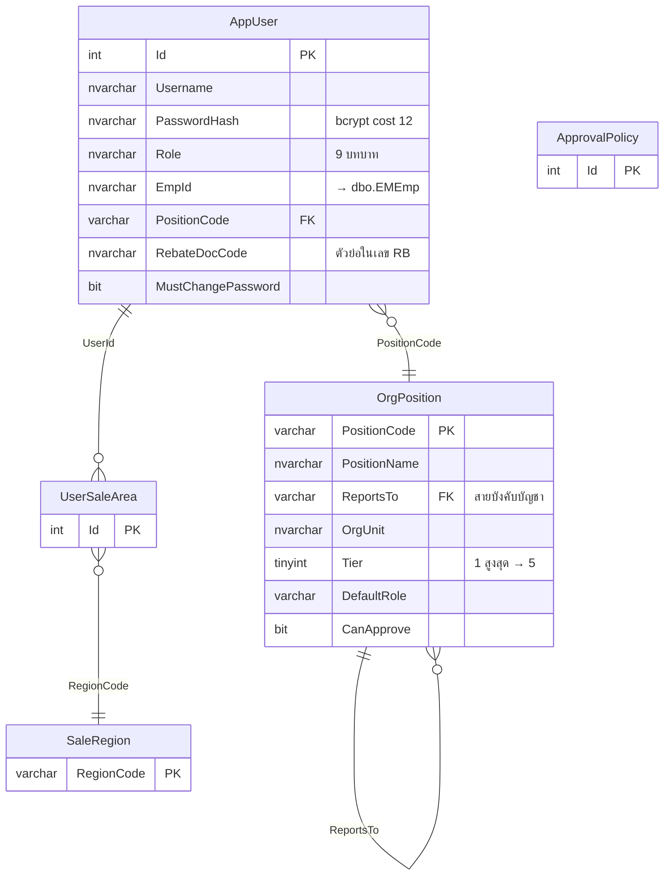
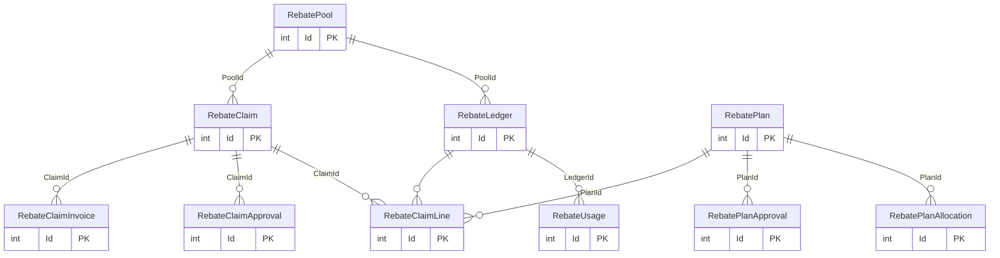

# โครงสร้าง schema `wf` พร้อม ERD

> **`wf` คือส่วนที่เราเป็นเจ้าของ · `dbo` คือของ WINSpeed ที่เราแตะได้จำกัด**
> กติกาข้อแรกของทั้งระบบ: เขียนได้เฉพาะ `wf` · `dbo` เป็น read-only โดยหลัก
> ข้อยกเว้นที่ได้รับอนุมัติมีรายการชัดเจนใน [`DOCUMENT-FLOW-TRACEABLE.md`](../08-APPENDICES/DOCUMENT-FLOW-TRACEABLE.md) §8

**นับได้จริงเมื่อ 3 ก.ย. 2569** — 60 ตาราง · 62 foreign key · 24 view · 6 stored procedure

---

## 1. อ่าน schema นี้ยังไง

`wf` แบ่งเป็น **7 กลุ่มงาน** ตารางในกลุ่มเดียวกันเกี่ยวข้องกันแน่น ข้ามกลุ่มเกี่ยวกันน้อย

| กลุ่ม | ตาราง | ทำอะไร |
|---|---|---|
| **ผู้ใช้และองค์กร** | 6 | ใครเป็นใคร อยู่ตำแหน่งไหน อนุมัติอะไรได้ |
| **ใบสั่งขาย** | 8 | ร่างใบสั่งขายก่อนส่งเข้า WINSpeed + ส่วนขยายหลังส่งแล้ว |
| **รีเบท** | 11 | กระเป๋าเงินรีเบท การตั้งยอด การเคลม การอนุมัติ |
| **ของแถม** | 5 | งบรายภาค การเบิก การยืม |
| **ราคา** | 4 | Price Book และราคาพิเศษ |
| **การชั่งและเอกสาร** | 6 | ใบชั่งของแอป · Paper Trail |
| **ระบบและการกำกับ** | 20 | migration · audit · outbox · PDPA · setting |

**หลักที่ใช้ทั้ง schema**

1. **`AppUser.Id` เป็นศูนย์กลาง** — 20 จาก 62 FK ชี้มาที่นี่ ทุกการกระทำผูกกับคนเสมอ
2. **ตารางที่ต่อกับ `dbo` ใช้ค่าจาก `dbo` เป็นคอลัมน์ธรรมดา ไม่ทำ FK ข้าม schema**
   เช่น `SalesOrder.CustId` เก็บรหัสลูกค้าของ WINSpeed แต่ไม่มี FK ไป `dbo.EMCust`
   **ตั้งใจ** — FK ข้ามไป `dbo` จะทำให้เราล็อกตารางของ WINSpeed โดยไม่ตั้งใจ
3. **มีคู่ `SalesOrder` / `SalesOrderExt`** — ก่อนและหลังส่งเข้า WINSpeed (ดู §3)

---

## 2. ERD — ภาพรวมทั้ง schema

```mermaid
erDiagram
    AppUser ||--o{ SalesOrder : "เจ้าของใบ"
    AppUser ||--o{ RebatePool : "กระเป๋ารีเบท"
    AppUser ||--o{ UserSaleArea : "เขตที่ดูแล"
    AppUser }o--|| OrgPosition : "ตำแหน่ง"
    OrgPosition ||--o{ OrgPosition : "ReportsTo"
    UserSaleArea }o--|| SaleRegion : ""

    SalesTrip ||--o{ SalesOrder : "เที่ยวรถ"
    SalesOrder ||--o{ SalesOrderLine : ""
    SalesOrder ||--o{ PaperTrail : ""
    SalesOrder ||--o{ Quotation : "ConvertedSoId"
    SalesOrderExt ||--o{ SalesOrderLineExt : ""

    Quotation ||--o{ QuotationLine : ""
    Quotation ||--o{ QuotationSourceSO : ""

    RebatePool ||--o{ RebateLedger : "ตั้งยอด"
    RebatePool ||--o{ RebateClaim : "เคลม"
    RebateLedger ||--o{ RebateUsage : "ตัดใช้"
    RebateLedger ||--o{ RebateClaimLine : ""
    RebateClaim ||--o{ RebateClaimLine : ""
    RebateClaim ||--o{ RebateClaimApproval : ""
    RebateClaim ||--o{ RebateClaimInvoice : ""
    RebatePlan ||--o{ RebatePlanAllocation : ""
    RebatePlan ||--o{ RebatePlanApproval : ""
    RebatePlan ||--o{ RebateClaimLine : ""

    BudgetPlan ||--o{ GiveawayBudget : ""
    GiveawayItem ||--o{ GiveawayItemMapping : ""
    AppUser ||--o{ GiveawayWithdrawal : ""
    AppUser ||--o{ GiveawayBorrowRequest : ""

    PriceBook ||--o{ PriceBookLine : ""
    PriceBook ||--o{ PriceBookSpecialPrice : ""

    AppUser ||--o{ WeighTicket : "ผู้ชั่ง"
    PaperCopy ||--o{ PaperScan : ""
```



> ตารางระบบ (`SchemaMigration` · `OutboxEvent` · `ApiAuditLog` · `ErrorLog` · `DsarLog` ·
> `SystemSetting` · `RetentionPolicy` · `LegacyTriggerBackup`) ไม่อยู่ในผังเพราะไม่ผูกกับใคร
> เป็นตารางบันทึกล้วน

---

## 3. กลุ่มใบสั่งขาย — ทำไมมีสองตาราง

นี่คือจุดที่คนใหม่สับสนบ่อยที่สุด



| | `wf.SalesOrder` | `wf.SalesOrderExt` |
|---|---|---|
| PK | `Id` (IDENTITY ของเรา) | **`SOID`** (เลขของ WINSpeed) |
| มีเมื่อไร | ตั้งแต่เริ่มร่าง | หลัง `sp_ConfirmSalesOrder` สร้างใบใน `dbo.SOHD` แล้ว |
| เก็บอะไร | ทุกอย่างของร่าง 30 คอลัมน์ | 25 คอลัมน์ที่ WINSpeed ไม่มีที่เก็บ เช่น `WeighOutWeight` `IsUnlocked` `IsLoaded` |
| หายไหมเมื่อ RESTORE | **หาย** — `.bak` ไม่มี schema `wf` | **หาย** เช่นกัน |

**ทำไมไม่รวมเป็นตารางเดียว** — ก่อนยืนยัน ใบยังไม่มี `SOID` เพราะเลขนั้นมาจากบล็อกของ WINSpeed
ถ้าใช้ตารางเดียวจะต้องมี PK ที่ว่างได้ครึ่งชีวิต ซึ่งทำ FK ไม่ได้และ join พลาดง่าย

**คอลัมน์สำคัญของ `SalesOrder`**

`Id*` `WfRef` `SoPrefix` `CustId` `CustName` `TruckPlate` `ControlTicketNo` `DeliveryDate`
`Status` `SalesUserId` `RebateDiscountAmt` `VerifiedBy` `VerifiedAt` `IsOwnTruck`
`NoTruckRequired` `CreditDays` `TranspId` `EnteredByUserId` `TripId`

**สถานะ** `DRAFT` → `PENDING_APPROVAL` → `CONFIRMED` → `PICKING` → `LOADED` → `SHIPPED` → `IMPORTED` · หรือ `CANCELLED`

> `PENDING_APPROVAL` **ไม่ได้เก็บในคอลัมน์** — คำนวณจาก `dbo.SOHD.AppvFlag='W' AND AppvDocuNo IS NULL`
> (migration 085) แปลว่าใบยืนยันแล้วแต่ยังรอเลข `AIyy` จากหน้าจอ WINSpeed

---

## 4. กลุ่มผู้ใช้และองค์กร



**บทบาท 9 อย่าง** `C_LEVEL` `ADMIN` `MANAGER` `ACCOUNTING` `APPROVER` `SALES` `COUNTER_SALES` `WAREHOUSE` `WEIGHBRIDGE`

> ⚠ **สิทธิ์จริงที่ backend ตรวจคือ `Role` ไม่ใช่ `PositionCode`**
> `OrgPosition.DefaultRole` บอกแค่ว่าตำแหน่งนี้ *ควร* เป็นบทบาทอะไร
> หน้าผังองค์กรเตือนเมื่อไม่ตรง แต่ไม่แก้ให้เอง เพราะเปลี่ยนบทบาท = เปลี่ยนสิทธิ์เข้าถึง

**สองวิวที่คำนวณสายอนุมัติ**

| วิว | ทำอะไร |
|---|---|
| `v_OrgChain` | recursive CTE ไต่ `ReportsTo` ขึ้นไปทุกชั้น (จำกัด 10 ชั้นกันวน) |
| `v_NearestApprover` | ชั้นที่ใกล้ที่สุดที่ `CanApprove = 1` |

---

## 5. กลุ่มรีเบท — กลุ่มที่ซับซ้อนที่สุด (11 ตาราง)



**เดินยังไง**

1. **`RebatePool`** = กระเป๋าเงินของพนักงานขายรายเดือน (`SalesUserId` + `PeriodYear` + `PeriodMonth`)
2. **`RebateLedger`** = ยอดที่ตั้งไว้จากใบสั่งขายแต่ละบรรทัด — **ตั้งตอน `SHIPPED` ไม่ใช่ตอน `CONFIRMED`**
3. **`RebateUsage`** = การตัดใช้แบบ FIFO
4. **`RebateClaim`** = ใบขอเคลม พร้อมสัดส่วนลูกค้า/บริษัท (`CustomerRatio` · `CompanyRatio` · `IsSelfClaim`)
5. **`RebatePlan`** = แผนจัดสรรงบรีเบทรายภาค

> ⚠ **รีเบทเป็นของพนักงานขายเจ้าของใบ (`SalesUserId`) ไม่ใช่คนที่กดปุ่มชั่งออก**
> เคยผิดมาแล้วตอนส่ง `req.user.sub` ทำให้ยอดไปเข้ากระเป๋าเจ้าหน้าที่เครื่องชั่ง

> ⚠ **ไม่มีแผน ≠ ราคาสุทธิ 0** — ถ้า `NetPricePerTon` ว่างต้องหยุด ไม่ใช่คิดเป็นศูนย์
> เคยคืนเต็มราคาขาย 163,400 บาท แทนที่จะเป็น 14,400 บาท

**เลขที่ใบคืนรีเบท** `RB[รหัสผู้ขอ]yy-NNN` — **3 หลัก** ยืนยันจาก 16,191 จาก 16,195 ใบจริง
`AppUser.RebateDocCode` คือรหัสผู้ขอ · เลขไม่มีตัวนับในระบบ อ่านลำดับล่าสุดจาก `dbo.SOInvHD` ตรง ๆ

---

## 6. กลุ่มการชั่ง — เปลี่ยนไปแล้วตั้งแต่ 3 ก.ย. 2569

| ตาราง | สถานะ | หมายเหตุ |
|---|---|---|
| `wf.WeighTicket` | **ยังใช้** | ใบชั่งที่ **แอป** บันทึกตอนกดชั่งออก (29 คอลัมน์) |
| `wf.WeighTicketItemLog` | ยังใช้ | ผลชั่งรายบรรทัดสินค้า |
| `wf.WeighInbox` | 🔴 **ตายแล้ว** | 220,396 แถวบน A · 271,963 บน B · ตัวป้อนคือ MySQL sync ซึ่งปิดไปแล้ว |
| `wf.TruckScaleSync` | 🔴 ตายแล้ว | watermark ของ sync ที่ปิดไปแล้ว |

**แหล่งข้อมูลการชั่งปัจจุบันคือ `dbo.WGHD` / `dbo.WGDT` / `dbo.WGDTReport` ของ WINSpeed**
แอป **อ่านอย่างเดียว** ไม่เขียนสามตารางนั้นเลย · รายละเอียดใน
[`DOCUMENT-FLOW-TRACEABLE.md`](../08-APPENDICES/DOCUMENT-FLOW-TRACEABLE.md) §9

> คอลัมน์ `ScaleWriteAction` `ScaleSid` `ScaleSequence` `ScaleWrittenAt` `ScaleError`
> ใน `WeighTicket` เป็นผลการเขียนกลับ MySQL ซึ่ง **เลิกใช้แล้ว** ไม่ลบทิ้งเพื่อเก็บประวัติ

---

## 7. ตารางระบบ

| ตาราง | ทำอะไร | ข้อควรรู้ |
|---|---|---|
| `SchemaMigration` | ทะเบียน migration | `FileName` `Checksum` `BatchCount` `AppliedAt` `AppliedBy` · นโยบาย `immutable-after-apply` |
| `OutboxEvent` | เหตุการณ์ integration | idempotent ด้วย `IdempotencyKey` · `SO_CONFIRMED` `SO_SHIPPED` · ~~`TRUCKSCALE_WRITEBACK`~~ |
| `SalesOrderAudit` | ประวัติสถานะใบสั่งขาย | `FromStatus` → `ToStatus` + `UserId` + `IpAddress` |
| `ApiAuditLog` | ทุก request | |
| `ErrorLog` | error ถาวร | |
| `AccessAsAudit` | การสวมสิทธิ์ผู้ใช้อื่น | |
| `DsarLog` · `RetentionPolicy` | PDPA | |
| `LegacyTriggerBackup` | สำรอง trigger ก่อนแก้ | |

---

## 8. Stored procedure ทั้ง 6 ตัว

| ชื่อ | ทำอะไร | เขียน `dbo` ไหม |
|---|---|---|
| `sp_ConfirmSalesOrder` | ย้ายร่างจาก `wf.SalesOrder` → `dbo.SOHD` (103) + `SODT` + remark | ✅ |
| `usp_AllocateWinspeedId` | ขอ id จากบล็อก `dbo.SMID` ตามกลไก WINSpeed | ✅ |
| `usp_AllocateCouponNo` | จองเลขตั๋วปุ๋ยเล่ม C/D กันซ้ำสามชั้น | ✅ |
| `usp_IssueSalesOrderCoupons` | ออกตั๋วปุ๋ยให้ใบที่แอปสร้าง (migration 098) | ✅ `dbo.WFCoupon` |
| `usp_WriteControlTicketRemark` | เขียนหมายเหตุตั๋วคุมลง `SOHDRemark` | ✅ |
| `usp_FindDeadEndDeliveries` | หาใบส่งขายที่เดินต่อไม่ได้ | ❌ อ่านอย่างเดียว |

> `SMID` **ไม่ใช่ IDENTITY** — WINSpeed แจก id เป็นบล็อกละ 1000 ต่อเครื่อง
> ใช้ `MAX+1` จะไปนั่งทับบล็อกที่จองให้เครื่องอื่นไว้

---

## 9. Views ทั้ง 24 ตัว

| กลุ่ม | วิว |
|---|---|
| ใบสั่งขาย | `v_AllSalesOrders` `v_AllSalesOrderLines` `v_SalesmanStatus` |
| ตั๋วคุม | `v_ControlTicket` `v_ControlTicketBalance` `v_ControlTicketDrawdown` |
| รีเบท | `v_RebateAccrualLot` `v_RebateAccrualRemaining` `v_RebateClaimTotals` `v_RebateDocCodeEvidence` `v_RebateRbReconciliation` |
| ใบคืนรีเบท (RB) | `v_RbBalance` `v_RbNumberIntegrity` `v_RbMissingNumbers` |
| ราคา | `v_CurrentPrice` `v_PriceBookEffective` |
| ของแถม/งบ | `v_GiveawayBudgetStatus` `v_BudgetPlanRegion` |
| องค์กร | `v_OrgChain` `v_NearestApprover` |
| ข้อมูลหลัก | `v_Customer` `v_FertGood` |
| คุณภาพข้อมูล | `v_TraceabilityHealth` `v_DeliveryCouponGaps` |

---

## 10. กติกาการแก้ schema

1. **แก้ผ่าน migration ใหม่เท่านั้น** — ห้ามแก้ไฟล์ที่รันไปแล้ว (`checksumPolicy=immutable-after-apply`)
2. **ห้ามมี `USE <database>` ในไฟล์ migration** — มี guard `assertNoDatabaseSwitch()` ดักไว้
   เคยทำให้ migration 074 เขียนผิดฐานมาแล้ว
3. **ห้าม `CREATE/ALTER/DROP` บน `dbo`** — เพิ่ม object ใหม่ให้ไปอยู่ใน `wf`
4. รันด้วย `DB_MODE` เท่านั้น และอ่านบรรทัด `Migration preflight for <TARGET>` ก่อนปล่อยให้เดินต่อ
5. ทำให้ครบทุกเครื่อง — `local` · `remote` (Azure) · `remote_b` (Hostinger) ต้องได้เลขเดียวกัน

**ตรวจว่าตรงกัน**

```bash
cd backend
for M in local remote remote_b; do
  printf "%-9s " "$M"; DB_MODE=$M node run_migrations.js --plan | grep "unchanged:"
done
```

ผลที่ต้องได้ — เลขเท่ากันทั้งสามบรรทัด และ `pending: 0; drift: 0`
