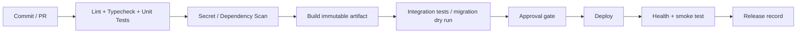

# Deployment, CI/CD and Environment Management

| รายการ | รายละเอียด |
|---|---|
| Document ID | `WF-OPS-001` |
| Product | WS-Sale-App — Sales Order, Warehouse Execution & Rebate Management |
| Client | World Fert Co., Ltd. |
| Version | v1.1 |
| Date | 24 กรกฎาคม 2569 (24 July 2026) |
| Owner | DevOps / IT |
| Status | Review — merged candidate; source verification required |
| Classification | Confidential — Client / Authorized Partner Use Only |

> **Merge provenance — 21 July 2026:** เอกสารต้นทาง v8.0 ถูกคงไว้เป็น v1.0 review candidate ตามนโยบาย `latest-document-wins`
> **Revision v1.1 — 24 July 2026:** เพิ่มปลายทาง deploy ที่ใช้งานจริง 3 แบบ, pipeline ที่ implement แล้ว
> และลำดับตั้ง DB ครั้งแรกที่บังคับ · รายละเอียดเชิงปฏิบัติดู `DEPLOY.md` (root) และ `WF-SEC-012` (Docker Deployment Guide)

---

## Environment model

| Environment | Purpose | Data | Access |
|---|---|---|---|
| Local | development | synthetic/sanitized | developer |
| DEV | integration | synthetic/sanitized | dev/QA |
| UAT | business validation | masked/approved | users/QA |
| PILOT | dual-run | controlled production-like | limited |
| PROD | live | production | least privilege |

Production data must not move to local/dev without written approval and masking.

---

## Deployment targets (as implemented)

ระบบรองรับ 3 ปลายทางพร้อมกัน — ใช้ระหว่างประเมินต้นทุนดูแล ความง่ายในการแก้ไข การโอนย้าย และความปลอดภัย

| | **A · Cloud PaaS** | **B · Coolify + VPS** | **C · On-Prem** |
|---|---|---|---|
| Frontend | Vercel | Coolify `wf-frontend` | container `wf-frontend` |
| Backend | Railway | Coolify `wf-backend` | container `wf-backend` |
| SQL Server | VM แยก | container `wf-databases` | container `wf-mssql` |
| MySQL | remote | container `wf-databases` | container `wf-mysql` |
| TLS | platform | Coolify (Traefik) | Caddy (Let's Encrypt) |
| Trigger | `git push` → auto | `git push` → webhook | `up.ps1` / `up.sh` |
| ชุดไฟล์ | `vercel.json` | `deploy/coolify/` | `deploy/onprem/` |

**ข้อจำกัดที่ยืนยันแล้ว:** SQL Server 2022 รันบน Railway ไม่ได้ (`sqlpal` misaligned log IO / stack overflow
จาก storage layer ที่ไม่รองรับ IO alignment) — Railway ใช้ได้เฉพาะ backend (Node)

**ข้อควรระวังเมื่อเปิดหลายปลายทางพร้อมกัน:** แต่ละปลายทางมีฐานข้อมูลของตัวเอง **ข้อมูลไม่ sync กัน**
ใช้เป็น staging / DR / เปรียบเทียบได้ แต่ห้ามให้ผู้ใช้จริงคีย์งานพร้อมกันมากกว่าหนึ่งปลายทาง

---

## CI pipeline target



### Pipeline ที่ implement แล้ว

```powershell
npm run deploy              # bump version -> migrate ทุกปลายทาง -> commit -> push
npm run deploy:minor        # / :major / :skip-migrate / :dry
```
`deploy.ps1` ทำ 4 ขั้น: bump version (root/backend/frontend) → migrate → commit → `git push origin main`
จากนั้นแต่ละ platform ที่เปิด auto-deploy ไว้จะดึงโค้ดไป build เอง

**Migration ยิงทุกปลายทางเป็นค่าเริ่มต้น** เพื่อกัน schema drift ระหว่างสภาพแวดล้อม:

| คำสั่ง | ปลายทาง |
|---|---|
| `npm run migrate` | **ทุกที่** (`local` + `remote` + `remote_b`) |
| `npm run migrate:plan` | ทุกที่ · read-only ไม่แตะ ledger |
| `npm run migrate:{local,remote,remote_b}` | เฉพาะที่ระบุ |

`backend/scripts/migrate-targets.js` spawn `run_migrations.js` แยก process ต่อปลายทางพร้อม env ที่แมปแล้ว
เปิด SSH tunnel ให้อัตโนมัติเมื่อจำเป็น ข้ามปลายทางที่ยังไม่ตั้งค่า และ **exit 1 ถ้าปลายทางใดล้มเหลว**
ทำให้ `deploy.ps1` หยุดก่อน push

---

## Release procedure

1. Approved CR.
2. Version/tag/release notes finalized.
3. Backup/recovery checkpoint.
4. Migration reviewed/dry-run (`npm run migrate:plan`).
5. CI checks pass.
6. Deploy artifact.
7. Health/critical smoke tests (`preflight-check.js`, `/api/health`).
8. Monitor release window.
9. Reconcile integration.
10. Close or rollback/forward-fix.

---

## 🚨 First-run database sequence (บังคับ ห้ามสลับลำดับ)

```
1) migrations/000_logins.sql     สร้าง LOGIN wf_reader / wf_owner (สิทธิ์ sysadmin)
2) node run_migrations.js        สร้าง schema wf
3) GRANT CONTROL/SELECT ON SCHEMA::wf
4) node seed_admin.js            สร้างผู้ใช้
```

**ทำไมลำดับสำคัญ**
- `001_wf_schema.sql` ครอบ GRANT ด้วย `IF EXISTS (... sys.database_principals ...)` → ถ้า login ยังไม่มี
  **GRANT จะถูกข้ามเงียบๆ ไม่มี error** ทำให้ `wf_owner` ไม่มีสิทธิ์เขียน schema `wf`
- ไฟล์ `.bak` ของ WINSpeed **ไม่มี schema `wf`** หลัง migrate `wf.AppUser` จะมีแต่บัญชี `emp-XXXXX`
  role `SALES` ทั้งหมด **ไม่มี ADMIN** → login ไม่ผ่านทุกบัญชี ระบบไม่มีใครดูแลได้

**เมื่อ RESTORE ทับ ต้องทำขั้น 1–4 ใหม่ทั้งหมด** (restore ลบ schema `wf` และ database user ทิ้ง)
สคริปต์ที่ทำครบให้แล้ว: `deploy/coolify/refresh-data.sh` · `deploy/onprem/bootstrap.sh`

**บัญชีเริ่มต้น:** `admin` / `W0rldF3rt` (`W0rld` ใช้เลขศูนย์) · พนักงานทุกคนได้รหัสเดียวกัน
→ **บังคับเปลี่ยนรหัสก่อน go-live** ถือเป็น release gate

---

## Container rules

- pinned/supported base image
- no secrets baked into image
- non-root process where possible
- health checks inspect app/dependencies but expose no secret
- frontend runtime configuration strategy documented
- retain deploy log, artifact digest and config version
- **`VITE_*` ถูก bake ตอน build** — เปลี่ยนโดเมนต้อง rebuild ไม่ใช่ restart
- **DB port ต้องผูก `127.0.0.1` เท่านั้น** — เข้าถึงจากภายนอกผ่าน SSH tunnel
- **`MSSQL_COLLATION=Thai_CI_AS` และ `TZ=Asia/Bangkok`** บังคับทุก container ที่แตะข้อมูลไทย/พ.ศ.

## Migration controls

- migration ledger with ID/checksum
- idempotent only by explicit design
- production migration uses controlled `wf_owner`
- external/dbo touch references ADR-003 and approval
- UAT/manual SQL ถูกกันออกจาก deploy path ด้วย `migration-policy.json` (pattern `^uat_`)
  — `uat_create_admin.sql` **ห้ามใช้ใน production** (เป็นของ UAT และมีบั๊ก)
- `--plan` เป็น read-only จึง bootstrap ledger ไม่ได้ — ครั้งแรกต้องรันแบบ apply

## Rollback

| Change | Strategy |
|---|---|
| stateless frontend/backend | redeploy previous artifact |
| additive wf schema | app rollback usually safe |
| destructive transform | backup + tested rollback or forward-fix |
| external WINSpeed action | compensation/reconciliation only |
| data migration | reconciliation/corrective migration |
| full DB restore | ต้องรัน first-run sequence ขั้น 1–4 ใหม่ทั้งหมด |
