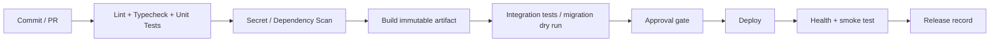

# Deployment, CI/CD and Environment Management

| รายการ | รายละเอียด |
|---|---|
| Document ID | `WF-OPS-001` |
| Product | WS-Sale-App — Sales Order, Warehouse Execution & Rebate Management |
| Client | World Fert Co., Ltd. |
| Version | v1.0 |
| Date | 28 มิถุนายน 2569 (28 June 2026) |
| Owner | DevOps / IT |
| Status | Review — merged candidate; source verification required |
| Classification | Confidential — Client / Authorized Partner Use Only |

> **Merge provenance — 21 July 2026:** เอกสารต้นทาง v8.0 ถูกคงไว้เป็น v1.0 review candidate ตามนโยบาย `latest-document-wins`; หากขัดกับเอกสารที่ใหม่กว่าหรือ source code ปัจจุบัน ให้ยึดหลักฐานล่าสุด และต้อง review/approve ก่อน baseline.

---

## Environment model

| Environment | Purpose | Data | Access |
|---|---|---|---|
| Local | development | synthetic/sanitized | developer |
| DEV | integration | synthetic/sanitized | dev/QA |
| UAT | business validation | masked/approved | users/QA |
| PILOT | dual-run | controlled production-like | limited |
| PROD | live | production | least privilege |

Production data must not move to local/dev without written approval and masking.

## CI pipeline target

## Release procedure

1. Approved CR.
2. Version/tag/release notes finalized.
3. Backup/recovery checkpoint.
4. Migration reviewed/dry-run.
5. CI checks pass.
6. Deploy artifact.
7. Health/critical smoke tests.
8. Monitor release window.
9. Reconcile integration.
10. Close or rollback/forward-fix.

## Container rules

- pinned/supported base image
- no secrets baked into image
- non-root process where possible
- health checks inspect app/dependencies but expose no secret
- frontend runtime configuration strategy documented
- retain deploy log, artifact digest and config version

## Migration controls

- migration ledger with ID/checksum
- idempotent only by explicit design
- production migration uses controlled `wf_owner`
- external/dbo touch references ADR-003 and approval

## Rollback

| Change | Strategy |
|---|---|
| stateless frontend/backend | redeploy previous artifact |
| additive wf schema | app rollback usually safe |
| destructive transform | backup + tested rollback or forward-fix |
| external WINSpeed action | compensation/reconciliation only |
| data migration | reconciliation/corrective migration |
