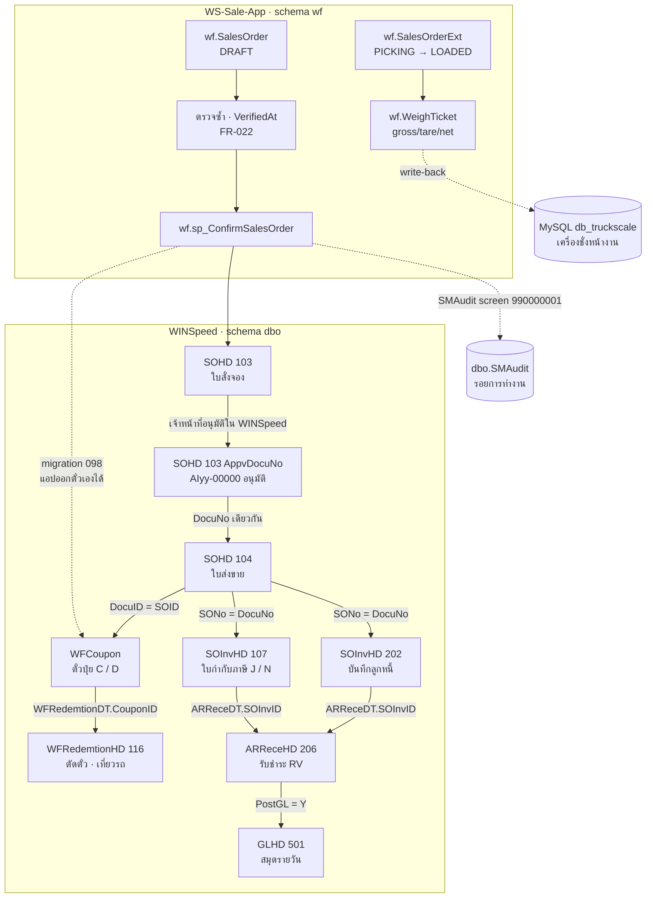

# Document Flow ที่สืบย้อนได้ — ทุกขั้นตอน ทุกจุดเชื่อม

> **เอกสารนี้ตอบคำถามเดียว: หยิบเลขเอกสารใบไหนก็ได้มาหนึ่งใบ แล้วเดินไปหน้า–ถอยหลังได้ครบทั้งสายหรือไม่**
>
> ทุกจุดเชื่อมในเอกสารนี้**รัน SQL จริงบนฐานผลิต** (Azure `dbwins_worldfert9`) เมื่อ 2 ก.ย. 2569
> ไม่มีข้อไหนอนุมานจากชื่อคอลัมน์ · ไม่มีคำสั่งใดเขียนลง `dbo`
> ขอบเขตที่ใช้วัด: **1 ต.ค. 2568 – 31 มี.ค. 2569** (`DocuDate` ก่อน 2026-04-01) ตามข้อจำกัดคุณภาพข้อมูลที่เจ้าของระบบแจ้งไว้

## สารบัญ

1. [สรุปหนึ่งหน้า](#1-สรุปหนึ่งหน้า)
2. [กฎการเชื่อม 6 ข้อ — คอลัมน์ไหนต่อกับคอลัมน์ไหน](#2-กฎการเชื่อม-6-ข้อ--คอลัมน์ไหนต่อกับคอลัมน์ไหน)
3. [กับดัก 5 ข้อที่ทำให้ trace ผิด](#3-กับดัก-5-ข้อที่ทำให้-trace-ผิด)
4. [ผังทั้งสาย](#4-ผังทั้งสาย)
5. [ขั้นตอนละเอียด ขั้นที่ 1–9](#5-ขั้นตอนละเอียด-ขั้นที่-19)
6. [Query สืบย้อนใบเดียว — คัดลอกไปใช้ได้ทันที](#6-query-สืบย้อนใบเดียว--คัดลอกไปใช้ได้ทันที)
7. [ความครบถ้วนของสายทั้งระบบ](#7-ความครบถ้วนของสายทั้งระบบ)
8. [แอปเขียนอะไรลง dbo บ้าง — ขอบเขตที่อนุมัติ](#8-แอปเขียนอะไรลง-dbo-บ้าง--ขอบเขตที่อนุมัติ)
9. [เอกสารชั่งเข้า–ชั่งออก (WGxx) — สถานะและสิ่งที่ยังขาด](#9-เอกสารชั่งเข้าชั่งออก-wgxx--สถานะและสิ่งที่ยังขาด)
10. [สิ่งที่ยังสืบย้อนไม่ได้](#10-สิ่งที่ยังสืบย้อนไม่ได้)

---

## 1. สรุปหนึ่งหน้า

**สายเอกสารสืบย้อนได้ครบทั้ง 7 ขั้น** จากใบสั่งจองถึงการรับชำระเงิน ยืนยันด้วยการเดินจริงทั้งสายบนใบ `K69-01039`

| ขั้น | เอกสาร | เลขในตัวอย่าง | วันที่ |
|---|---|---|---|
| 1 | ใบสั่งจอง (103) | `K69-01039` | 19 มี.ค. 2569 |
| 2 | ใบส่งขาย (104) | `K69-01039` | 26 มี.ค. 2569 |
| 3 | ตั๋วปุ๋ย (WFCoupon) | `D6902040` 29 ตัน · `D6902041` 3 ตัน | — |
| 4 | ตัดตั๋ว/เที่ยวรถ (116) | `69031565` ทะเบียน ขก70-8999/4723 | 26 มี.ค. 2569 |
| 5 | บันทึกลูกหนี้ (202) | `K69-01039` ฿463,700 · PostGL=Y | 26 มี.ค. 2569 |
| 6 | ใบกำกับภาษี (107) | `N69-00922` ฿463,700 · PostGL=Y | 26 มี.ค. 2569 |
| 7 | รับชำระหนี้ (206) | `RV69-00977` ฿463,700 | 29 เม.ย. 2569 |

**ข้อสรุปที่ต้องรู้ก่อนใช้เอกสารนี้**

- คอลัมน์ที่เชื่อมใบส่งขายกับใบกำกับ **คือ `SOInvHD.SONo` ไม่ใช่ `RefNo`** — `RefNo` เป็น NULL ทั้งคอลัมน์ในช่วงที่วัด
- `SOHD.RefSOID` เป็น **NULL ทั้ง 60,038 ใบ** — ขั้น 103 → 104 ไม่มี relational link ต่อกันด้วยเลขที่เดียวกันเท่านั้น
- ตั๋วปุ๋ยผูกกับ **ใบส่งขาย (104)** ผ่าน `WFCoupon.DocuID = SOHD.SOID` ไม่ได้ผูกกับใบสั่งจอง
- `dbo.WGHD` (โมดูลชั่งของ WINSpeed) ต่อกับใบสั่งจองผ่าน **`SPID = SOHD.SOID` 100 %** แต่ **สถานะการชั่งไม่ได้ปิด SO** — ดู §9

---

## 2. กฎการเชื่อม 6 ข้อ — คอลัมน์ไหนต่อกับคอลัมน์ไหน

ทุกแถวในตารางนี้วัดจริงในช่วง ต.ค. 2568 – มี.ค. 2569

| # | จาก | ไป | คอลัมน์ที่เชื่อม | อัตราเชื่อมติด |
|---|---|---|---|---|
| L1 | `SOHD` 103 | `SOHD` 104 | `DocuNo` เท่ากัน · `DocuType` ต่างกัน | **3,593 / 3,638 = 98.76 %** |
| L2 | `SOHD` 104 | `WFCoupon` | `WFCoupon.DocuID = SOHD.SOID` | **3,638 / 3,638 = 100 %** |
| L3 | `WFCoupon` | `WFRedemtionHD` (116) | `WFRedemtionDT.CouponID` → `RedemtionID` | **7,946 / 7,946 บรรทัด = 100 %** |
| L4 | `SOHD` 104 | `SOInvHD` 202 | `SOInvHD.SONo = SOHD.DocuNo` | **3,638 / 3,638 = 100 %** |
| L5 | `SOHD` 104 | `SOInvHD` 107 | `SOInvHD.SONo = SOHD.DocuNo` | **4,133 / 4,133 = 100 %** |
| L6 | `SOInvHD` | `ARReceHD` 206 | `ARReceDT.SOInvID` → `ARReceID` | **4,215 / 4,215 = 100 %** |

### กฎเล่มเอกสาร — ยืนยันจากคู่จริง ไม่ใช่จากความจำ

| ใบส่งขาย 104 | ใบกำกับ 107 | จำนวนคู่ | บันทึกลูกหนี้ 202 | จำนวนคู่ |
|---|---|---|---|---|
| เล่ม **I** | เล่ม **J** | 2,448 | เล่ม **I** (เลขเดียวกัน) | 1,911 |
| เล่ม **K** | เล่ม **N** | 1,685 | เล่ม **K** (เลขเดียวกัน) | 1,727 |

> ไม่มีคู่นอกกฎนี้แม้แต่คู่เดียวในช่วงที่วัด
> **บันทึกลูกหนี้ (202) ใช้เลขเดียวกับใบส่งขาย** ส่วนใบกำกับภาษี (107) ออกเลขใหม่คนละเล่ม

### ตัวนับเลขที่เอกสาร

| ชุดเลข | ตารางตัวนับ | RunCode |
|---|---|---|
| `Iyy-00000` ใบสั่งจอง/ใบส่งขาย เล่ม I | `dbo.EMRunBrch` | `103` |
| `Kyy-00000` ใบสั่งจอง/ใบส่งขาย เล่ม K | `dbo.EMRunBrch` | `104` |
| ตั๋วปุ๋ยเล่ม **D** | `dbo.EMRunBrch` | `couponno` |
| ตั๋วปุ๋ยเล่ม **C** | `dbo.EMRunChar` | `couponno` + Prefix `Cyy%` |

---

## 3. กับดัก 5 ข้อที่ทำให้ trace ผิด

| # | กับดัก | ผลถ้าไม่รู้ | ทางที่ถูก |
|---|---|---|---|
| T1 | **`DocuNo` ไม่ unique ข้าม `DocuType`** — `K69-01039` เป็นทั้ง 103 และ 104 | join แล้วได้แถวคูณสอง ยอดเงินเบิ้ล | ใส่ `DocuType` ในเงื่อนไข join **ทุกครั้ง** |
| T2 | **`SOInvHD.RefNo` เป็น NULL ทั้งคอลัมน์** | สรุปว่าใบกำกับไม่ผูกกับใบส่งขาย ทั้งที่ผูก 100 % | ใช้ `SOInvHD.SONo` |
| T3 | **`SOHD.RefSOID` เป็น NULL ทั้ง 60,038 ใบ 104** | เขียน join ด้วย `RefSOID` แล้วได้ 0 แถว | เชื่อ 103 → 104 ด้วย `DocuNo` เท่ากัน |
| T4 | **`GLDT.AccID` ไม่ใช่รหัสบัญชี** | อ่านผังบัญชีผิดทั้งรายงาน | join `dbo.EMAcc` เอา `AccCode` |
| T5 | **`WFRedemtionHD.DocuNo` เป็นเลขเที่ยวรถ (movebill) ตัวเลขล้วน** เช่น `69031565` ไม่ใช่เลขใบส่งขาย | join กับ `SOHD.DocuNo` ได้ **0 / 3,638 แถว** | เชื่อผ่าน `WFRedemtionDT.CouponID` → `WFCoupon.DocuID` |

---

## 4. ผังทั้งสาย



---

## 5. ขั้นตอนละเอียด ขั้นที่ 1–9

แต่ละขั้นตอบ 6 คำถามเดียวกัน: **ใครทำ · ทำที่ไหน · เกิดแถวที่ไหน · ได้เลขอะไร · พิสูจน์ยังไง · ถอยกลับยังไง**

---

### ขั้นที่ 0 — ร่างใบสั่งขายในแอป

| | |
|---|---|
| **ใครทำ** | `SALES` / `COUNTER_SALES` |
| **หน้าจอ** | หน้าขาย (POS) → `SalesPortal` |
| **API** | `POST /api/so` |
| **เขียนที่ไหน** | `wf.SalesOrder` · `wf.SalesOrderLine` (schema `wf` เท่านั้น ยังไม่แตะ `dbo`) |
| **เลขที่ได้** | `WfRef` จองล่วงหน้าเป็น `Iyy-00000` / `Kyy-00000` |
| **สถานะ** | `DRAFT` |

**ด่านที่ต้องผ่านก่อนไปขั้นถัดไป** (บังคับใน `routes/so.js`)

1. ต้องมีทะเบียนรถ หรือทำเครื่องหมาย "ไม่ใช้รถ"
2. ต้องผ่านการตรวจซ้ำโดย Counter-Sales — `wf.SalesOrder.VerifiedAt` ต้องไม่ว่าง (FR-022 · `ADMIN` ข้ามได้)
3. ถ้าลูกค้าติด Credit Hold ต้องมีผู้มีอำนาจตามนโยบาย `CREDIT_OVERRIDE` อนุมัติ (FR-003)
4. ราคาขายต่ำกว่าราคา NET เกิน **500 บาท/ตัน** → บล็อก ต้องผ่าน ผจก. 3 ท่าน
5. รายการของแถมทุกบรรทัดต้อง `GiveawayApprovalStatus = 'APPROVED'`
6. ถ้าผูกกับใบเสนอราคาที่ยัง `DRAFT`/`SENT`/`EXPIRED` → บล็อก

**ถอยกลับ** — `wf.SalesOrderAudit` เก็บทุกการเปลี่ยนสถานะพร้อม `UserId` และ IP

---

### ขั้นที่ 1 — ยืนยัน → เกิดใบสั่งจอง 103 ใน WINSpeed

| | |
|---|---|
| **ใครทำ** | `SALES` / `COUNTER_SALES` / `ADMIN` / `C_LEVEL` |
| **API** | `PATCH /api/so/:id/confirm` |
| **กลไก** | เรียก `wf.sp_ConfirmSalesOrder` ด้วย `ownerPool` |
| **เขียนลง dbo** | `dbo.SOHD` (`DocuType=103`) · `dbo.SODT` · `dbo.SOHDRemark` · `dbo.SODTRemark` |
| **เขียนต่อเนื่อง** | `dbo.EMRunBrch.LastNo` เดินตัวนับตาม (`advanceDocuNoCounter`) · `dbo.SMAudit` screen `990000001` · `wf.OutboxEvent` เหตุการณ์ `SO_CONFIRMED` |
| **เลขที่ได้** | `SOID` จาก **บล็อก `dbo.SMID`** (ไม่ใช่ IDENTITY) ผ่าน `wf.usp_AllocateWinspeedId` |

> **ทำไมต้องเดินตัวนับ** — แอปออกเลขเองจาก MAX+1 ถ้าไม่ผลัก `EMRunBrch.LastNo` ตาม
> หน้าจอ WINSpeed จะเสนอเลขที่แอปใช้ไปแล้วให้พนักงานคนถัดไป และชนกันไล่ไปทุกใบจนตัวนับตามทัน
> ตัวนับ **ไม่เคยถอยหลัง** — อัปเดตเมื่อเลขใหม่มากกว่าค่าเดิมเท่านั้น

**พิสูจน์**

```sql
-- ใบที่แอปสร้าง จะมีรอยใน SMAudit ช่วง 9900000xx ซึ่ง WINSpeed ไม่เคยใช้
SELECT audit_screen, audit_docuno, audit_datetime, audit_username
FROM   dbo.SMAudit
WHERE  audit_screen BETWEEN 990000001 AND 990000099
ORDER  BY audit_datetime DESC;
```

**ถอยกลับ** — `wf.SalesOrderExt.SOID` เก็บเลข `SOID` ที่ได้กลับมา จับคู่ร่างในแอปกับเอกสารใน WINSpeed ได้เสมอ

---

### ขั้นที่ 2 — อนุมัติใบสั่งจอง (ทำใน WINSpeed)

| | |
|---|---|
| **ใครทำ** | ผู้มีอำนาจอนุมัติ — **หน้าจอ WINSpeed เท่านั้น** แอปไม่ทำขั้นนี้ |
| **หน้าจอ** | `2098003080` อนุมัติใบสั่งจอง (WF) |
| **ผลที่เกิด** | `SOHD.AppvDocuNo` ได้เลข `AIyy-00000` · `AppvFlag` เปลี่ยน |
| **สถานะในแอป** | `PENDING_APPROVAL` จนกว่าจะมีเลข AI |

**กฎเล่ม** — `I → AI → C` และ `K → AI → D` (เล่มใบสั่งจอง → เล่มใบอนุมัติ → เล่มตั๋วปุ๋ย)

**พิสูจน์**

```sql
SELECT DocuNo, AppvDocuNo, AppvFlag, AppvDate
FROM   dbo.SOHD WHERE DocuType = 103 AND DocuNo = @DocuNo;
```

---

### ขั้นที่ 3 — ใบส่งขาย 104

| | |
|---|---|
| **ใครทำ** | เจ้าหน้าที่ WINSpeed (หน้าจอ `2098003049` ใบสั่งขาย (WF)) |
| **เลขที่ได้** | **เลขเดียวกับใบสั่งจอง** ต่างที่ `DocuType` |
| **ระยะห่างจากขั้น 1** | เฉลี่ย **10.4 วัน** · นานสุดที่วัดได้ **38 วัน** |

> ใบส่งขายต้อง **สืบทอดเล่มจากใบสั่งจอง** — ปุ่ม "รันเลขใบส่งขาย" ในบางหน้าจอไม่สืบทอดเล่ม
> เป็นต้นเหตุที่เคยได้เอกสารเล่มผิดมาแล้ว

**ค่าที่ต้องเป็นแบบนี้เสมอ** (วัดจาก 60,038 ใบ)

| คอลัมน์ | ค่า | จำนวน |
|---|---|---|
| `AppvFlag` | `W` | 60,038 / 60,038 |
| `CouponFlag` | `Y` | 60,037 / 60,038 |
| `RefSOID` | `NULL` | 60,038 / 60,038 |

> `CouponFlag='N'` บนใบ 104 คือ **สัญญาณว่าตั๋วปุ๋ยยังไม่ออก** ซึ่งจะทำให้ Post Invoice (WF) มองไม่เห็นเอกสาร

---

### ขั้นที่ 4 — ตั๋วปุ๋ย (WFCoupon)

| | |
|---|---|
| **เกิดตอนไหน** | ตอนบันทึกใบส่งขาย โดยกดปุ่ม **Calculate ในแท็บ Coupon ก่อน Save** |
| **เขียนที่ไหน** | `dbo.WFCoupon` |
| **ผูกกับใบส่งขายด้วย** | `WFCoupon.DocuID = SOHD.SOID` และ `WFCoupon.SONo = SOHD.DocuNo` |
| **เลขที่ได้** | เล่ม `C` (จากใบเล่ม I) หรือ `D` (จากใบเล่ม K) · รีเซ็ตลำดับเป็น `00001` ทุกปีพุทธ |

**กฎที่ถอดจาก 111,192 แถว — ไม่มีข้อยกเว้นแม้แต่แถวเดียว**

1. 1 บรรทัดสินค้า = 1 ใบตั๋วเสมอ
2. `SackQty × ContainQty ÷ 1000 = GoodQty`
3. `SUM(GoodQty ของตั๋วทั้งใบ) = SODT.GoodQty2`
4. `ContainQty` คงที่ต่อรหัสสินค้า (140 รหัส มีค่าเดียวทุกรหัส)
5. `GoodUnitID = SODT.GoodUnitID2` และ `GoodPrice = SODT.GoodPrice2`

**แอปทำขั้นนี้เองได้แล้ว** ตั้งแต่ migration `098_app_issue_coupons.sql` — จองเลขผ่าน `wf.usp_AllocateCouponNo`
ซึ่งกันเลขซ้ำสามชั้น: ล็อกแถวตัวนับด้วย `UPDLOCK/HOLDLOCK` · เลขถัดไป = `MAX(ตัวนับ, MAX เลขจริง) + 1` · ตรวจซ้ำก่อน INSERT

**พิสูจน์**

```sql
SELECT c.CouponNo, c.GoodName, c.GoodQty, c.SackQty, c.RemaQty
FROM   dbo.WFCoupon c
JOIN   dbo.SOHD h ON h.SOID = c.DocuID
WHERE  h.DocuType = 104 AND h.DocuNo = @DocuNo;
```

---

### ขั้นที่ 5 — ตัดตั๋ว / เที่ยวรถ (DocuType 116)

| | |
|---|---|
| **ใครทำ** | เจ้าหน้าที่เครื่องชั่ง — หน้าจอ `2098003052` (หน้าจอที่ใช้มากที่สุดในกลุ่ม WF) |
| **เขียนที่ไหน** | `dbo.WFRedemtionHD` (157,151 ใบ) · `dbo.WFRedemtionDT` (291,068 บรรทัด) |
| **`DocuType`** | **`116` ทุกใบ** ไม่มีค่าอื่น |
| **เลขที่ได้** | **movebill — ตัวเลขล้วน `YYMMxxxxx`** เช่น `69031565` ไม่มีตัวอักษรนำหน้า |

**นี่คือจุดที่ "ตั๋วกลายเป็นการส่งของจริง"** — หนึ่งเที่ยวรถตัดตั๋วได้หลายใบ และตั๋วหนึ่งใบถูกตัดได้หลายเที่ยว
ในตัวอย่าง `K69-01039` ตั๋ว `D6902040` (29 ตัน) และ `D6902041` (3 ตัน) ถูกตัดในเที่ยว `69031565` เที่ยวเดียวกัน

> **ทะเบียนรถที่ตัดตั๋วมักไม่ใช่ทะเบียนที่จองไว้** — ตัวอย่างจองไว้ `ตาก70-6185/86` แต่ตัดตั๋วด้วย `ขก70-8999/4723`
> เป็นเรื่องปกติของงานจริง แต่ต้องรู้ตอนกระทบยอด

**พิสูจน์**

```sql
SELECT rh.DocuNo AS movebill, rh.DocuDate, rh.CarLicense,
       c.CouponNo, rd.GoodQty, rd.PostInv, i.DocuNo AS InvNo
FROM   dbo.WFCoupon      c
JOIN   dbo.WFRedemtionDT rd ON rd.CouponID   = c.CouponID
JOIN   dbo.WFRedemtionHD rh ON rh.RedemtionID = rd.RedemtionID
LEFT   JOIN dbo.SOInvHD  i  ON i.SOInvID     = rd.SOInvID
JOIN   dbo.SOHD          h  ON h.SOID        = c.DocuID
WHERE  h.DocuType = 104 AND h.DocuNo = @DocuNo;
```

---

### ขั้นที่ 6 — บันทึกลูกหนี้ 202

| | |
|---|---|
| **เขียนที่ไหน** | `dbo.SOInvHD` `Docutype = 202` |
| **เลขที่ได้** | **เลขเดียวกับใบส่งขาย** (เล่ม I → I · K → K) |
| **ผูกกลับด้วย** | `SOInvHD.SONo = SOHD.DocuNo` |

---

### ขั้นที่ 7 — ใบกำกับภาษี 107

| | |
|---|---|
| **เขียนที่ไหน** | `dbo.SOInvHD` `Docutype = 107` (155,584 ใบทั้งฐาน) |
| **เลขที่ได้** | **เล่มใหม่** — I → `Jyy-00000` · K → `Nyy-00000` |
| **ผูกกลับด้วย** | `SOInvHD.SONo = SOHD.DocuNo` |
| **ลงบัญชีแล้วหรือยัง** | `PostGL = 'Y'` |

---

### ขั้นที่ 8 — รับชำระหนี้ 206 (จุดที่รีเบทลงบัญชีจริง)

| | |
|---|---|
| **เขียนที่ไหน** | `dbo.ARReceHD` `DocuType = 206` (55,285 ใบ) · `dbo.ARReceDT` รายบรรทัด |
| **เลขที่ได้** | เล่ม `RVyy-00000` |
| **ผูกกลับด้วย** | `ARReceDT.SOInvID → SOInvHD.SOInvID` |

> **รีเบทไม่ได้ลงบัญชีจากใบ RB** แต่ลงตอนรับชำระ — บัญชี `536201 ส่วนลด-รีเบท`
> ช่วง ต.ค. 2568 – มี.ค. 2569 มี **519 รายการ ยอด Dr 30,787,349.18 บาท**

---

### ขั้นที่ 9 — ลงสมุดรายวัน GL 501

| | |
|---|---|
| **เขียนที่ไหน** | `dbo.GLHD` `DocuType = 501` · `dbo.GLDT` |
| **ผูกกลับด้วย** | `GLDT.DocuNo` เก็บเลขเอกสารต้นทาง |
| **ผลที่วัดได้** | 206 จำนวน 1,550 ใบ → `PostGL='Y'` **1,455 ใบ (93.9 %)** |

**บัญชีที่ถูกแตะมากที่สุด** (ต.ค. 2568 – มี.ค. 2569)

| รหัส | ชื่อบัญชี | จำนวนรายการ | Dr | Cr |
|---|---|---|---|---|
| 112200 | ลูกหนี้-ค้างส่ง | 7,608 | 1,243,548,337 | 1,324,946,485 |
| 112100 | ลูกหนี้การค้าในประเทศ | 5,105 | 1,388,937,400 | 1,221,536,470 |
| 411001 | ขายสินค้า - เงินเชื่อ | 4,103 | 0 | 1,219,480,117 |
| **536201** | **ส่วนลด-รีเบท** | **519** | **30,787,349** | 0 |

> ⚠ `GLDT.AccID` **ไม่ใช่รหัสบัญชี** ต้อง join `dbo.EMAcc` เอา `AccCode` เสมอ (กับดัก T4)

---

## 6. Query สืบย้อนใบเดียว — คัดลอกไปใช้ได้ทันที

ใส่เลขใบส่งขาย (104) ลงในบรรทัดแรก แล้วรันได้เลย · **อ่านอย่างเดียว ไม่เขียนอะไรทั้งสิ้น**
ผลลัพธ์คือทั้งสาย 7 ขั้นในตารางเดียว

```sql
DECLARE @DocuNo varchar(30) = 'K69-01039';   -- ← ใส่เลขใบส่งขายตรงนี้

SELECT [ขั้น] = 'ขั้นที่ 1 · ใบสั่งจอง 103', DocuNo, DocuType,
       CONVERT(varchar(10), DocuDate, 120) AS DocuDate,
       Ref1 = TransRegistration, Ref2 = AppvDocuNo, Ref3 = CAST(SOID AS varchar(20))
FROM   dbo.SOHD WHERE DocuNo = @DocuNo AND DocuType = 103

UNION ALL
SELECT 'ขั้นที่ 2 · ใบส่งขาย 104', DocuNo, DocuType, CONVERT(varchar(10), DocuDate, 120),
       'CouponFlag=' + ISNULL(CouponFlag,'?'), 'AppvFlag=' + ISNULL(AppvFlag,'?'), CAST(SOID AS varchar(20))
FROM   dbo.SOHD WHERE DocuNo = @DocuNo AND DocuType = 104

UNION ALL
SELECT 'ขั้นที่ 3 · ตั๋วปุ๋ย', c.CouponNo, NULL, NULL,
       'คงเหลือ ' + CAST(c.RemaQty AS varchar(20)) + ' ตัน',
       'ออก '     + CAST(c.GoodQty AS varchar(20)) + ' ตัน', CAST(c.CouponID AS varchar(20))
FROM   dbo.WFCoupon c JOIN dbo.SOHD h ON h.SOID = c.DocuID
WHERE  h.DocuNo = @DocuNo AND h.DocuType = 104

UNION ALL
SELECT 'ขั้นที่ 4 · ตัดตั๋ว/เที่ยวรถ', rh.DocuNo, rh.DocuType, CONVERT(varchar(10), rh.DocuDate, 120),
       rh.CarLicense, 'ตัด ' + CAST(rd.GoodQty AS varchar(20)) + ' ตัน', CAST(rh.RedemtionID AS varchar(20))
FROM   dbo.WFRedemtionDT rd
JOIN   dbo.WFRedemtionHD rh ON rh.RedemtionID = rd.RedemtionID
JOIN   dbo.WFCoupon      c  ON c.CouponID     = rd.CouponID
JOIN   dbo.SOHD          h  ON h.SOID         = c.DocuID
WHERE  h.DocuNo = @DocuNo AND h.DocuType = 104

UNION ALL
SELECT 'ขั้นที่ 5 · บันทึกลูกหนี้ 202', DocuNo, Docutype, CONVERT(varchar(10), DocuDate, 120),
       'สุทธิ ' + CAST(NetAmnt AS varchar(20)), 'PostGL=' + ISNULL(PostGL,'?'), CAST(SOInvID AS varchar(20))
FROM   dbo.SOInvHD WHERE SONo = @DocuNo AND Docutype = 202

UNION ALL
SELECT 'ขั้นที่ 6 · ใบกำกับภาษี 107', DocuNo, Docutype, CONVERT(varchar(10), DocuDate, 120),
       'สุทธิ ' + CAST(NetAmnt AS varchar(20)), 'PostGL=' + ISNULL(PostGL,'?'), CAST(SOInvID AS varchar(20))
FROM   dbo.SOInvHD WHERE SONo = @DocuNo AND Docutype = 107

UNION ALL
SELECT 'ขั้นที่ 7 · รับชำระ 206', rh.DocuNo, rh.DocuType, CONVERT(varchar(10), rh.DocuDate, 120),
       'รับ ' + CAST(rd.ReceAmnt AS varchar(20)), 'ตัดใบ ' + ISNULL(rd.SOInvNo,''), CAST(rh.ARReceID AS varchar(20))
FROM   dbo.ARReceDT rd
JOIN   dbo.ARReceHD rh ON rh.ARReceID = rd.ARReceID
JOIN   dbo.SOInvHD  i  ON i.SOInvID   = rd.SOInvID
WHERE  i.SONo = @DocuNo AND rh.DocuType = 206

ORDER BY 1, 2;
```

### ถอยหลังจากเลขอื่น

| ถ้ามีเลขนี้ | หาเลขใบส่งขายด้วย |
|---|---|
| ใบกำกับ `Nyy` / `Jyy` | `SELECT SONo FROM dbo.SOInvHD WHERE DocuNo = @No AND Docutype = 107` |
| ใบรับชำระ `RVyy` | `ARReceDT.SOInvNo` หรือ join `SOInvID` กลับไป `SOInvHD.SONo` |
| เลขตั๋วปุ๋ย `Cyy` / `Dyy` | `SELECT SONo FROM dbo.WFCoupon WHERE CouponNo = @No` |
| เลขเที่ยวรถ (movebill) | `WFRedemtionDT.CouponID` → `WFCoupon.SONo` |
| เลขอนุมัติ `AIyy` | `SELECT DocuNo FROM dbo.SOHD WHERE AppvDocuNo = @No AND DocuType = 103` |

---

## 7. ความครบถ้วนของสายทั้งระบบ

ใบส่งขาย (104) ทั้งหมด **3,638 ใบ** ในช่วง 1 ต.ค. 2568 – 31 มี.ค. 2569

| ขั้น | เชื่อมติด | อัตรา | ที่ขาด |
|---|---|---|---|
| มีใบสั่งจอง 103 | 3,593 | **98.76 %** | 45 ใบ |
| ออกตั๋วปุ๋ยแล้ว | 3,638 | **100 %** | — |
| ตัดตั๋วแล้ว | 3,612 | **99.29 %** | 26 ใบ |
| มีบันทึกลูกหนี้ 202 | 3,638 | **100 %** | — |
| มีใบกำกับภาษี 107 | 3,612 | **99.29 %** | 26 ใบ |
| รับชำระแล้ว 206 | 3,454 | **94.94 %** | 184 ใบ |

**อ่านตัวเลขนี้ยังไง**

- **100 %** ในสามขั้นกลาง = สายเอกสารหลักไม่มีรูรั่วเชิงโครงสร้าง
- **45 ใบไม่มีใบสั่งจอง** — เป็นใบที่เปิดตรงที่ขั้นส่งของ ไม่ใช่ข้อมูลหาย
- **184 ใบยังไม่รับชำระ** — เป็นลูกหนี้ที่ยังไม่ครบกำหนด **ไม่ใช่ข้อบกพร่อง** (ตัวอย่าง `K69-01039` ส่งของ 26 มี.ค. รับเงิน 29 เม.ย. = 34 วัน)

---

## 8. แอปเขียนอะไรลง dbo บ้าง — ขอบเขตที่อนุมัติ

`dbo` เป็น **read-only โดยหลัก** ข้อยกเว้นทั้งหมดอยู่ในตารางนี้ ไม่มีจุดอื่น

| ตาราง | คำสั่ง | ทำไมต้องเขียน |
|---|---|---|
| `dbo.SOHD` | INSERT · UPDATE | `sp_ConfirmSalesOrder` สร้างใบสั่งจอง · อัปเดต `PkgStatus` ตอนจัดสินค้า |
| `dbo.SODT` | INSERT · UPDATE · DELETE | บรรทัดสินค้าของใบสั่งจอง |
| `dbo.SOHDRemark` · `dbo.SODTRemark` | INSERT · UPDATE · DELETE | หมายเหตุใบและหมายเหตุบรรทัด (ลำดับการโหลด/ตั๋วคุม) |
| `dbo.WFCoupon` | INSERT | ออกตั๋วปุ๋ยให้ใบที่แอปสร้าง (migration 098) |
| `dbo.EMRunBrch` · `dbo.EMRunChar` | UPDATE เฉพาะ `LastNo` | เดินตัวนับตามเลขที่แอปออกไปแล้ว · **ไม่เคยถอยหลัง** |
| `dbo.SMID` | INSERT | ขอบล็อก id ตามกลไกของ WINSpeed เอง |
| `dbo.SMAudit` | INSERT | บันทึกรอย screen `9900000xx` (ช่วงที่ WINSpeed ไม่ได้ใช้) |
| `dbo.EMCust` · `dbo.EMGood` · `dbo.EMSetPriceHD/DT` | UPDATE · INSERT | แก้ข้อมูลหลักผ่านหน้าจอ Master Data |

**ไม่มีคำสั่ง `DELETE FROM dbo.SOHD` ในโค้ดทั้งโปรเจกต์** — ตรวจแล้วทั้ง `routes/`, `services/`, `migrations/`

**รอยที่แอปทิ้งไว้ให้ผู้ตรวจ**

| ช่องทาง | เก็บอะไร |
|---|---|
| `dbo.SMAudit` screen 990000001–990000004 | ยืนยัน SO · จัดสินค้า · ปลดล็อก · ชั่งออก |
| `wf.SalesOrderAudit` | ทุกการเปลี่ยนสถานะ พร้อม `UserId` · IP · สถานะเดิม/ใหม่ |
| `wf.ApiAuditLog` | ทุก request ที่เข้ามา |
| `wf.OutboxEvent` | เหตุการณ์ integration แบบ idempotent (`SO_CONFIRMED`, `SO_SHIPPED`, `TRUCKSCALE_WRITEBACK`) |

---

## 9. สถานะการชั่งรถ (WGxx) — จุดเชื่อมที่ถูกต้อง

ตั้งแต่ **3 ก.ย. 2569** สถานะการชั่งอ่านจาก **WINSpeed `dbo.WGHD` / `dbo.WGDT` / `dbo.WGDTReport`**
MySQL ของ TruckScale **ยกเลิกทั้งหมดแล้ว** และแอป **ไม่เขียนสามตารางนี้เลย** อ่านอย่างเดียว รีเฟรชทุก 1 นาที

### 9.1 จุดเชื่อมคือ `SPID` ไม่ใช่ `DocuNo`

> ⚠ **แก้จากที่เคยสรุปไว้ผิดในฉบับ 2 ก.ย.** — ตอนนั้นผมผูกด้วย `WGHD.DocuNo` แบบสตริง
> เจ้าของระบบให้พจนานุกรมข้อมูลมา 3 ก.ย. แล้วตรวจกับฐานจริงจึงพบว่าตัวเชื่อมจริงคือ `SPID`

| จาก | ไป | คอลัมน์ | อัตราเชื่อมติด |
|---|---|---|---|
| `WGHD` (WGType `SO`) | `SOHD` | `WGHD.SPID = SOHD.SOID` | **141 / 141 = 100 %** |
| `WGHD` (WGType `PO`) | `POHD` | `WGHD.SPID = POHD.POID` | 0 / 32 — ข้อมูลทดสอบยังไม่ผูก |
| `WGHD` | `EMDriver` | `WGHD.EMDriverId = EMDriver.Id` | 129 / 181 |
| `WGDT` | `WGHD` | `WGDT.WGHDId = WGHD.Id` | 311 / 311 |
| `WGDT` | `EMSTOType` | `WGDT.STOCode = EMSTOType.STOCode` | 16 คลังในทะเบียน |

**`SPID` ชี้ที่ใบสั่งจอง (DocuType 103) เสมอ — 141/141** ไม่เคยชี้ที่ใบส่งขาย
สมเหตุสมผล เพราะรถมาถึงตามใบจอง แล้วใบส่งขายเกิดหลังชั่ง

**ห้ามใช้ `WGHD.DocuNo` เป็นตัวเชื่อม** — ตรงกับ `SOHD.DocuNo` ของ `SPID` เพียง **117 / 141**

### 9.2 พจนานุกรมข้อมูล

| คอลัมน์ | ความหมาย |
|---|---|
| `WGType` | `SO` ขายออก → `SOHD`/`SODT` · `PO` ซื้อเข้า → `POHD`/`PODT` · `MO` เคลื่อนย้ายภายใน |
| `SPID` | ID เอกสารต้นทางตามชนิด |
| `CVID` `CVCode` `CVName` | ลูกค้า (SO) หรือผู้ขาย (PO) — เก็บ Code/Name ไว้ในตัวแล้ว ไม่ต้อง join |
| `CarNo` · `EMDriverId` | ทะเบียนรถ · คนขับ |
| `MoveBill` | running number ปกติขึ้นต้นด้วยปี พ.ศ. สองหลัก |
| `STOCode` | คลัง → `EMSTOType` |
| `CouponNo` (ที่ `WGDT`) | เลขตั๋วคุมที่ถูกตัดในเที่ยวนี้ |
| หน่วย | น้ำหนักเป็น **กิโลกรัม** · Ton = ตัน · Kasob = กระสอบ · **1 กระสอบ = 50 กก.** |

### 9.3 สถานะ 1 → 2 → 3

| สถานะ | ความหมาย | ค่าที่เกิด |
|---|---|---|
| **1** | รถลงทะเบียน รอเข้าชั่ง | — |
| **2** | ชั่งเข้าแล้ว | `WeightIn` · `DateIn` |
| **3** | ชั่งออกแล้ว | `WeightOut` · `DateOut` · `WeightNet` ⇒ **SO ถือว่า SHIPPED** |

**ทิศทางน้ำหนักสุทธิขึ้นกับ `WGType`** — พบเพิ่มระหว่างทดสอบ ไม่ได้อยู่ในพจนานุกรมที่ให้มา

| ชนิด | รถขาเข้า | รถขาออก | สูตร |
|---|---|---|---|
| `SO` ขายออก | เปล่า | หนัก | `WeightOut − WeightIn` |
| `PO` ซื้อเข้า | หนัก | เปล่า | `WeightIn − WeightOut` |

ยืนยันจาก 15 แถวที่มีครบสามค่า — SO 10/11 ตรงกับ out−in · PO แถวเดียวที่มีส่วนต่างจริง (Id 64) ตรงกับ in−out
โค้ดจึง **แสดงค่า `WeightNet` ที่เก็บไว้เสมอ ไม่คำนวณทับ** และใช้สูตรตามทิศทางเป็นตัวตรวจสอบ

### 9.4 ⚠ สถานะ 3 **ไม่ได้** ปิด SO ในฝั่ง WINSpeed

ตรวจใบ SO ที่สถานะ 3 ทั้ง 11 ใบ — `SOHD` ของทุกใบยังเป็น
`clearflag = 'N'` · `CouponFlag = 'N'` · `DocuStatus = 'Y'` **เหมือนใบที่ยังไม่เคยชั่ง**

**แปลว่า WINSpeed ไม่ได้เดินสถานะเอกสารตามการชั่ง** — สิ่งที่ปิด SO จริงยังคงเป็นการตัดตั๋วปุ๋ย (ขั้นที่ 5)
"สถานะ 3 = SHIPPED" จึงเป็น **กติกาทางธุรกิจที่แอปเป็นผู้ตีความ** ไม่ใช่สิ่งที่ฐานข้อมูลบันทึกไว้
แอปแสดงเป็น `SoStage` ในผลลัพธ์ `/api/weighing/live` และ **ไม่เขียนกลับไปที่ใด**

### 9.5 สภาพข้อมูลวันนี้ — ยังเป็นชุดทดสอบ

| ตัวเลข | ค่า |
|---|---|
| ใบชั่งทั้งหมด | 181 (SO 141 · PO 32 · MO 4 · ไม่ระบุ 4) |
| แยกตามสถานะ | รอเข้าชั่ง 160 · ชั่งเข้าแล้ว 6 · ชั่งออกแล้ว 15 |
| มีน้ำหนักสุทธิ > 0 | **5** |
| `CouponNo` ที่มีค่า | **0 จาก 311 บรรทัด** |
| ช่วงข้อมูล | 8 พ.ค. – 25 มิ.ย. 2569 · ชั่งออกครั้งล่าสุด 26 พ.ค. |
| แถวที่ตัวเลขขัดกันเอง | **11** (ดู `/api/weighing/anomalies`) |

### 9.6 API และหน้าจอ

`/api/weighing` — **อ่านอย่างเดียว ไม่มี endpoint ที่เขียน WGxx**

`live` · `anomalies` · `coverage` · `tickets` · `tickets/:id` · `by-date` · `by-product` · `by-godown` · `by-customer` · `by-so`
กรองด้วย `?type=SO|PO|MO` · จำกัด 500 แถวต่อครั้ง · ค่า type ที่ไม่รู้จักตอบ 400

หน้าจอ **สถานะการชั่งรถ** 8 แท็บ เริ่มที่ "สถานะสด" · รีเฟรชเองทุก 1 นาที · หยุดชั่วคราวได้
ไม่ยิงคิวรีตอนแท็บเบราว์เซอร์ถูกซ่อน · แท็บสถานะสดไม่ผูกกับช่วงวันที่ เพื่อไม่ให้รถที่ค้างจากเมื่อวานหายไป

### 9.7 MySQL TruckScale — ปิดหมดแล้ว

| จุด | สถานะ |
|---|---|
| `services/truckscale-db.js` | `getPool()` คืน `null` ทั้งชั้น · เปิดกลับด้วย `TRUCKSCALE_MYSQL=on` |
| `services/truckscale-sync.js` | worker ไม่ถูกสตาร์ท |
| `/api/truckscale` · `/api/scale-reports` | comment ออกจาก `server.js` |
| write-back ตอนชั่งออก · ใบชั่งล่วงหน้า | ตัดออกจาก `routes/so.js` |
| health check | รายงาน `mysql: "disabled"` แยกจาก `"down"` |

**ไม่ลบไฟล์ใดเลย** ตามคำสั่งเจ้าของระบบ

---

## 10. สิ่งที่ยังสืบย้อนไม่ได้

| # | ช่องว่าง | ความรุนแรง | หมายเหตุ |
|---|---|---|---|
| D-1 | **103 → 104 ไม่มี relational link** — `RefSOID` NULL ทั้งคอลัมน์ | 🟠 ออกแบบ | ตามตั๋วคุมอัตโนมัติไม่ได้ · ต้องอาศัย `SOHDRemark` ที่เป็นข้อความอิสระ |
| D-2 | **RB (ใบรีเบท) ไม่มีตัวนับใน `EMRunBrch`** | 🟠 ควบคุม | เลขพิมพ์มือ เสี่ยงซ้ำ/ข้าม · RB หยุดออกตั้งแต่ 5 มี.ค. 2569 |
| D-3 | **RB ไม่ลง GL** | 🟡 ควบคุม | รีเบทลงบัญชีที่ 536201 ตอนรับชำระแทน |
| W-1 | สถานะชั่ง 3 ไม่ได้เดินสถานะเอกสารใน `SOHD` — แอปเป็นผู้ตีความว่า = SHIPPED | 🟠 ออกแบบ | ดู §9.4 |
| W-2 | `WGDT.CouponNo` ว่างทั้ง 311 บรรทัด — ผูกใบชั่งกับตั๋วคุมยังทำไม่ได้ | 🟡 รอข้อมูลจริง | ดู §9.5 |
| ~~R-1~~ | ~~`RptSent` / `ReportKangChang`~~ | ✅ **ยกเลิก** | เจ้าของระบบสั่งไม่ต้องทำต่อ 03/09/2569 |

### คำถามถึง Prosoft — ปิดไปแล้ว 2 ข้อ

| # | คำถามเดิม | สถานะ |
|---|---|---|
| 1 | WGHD ผูกกับ SOHD อย่างไร | ✅ **ตอบแล้ว** — `SPID = SOHD.SOID` (เจ้าของระบบให้พจนานุกรม 03/09/2569) |
| 2 | ใครเติม `WGDT.CouponNo` | 🟡 ยังไม่มีข้อมูลจริง — ว่างทั้ง 311 บรรทัด |
| 3 | ปุ่ม Calculate เรียกจากภายนอกได้ไหม | ✅ **ไม่ต้องถามแล้ว** — แอปไม่บันทึกผลชั่งเอง อ่านอย่างเดียว |

---

## ภาคผนวก — ที่มาของตัวเลขทุกตัวในเอกสารนี้

| ตัวเลข | คำสั่งที่ใช้วัด |
|---|---|
| อัตราเชื่อม L1–L6 | `LEFT JOIN` + `COUNT` บนช่วง `DocuDate >= '2025-10-01' AND < '2026-04-01'` |
| กฎเล่มเอกสาร | `GROUP BY LEFT(DocuNo,1)` ทั้งสองฝั่งของ join |
| `RefSOID` NULL 60,038 | `SUM(CASE WHEN RefSOID IS NOT NULL THEN 1 ELSE 0 END)` บน `DocuType=104` |
| บัญชี GL | `GLHD` JOIN `GLDT` JOIN `EMAcc` · `GROUP BY AccCode` |
| ระยะ 103→104 | `AVG/MAX(DATEDIFF(day, b.DocuDate, d.DocuDate))` |
| WGxx ทุกตัวเลข | นับตรงบน `dbo.WGHD` / `dbo.WGDT` / `dbo.WGDTReport` |

**ทุก query รันด้วย `readerPool` (`wf_reader`) ซึ่งไม่มีสิทธิ์เขียน `dbo`**
