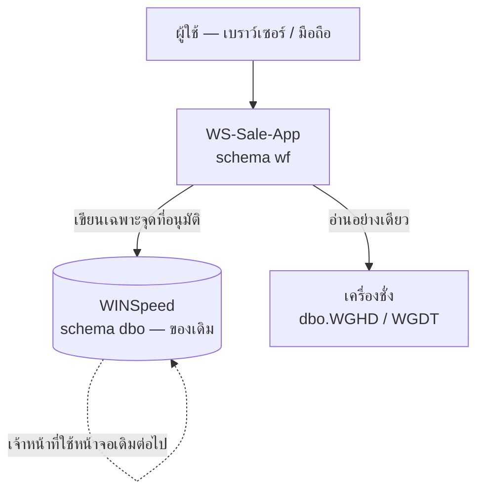
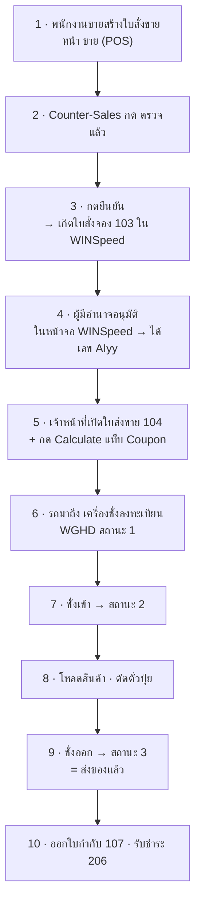

# คู่มือฉบับสมบูรณ์ — WS-Sale-App v1.9.10

> **เอกสารนี้เขียนให้คนสองกลุ่ม**
> **ผู้ใช้งาน** — อ่าน §1, §8, §9 (ข้ามส่วนเทคนิคได้)
> **นักพัฒนาที่เพิ่งเข้าทีม** — อ่านตามลำดับตั้งแต่ §2 และ **อย่าข้าม §10** ซึ่งเป็นกับดักที่เคยทำให้เสียเวลาไปแล้วจริง

---

## สารบัญ

| § | หัวข้อ | สำหรับ |
|---|---|---|
| 1 | ระบบนี้คืออะไร ตอบปัญหาอะไร | ทุกคน |
| 2 | สถาปัตยกรรม — ชิ้นส่วนและที่อยู่ | นักพัฒนา |
| 3 | ขั้นวิเคราะห์ — ข้อจำกัดที่กำหนดทุกอย่าง | นักพัฒนา |
| 4 | ขั้นออกแบบ — ตัดสินใจอะไรไว้บ้าง เพราะอะไร | นักพัฒนา |
| 5 | ขั้นติดตั้งเครื่องนักพัฒนา | นักพัฒนา |
| 6 | ขั้นทดสอบ — วิธีและผลจริง | นักพัฒนา · QA |
| 7 | ขั้น Deploy — 3 ปลายทางที่เปิดใช้ | นักพัฒนา · IT |
| 8 | Flow การทำงานประจำวัน (หลังเลิกใช้ MySQL) | **ผู้ใช้งาน** |
| 9 | คู่มือรายหน้าจอ | **ผู้ใช้งาน** |
| 10 | กับดัก 10 ข้อที่เคยทำให้เสียเวลาจริง | นักพัฒนา |
| 11 | ตรวจรับ — รายการที่ต้องผ่านทั้งหมด | ทุกคน |

---

## 1. ระบบนี้คืออะไร

World Fert ใช้ **Prosoft WINSpeed 9.0** เป็นระบบ ERP หลัก — ขาย สต็อก บัญชี ครบ
แต่หน้าจอ WINSpeed เป็นโปรแกรม Windows ที่ต้องติดตั้งบนเครื่อง ใช้จากนอกโรงงานไม่ได้
และงานบางอย่าง (รีเบท ของแถม ตั๋วคุม การควบคุมเอกสาร) **ไม่มีที่เก็บใน WINSpeed เลย**

**WS-Sale-App คือชั้นที่คร่อมอยู่บน WINSpeed** ไม่ใช่ระบบที่มาแทน



**กติกาข้อแรกที่กำหนดทุกอย่างที่เหลือ**

> **`dbo` เป็นของ WINSpeed — เขียนได้เฉพาะจุดที่ได้รับอนุมัติไว้เป็นรายการ**
> เพราะถ้าเราแก้โครงสร้าง `dbo` แล้ว WINSpeed อัปเดตรุ่น ระบบจะพังทั้งโรงงาน
> และเราจะไม่มีทางรู้ว่าพังเพราะอะไร

---

## 2. สถาปัตยกรรม

### 2.1 ชิ้นส่วน

| ชิ้น | เทคโนโลยี | หน้าที่ |
|---|---|---|
| Frontend | React + TypeScript + Vite + Tailwind | หน้าจอทั้งหมด |
| Backend | Node.js + Express | API · กติกาธุรกิจ · ด่านตรวจ |
| ฐานข้อมูล | SQL Server (`dbwins_worldfert9`) | `dbo` = WINSpeed · `wf` = ของเรา |
| ~~MySQL~~ | ~~`db_truckscale`~~ | 🔴 **ถอดออกหมดแล้ว** — โค้ดเลิกเรียก 3 ก.ย. · ตารางตกค้าง (`wf.WeighInbox` 220,396 แถว + `WGxxBackup_*` 3 ตาราง) ถูก DROP ด้วย migration 106 เมื่อ 5 ก.ย. 2569 |

### 2.2 สภาพแวดล้อมทั้งหมด

| ชื่อ | Frontend | Backend | ฐานข้อมูล | สถานะ 5 ก.ย. 2569 |
|---|---|---|---|---|
| **Localhost** | Vite `:5173` | `:3000` | เลือกด้วย `DB_MODE` | 🟢 เปิดใช้ — เครื่องนักพัฒนา |
| **Docker on-prem** | `wf-frontend` | `wf-backend` | `mssql` ในคอนเทนเนอร์ | 🟢 เปิดใช้ — ชุดติดตั้งในโรงงาน |
| **PROD-B** | Hostinger | Hostinger | **Hostinger** `76.13.190.104` | 🟢 เปิดใช้ |
| **UAT** | — | บน VPS | `dbwins_worldfert9_test` @ Hostinger | 🟢 เปิดใช้ — ทดสอบ |
| ~~PROD-A~~ | ~~Vercel~~ | ~~Railway~~ | ~~Azure~~ | ⏸ **พักใช้งานชั่วคราว** |

> ⏸ **PROD-A (Railway + Vercel + Azure) ถูกพักตามคำสั่งเจ้าของระบบเมื่อ 5 ก.ย. 2569**
> จะเปิดกลับเมื่อได้รับแจ้ง · ระหว่างนี้ข้าม deploy และ test ช่องทางนี้ทั้งหมด
> ในโค้ดสะท้อนด้วย `SUSPENDED_TARGETS = ['remote']` ใน `backend/scripts/migrate-targets.js`
> — **จงใจไม่ลบ `'remote'` ออกจาก `ALL_TARGETS`** เพื่อให้เปิดกลับได้ด้วยการแก้บรรทัดเดียว

> PROD-B **ต้อง deploy มือ** — `/opt/worldfert/app` ไม่ใช่ git repo
> ตั้งแต่ v1.9.10 มี GitHub Actions (`deploy-prod-b.yml`) ทำแทนได้ แต่ยังต้องติดตั้ง self-hosted runner ก่อน

### 2.3 ที่เก็บความลับ

ดู [`CREDENTIALS-AND-SECRETS.md`](05-SECURITY-DEVOPS/CREDENTIALS-AND-SECRETS.md) — สรุปสั้น:
รหัสผู้ใช้เป็น **bcrypt cost 12** ใน `wf.AppUser.PasswordHash` · ความลับอื่นอยู่ใน `.env` และ
`.local-secrets/` ซึ่ง **ไม่มีอะไรอยู่ใน git เลย** (ตรวจแล้ว)

---

## 3. ขั้นวิเคราะห์ — ข้อจำกัดที่กำหนดทุกอย่าง

ก่อนเขียนโค้ดบรรทัดแรก ต้องเข้าใจ 6 ข้อนี้ ไม่งั้นจะออกแบบผิดตั้งแต่ต้น

### 3.1 `dbo` แก้ไม่ได้

เจ้าของระบบสั่งไว้ตรง ๆ:

> *"เราจะไม่แก้อะไรใน dbo schema ครับ ฉะนั้น ต้องปรับ App ให้ทำงานร่วมกับ dbo ให้ถูกต้อง
> หากจะเป็น สามารถเพิ่ม wf schema มาช่วยดำเนินการร่วมเพื่อให้ app ทำงานได้ถูกต้อง"*

ผลคือทุกอย่างที่เราต้องเก็บเพิ่มต้องไปอยู่ใน `wf` และต้องผูกกลับด้วยคีย์ของ WINSpeed

### 3.2 WINSpeed ไม่ได้ใช้ IDENTITY

`SOID` `CouponID` `audit_id` **มาจากบล็อกละ 1000 ต่อเครื่อง** ผ่าน `dbo.SMID`
ใช้ `MAX+1` จะไปนั่งทับบล็อกที่จองให้เครื่องอื่นไว้ แล้วชนกันภายหลัง

### 3.3 `DocuNo` ไม่ unique ข้าม `DocuType`

`K69-01039` เป็นทั้งใบสั่งจอง (103) และใบส่งขาย (104) — คนละใบ
**ทุก join ต้องระบุ `DocuType` เสมอ**

### 3.4 ข้อมูลหลัง 31 มี.ค. 2569 เชื่อไม่ได้

เจ้าของระบบแจ้งไว้ — ทุกคิวรีที่ใช้สรุปตัวเลขต้องกรอง `DocuDate < '2026-04-01'`

### 3.5 รีเบทลงบัญชีตอนรับชำระ ไม่ใช่ตอนออกใบ RB

ลงที่บัญชี `536201 ส่วนลด-รีเบท` ในใบรับชำระ 206
**ใบ RB ไม่ลง GL เลย** และไม่มีตัวนับเลขในระบบ

### 3.6 เครื่องชั่งไม่ได้ปิด SO ให้

ตรวจใบ SO ที่ชั่งครบทั้ง 11 ใบ — `SOHD` ยังเป็น `clearflag='N'` `CouponFlag='N'`
เหมือนใบที่ไม่เคยชั่ง **สิ่งที่ปิด SO จริงคือการตัดตั๋วปุ๋ย**

---

## 4. ขั้นออกแบบ — ตัดสินใจอะไรไว้ เพราะอะไร

| # | ตัดสินใจ | เหตุผล |
|---|---|---|
| D1 | เพิ่ม schema `wf` แทนการแก้ `dbo` | ข้อ 3.1 · WINSpeed อัปเดตรุ่นได้โดยไม่กระทบเรา |
| D2 | ไม่ทำ FK ข้ามไป `dbo` | FK จะล็อกตารางของ WINSpeed โดยไม่ตั้งใจ |
| D3 | แยก `SalesOrder` / `SalesOrderExt` | ก่อนยืนยันยังไม่มี `SOID` · PK ที่ว่างได้ครึ่งชีวิตทำ FK ไม่ได้ |
| D4 | ขอ id ผ่าน `usp_AllocateWinspeedId` | ข้อ 3.2 |
| D5 | เขียนรอยลง `dbo.SMAudit` screen `9900000xx` | ผู้ตรวจ ISO ต้องเห็นว่าเอกสารที่โผล่ใน WINSpeed มาจากไหน · ช่วงเลขนี้ WINSpeed ไม่ได้ใช้ |
| D6 | เดินตัวนับ `dbo.EMRunBrch` ตามหลังออกเลข | ไม่งั้นหน้าจอ WINSpeed เสนอเลขที่ถูกใช้ไปแล้ว |
| D7 | ตั้งรีเบทตอน `SHIPPED` ไม่ใช่ `CONFIRMED` | ของออกจากโรงงานจริงแล้วค่อยตั้งยอด |
| D8 | รีเบทเป็นของ `SalesUserId` | เคยผิดจนยอดไปเข้ากระเป๋าเจ้าหน้าที่เครื่องชั่ง |
| D9 | **แอปอ่าน `dbo.WGHD` อย่างเดียว** แม้จะได้สิทธิ์เขียนแล้ว | เครื่องชั่งเป็นเจ้าของข้อมูล · เจ้าของระบบเปิดสิทธิ์เขียน 5 ก.ย. 2569 เพื่อ **seed ข้อมูลทดสอบ** ไม่ใช่ให้แอปเขียนตอนทำงานจริง · มีปุ่มเขียนเมื่อไรจะได้แหล่งความจริงสองแหล่ง |
| D10 | ยกเลิก MySQL เป็น 2 จังหวะ — ปิดด้วยสวิตช์ก่อน แล้วค่อยลบ | 3 ก.ย. ปิดสวิตช์เพื่อให้ถอยกลับได้ใน 2 บรรทัด · เมื่อพิสูจน์ว่าไม่มีอะไรเรียกใช้แล้ว 5 ก.ย. จึงลบโค้ดและ DROP ตารางด้วย migration 106 |
| D11 | หน้าผังองค์กรไม่แก้ `Role` ให้เอง | เปลี่ยนบทบาท = เปลี่ยนสิทธิ์เข้าถึง ต้องเป็นการตัดสินใจของคน |
| D12 | Sale Trip เป็น **ก้อนขนส่ง** ไม่ใช่ใบสั่งขายที่ใหญ่ขึ้น | รถหนึ่งคันบรรทุกให้หลายลูกค้าได้ · ผูก `TripId` ไว้ที่ `wf.SalesOrderExt` แล้วให้ `sp_ConfirmSalesOrder` พาข้ามขั้นยืนยันไปด้วย (migration 104) |
| D13 | แก้เอกสารหลังยืนยันต้อง**ขออนุมัติพร้อมเหตุผล** | เอกสารที่ยืนยันแล้วไปโผล่ใน WINSpeed แล้ว · เหตุผลเก็บเป็นรายการแก้ได้ใน Master Settings ไม่ฝังในโค้ด |
| D14 | Hold รถเป็น **การแจ้งเตือนในแอป** ไม่ใช่การหยุดรถ | `dbo.SOHD.OnHold` เป็นช่องเดียวที่ WINSpeed มีให้ แต่ **ทีม TruckScale ยืนยัน 5 ก.ย. 2569 ว่าไม่ได้อ่าน** · สวิตช์จึงปิดไว้ และหน้าจอบอกตรง ๆ ว่าต้องแจ้งพนักงานเครื่องชั่งเอง |

---

## 5. ขั้นติดตั้งเครื่องนักพัฒนา

### 5.1 ต้องมีอะไรก่อน

Node.js 22+ · SQL Server (หรือสิทธิ์เข้าถึงเครื่องระยะไกล) · Git

### 5.2 ขั้นตอน

```bash
git clone https://github.com/thirayume/winspeed-connect.git
cd winspeed-connect

# backend
cd backend
npm install
cp .env.example .env      # แล้วเติมค่าจริง — ดู CREDENTIALS-AND-SECRETS.md §4

# frontend
cd ../WSSale-App
npm install
cp .env.example .env.local
```

### 5.3 เตรียมฐานข้อมูล — **ลำดับนี้ห้ามสลับ**

```
1. RESTORE ฐานข้อมูลจาก .bak
2. สร้าง logins/users (wf_reader, wf_owner)   ← ห้ามข้าม
3. node run_migrations.js
4. node seed_admin.js
```

> 🔴 **ข้อ 2 ห้ามข้าม** — `RESTORE` ลบ database user ทิ้งทุกครั้ง
> migration 002 จะล้มด้วย `Cannot find the user 'wf_reader'` ถ้าไม่มี user มาก่อน

บน VPS มีสคริปต์ทำให้ครบแล้ว: `restore-mssql.sh` → `finalize-mssql.sh`

### 5.4 รัน

```bash
cd backend && npm start        # :3000
cd WSSale-App && npm run dev   # :5173
```

ตรวจว่าขึ้นจริง:

```bash
curl -s http://localhost:3000/api/health
```

ต้องได้ `"version":"1.9.10"` · `"sqlserver":"up"` · `"weighing":"winspeed:WGHD"`

> 🔵 **ไม่มีคีย์ `mysql` ในคำตอบแล้ว** — ก่อน 5 ก.ย. 2569 เคยได้ `"mysql":"disabled"`
> ถ้ายังเห็นคีย์นี้ แปลว่ากำลังคุยกับ build เก่า

---

## 6. ขั้นทดสอบ — วิธีและผลจริง

### 6.1 เทสต์อัตโนมัติ

```bash
cd backend && node --test
```

**ผลจริง 5 ก.ย. 2569 — `# tests 8 · # pass 8 · # fail 0`**

ครอบคลุมอะไร: guard ของ migration runner · การคำนวณรีเบท · การกระทบยอดน้ำหนัก
(3 ไฟล์: `run_migrations.test.js` · `tests/rebate.test.js` · `tests/weight-reconciliation.test.js`)

> **ทำไมเหลือ 8 จาก 19** — 11 เคสที่หายไปอยู่ในสองไฟล์ที่ถูกลบพร้อม MySQL
> `tests/truckscale-write-guard.test.js` (9 เคส) และ `tests/truckscale-db.test.js` (2 เคส)
> ทั้งคู่เฝ้าไม่ให้แอปเขียนฐาน MySQL ของเครื่องชั่ง — เมื่อไม่มีฐานนั้นแล้วก็ไม่มีอะไรให้เฝ้า
> ตรวจซ้ำได้: `git log --diff-filter=D --name-only -- "backend/**/*.test.js"`
> **ตัวเลขที่ลดลงในที่นี้ไม่ได้แปลว่าความครอบคลุมลดลง** — ขอบเขตที่ต้องเฝ้าเล็กลงต่างหาก

### 6.2 Typecheck และ build

```bash
cd WSSale-App && npm run build     # = tsc -b && vite build
```

**ผลจริง — `tsc -b --force` รายงาน 0 error · build ผ่าน**

> 🔴 **`npx tsc --noEmit` ไม่ได้ตรวจอะไรเลย**
> `tsconfig.json` ตั้ง `"files": []` กับ project references — คำสั่งนั้นตรวจศูนย์ไฟล์แล้วผ่านเงียบ ๆ
> ต้องใช้ `tsc -b` เท่านั้น · ก่อน 3 ก.ย. 2569 มี ~70 error สะสมเพราะเรื่องนี้

### 6.3 ตรวจสถานะฐานข้อมูลทุกเครื่องที่เปิดใช้

```bash
cd backend
for M in local remote_b; do
  printf "%-9s " "$M"; DB_MODE=$M node run_migrations.js --plan | grep "unchanged:"
done
```

**ผลจริง 5 ก.ย. 2569**

```
local       unchanged: 105; pending: 0; drift: 0
remote_b    unchanged: 105; pending: 0; drift: 0
```

> ⏸ **ไม่ตรวจ `remote` (Azure) แล้ว** เพราะถูกพักใช้งาน — `npm run migrate:all` ก็ข้ามให้เอง
> ตัวเลขขยับจาก 101 เป็น 105 เพราะ migration 103–106 ของเฟส 4–6

### 6.4 ตรวจ API บนของจริง

| เส้นทาง | ต้องได้ | ความหมาย |
|---|---|---|
| `/api/weighing/live` · `/coverage` · `/anomalies` | **401** | มีเส้นทาง และบังคับ auth ถูกต้อง |
| `/api/auth/org-positions` | **401** | เหมือนกัน |
| `/api/scale-reports/*` | **404** | เส้นทาง MySQL ปิดสำเร็จ |
| `/api/truckscale/*` | **404** | เหมือนกัน |

**ผลจริง — ตรงทั้งหมดทั้ง PROD-A และ PROD-B**

### 6.5 ตรวจความครบถ้วนของสายเอกสาร

ใบส่งขาย 3,638 ใบ ช่วง 1 ต.ค. 2568 – 31 มี.ค. 2569

| ขั้น | เชื่อมติด | อัตรา |
|---|---|---|
| มีใบสั่งจอง 103 | 3,593 | 98.76 % |
| ออกตั๋วปุ๋ยแล้ว | 3,638 | **100 %** |
| ตัดตั๋วแล้ว | 3,612 | 99.29 % |
| มีบันทึกลูกหนี้ 202 | 3,638 | **100 %** |
| มีใบกำกับภาษี 107 | 3,612 | 99.29 % |
| รับชำระแล้ว 206 | 3,454 | 94.94 % |

วิธีตรวจซ้ำอยู่ใน [`DOCUMENT-FLOW-TRACEABLE.md`](08-APPENDICES/DOCUMENT-FLOW-TRACEABLE.md) §7

### 6.6 ทดสอบด้วยมือบนหน้าจอจริง

**ตัวอย่างที่ทำจริง 3 ก.ย. 2569 — หน้าผังองค์กร บน PROD-B**

| ขั้น | ผล |
|---|---|
| เปิดหน้า | แถบนับขึ้น `0/42` · 43 ตำแหน่งว่าง |
| ผูกตำแหน่งให้ 1 คน | ตัวเลขขยับเป็น `1/42` ทันที |
| ตรวจผู้อนุมัติ | ขึ้น `ผู้ช่วยกรรมการผู้จัดการ ฝ่ายการตลาด` — ไต่สายถูกต้อง |
| ตรวจการเตือน | บทบาท `C_LEVEL` vs ตำแหน่งกำหนด `APPROVER` → แถบแดงขึ้นเอง |
| ถอดกลับ | ยืนยัน **ทั้ง PROD-A และ PROD-B กลับเป็น 0** ไม่มีข้อมูลทดสอบค้าง |

> **หลักการทดสอบบนระบบจริง** — ทดสอบได้ แต่ต้องถอดกลับและ**ยืนยันด้วยคิวรีว่าถอดจริง**
> ไม่ใช่แค่เชื่อว่าหน้าจอกลับไปแล้ว

---

## 7. ขั้น Deploy

> ⏸ **PROD-A (Railway/Vercel) ถูกพักตั้งแต่ 5 ก.ย. 2569** — ข้ามการ deploy และ test ช่องทางนี้
> ขั้นตอนเดิมคือ `git push origin main` แล้วปล่อยให้ Railway/Vercel deploy เอง เก็บไว้ใช้เมื่อเปิดกลับ

### 7.1 Docker on-prem — ชุดติดตั้งในโรงงาน

```bash
cd deploy/onprem
cp .env.example .env      # เติมรหัสผ่านจริง — ไฟล์นี้ gitignored
docker compose up -d
```

4 คอนเทนเนอร์: `caddy` · `mssql` · `backend` · `frontend`

> 🔴 **Caddy แยกเส้นทางด้วย "โดเมน" ไม่ใช่ path** ตั้ง `APP_DOMAIN` กับ `API_DOMAIN` ให้ครบเสมอ
> ยิงที่ `https://<host>/api/...` ตรง ๆ จะไม่ถึง backend
>
> 🔵 **ถ้าพอร์ต 80/443 ถูกจับอยู่** (บน Windows มัก
> เป็น PID 4 = `http.sys`) ให้ตั้ง `HTTP_PORT` / `HTTPS_PORT` เป็นพอร์ตอื่น

**ผลทดสอบจริง 5 ก.ย. 2569 บนเครื่องพัฒนา** — ตั้ง `APP_DOMAIN=localhost`,
`API_DOMAIN=api.localhost`, `HTTPS_PORT=8443`

| ตรวจ | ผล |
|---|---|
| `https://localhost:8443/` | **200** · `<title>wssale-app</title>` |
| `https://api.localhost:8443/api/health` | `{"ok":true,"version":"1.9.10","db":{"sqlserver":"up","weighing":"winspeed:WGHD"}}` |

### 7.2 PROD-B — ทำมือ

```bash
cd WSSale-App && npm run build && cd ..

tar -czf /tmp/worldfert-release.tgz \
  --exclude=node_modules --exclude=.git --exclude=deliverables --exclude=backup \
  --exclude=backend/.env --exclude='backend/.env.*' \
  --exclude=WSSale-App/.env --exclude='WSSale-App/.env.*' \
  --exclude=deploy/cloud-vps/.env --exclude=deploy/cloud-vps/.local-secrets \
  --exclude=remote-config.bat --exclude=server-config.env \
  backend WSSale-App deploy
```

**ตรวจ archive ก่อนส่งเสมอ** — ต้องเจอแต่ไฟล์ `.example`

```bash
tar -tzf /tmp/worldfert-release.tgz | grep -iE "\.env$|local-secrets|\.pem$|\.key$"
```

```bash
K=deploy/cloud-vps/.local-secrets/worldfert-hostinger-deploy
scp -i $K /tmp/worldfert-release.tgz root@76.13.190.104:/tmp/

ssh -i $K root@76.13.190.104 '
  tar -xzf /tmp/worldfert-release.tgz -C /opt/worldfert/app
  chown -R root:root /opt/worldfert/app
  chmod 600 /opt/worldfert/app/deploy/cloud-vps/.env
  rm -f /tmp/worldfert-release.tgz
  chmod +x /opt/worldfert/app/deploy/cloud-vps/server/*.sh
  /opt/worldfert/app/deploy/cloud-vps/server/deploy-release.sh /opt/worldfert/app'
```

ต้องจบด้วย **`HEALTH CHECK OK`** แล้ว **`DEPLOY OK`**

> **ไม่แตะ `.env` บนเครื่อง** — ใช้เส้นทางปกติที่รักษาไฟล์เดิม
> **Downtime ~20 วินาที** เฉพาะ `wf-backend` และ `wf-frontend` · ฐานข้อมูลไม่ถูกแตะ
> ถ้าแก้แต่ frontend คอนเทนเนอร์ backend จะไม่ถูกสร้างใหม่เลย

### 7.3 ตรวจหลัง deploy

```bash
curl -s https://api.thirayu.online/api/health
```

ต้องได้ `version` ตรงกับที่เพิ่ง deploy · `"sqlserver":"up"` · `"weighing":"winspeed:WGHD"`

### 7.4 GitHub Actions (v1.9.10)

| workflow | ทำอะไร | เงื่อนไข |
|---|---|---|
| `ci.yml` | ตรวจโค้ดทุก push/PR | พร้อมใช้ |
| `deploy-prod-b.yml` | deploy PROD-B ผ่าน self-hosted runner | 🔴 **ยังใช้ไม่ได้ — ยังไม่ได้ติดตั้ง runner** ต้องใช้ token จากเจ้าของ repo |

เหตุผลที่ต้องใช้ self-hosted runner: ไฟร์วอลล์ hPanel เปิดพอร์ตให้เฉพาะ IP ที่ allowlist ไว้
และ IP ของ runner ฝั่ง GitHub มาจากช่วงใหญ่มากและเปลี่ยนทุกสัปดาห์ จึง allowlist ไม่ได้

---

## 8. Flow การทำงานประจำวัน (สำหรับผู้ใช้งาน)

**นี่คือสิ่งที่เปลี่ยนไปหลังเลิกใช้ MySQL เมื่อ 3 ก.ย. 2569**



### 8.1 อะไรเปลี่ยนไปบ้าง

| เดิม | ตอนนี้ |
|---|---|
| ดูผลชั่งจากรายงานที่อ่าน MySQL ของ TruckScale | **หน้า "สถานะการชั่งรถ" อ่านจาก WINSpeed โดยตรง** |
| แอปเขียนใบชั่งกลับเข้า MySQL | **ไม่เขียนแล้ว** — เครื่องชั่งเป็นเจ้าของข้อมูลฝ่ายเดียว |
| ต้องรอ sync | **รีเฟรชเองทุก 1 นาที** |

### 8.2 ⚠ สิ่งที่ผู้ใช้ต้องรู้

1. **ข้อมูลในตารางชั่งยังเป็นชุดทดสอบ** — 181 ใบ ได้น้ำหนักสุทธิจริงเพียง 5 ใบ
   ชั่งออกครั้งล่าสุด 26 พ.ค. 2569 · **ยังใช้ตัดสินใจไม่ได้**
2. **สถานะ 3 ไม่ได้ปิด SO ใน WINSpeed** — เป็นการตีความของแอป
   สิ่งที่ปิด SO จริงคือการตัดตั๋วปุ๋ย
3. **ทิศทางน้ำหนักกลับกันระหว่างขายออกกับซื้อเข้า**

| ชนิด | รถขาเข้า | รถขาออก | น้ำหนักสินค้า |
|---|---|---|---|
| ขายออก (SO) | เปล่า | หนัก | ชั่งออก − ชั่งเข้า |
| ซื้อเข้า (PO) | หนัก | เปล่า | ชั่งเข้า − ชั่งออก |

หน่วยเป็นกิโลกรัม · **1 กระสอบ = 50 กก.**

---

## 9. คู่มือรายหน้าจอ

| เมนู | ใช้ทำอะไร | ใครเข้าได้ |
|---|---|---|
| **ขาย (POS)** | สร้างใบสั่งขาย · ยืนยัน | SALES · COUNTER_SALES · ADMIN · C_LEVEL |
| **เสนอราคา** | ใบเสนอราคา → แปลงเป็น SO | ทุกบทบาท |
| **คลัง** | รับสินค้า · จัดสินค้า · โหลด | WAREHOUSE · ADMIN · C_LEVEL |
| **Paper Trail** | ติดตามสำเนาเอกสาร 4 ชุด | ทุกบทบาท |
| **ตั๋วคงค้าง** | SO ค้าง · ค้นหา | ทุกบทบาท |
| **รีเบท (App)** | กระเป๋าเงิน · เคลม | C_LEVEL · ADMIN · MANAGER · ACCOUNTING · APPROVER · SALES |
| **Rebate Plan** | แผนจัดสรรงบ | C_LEVEL · ADMIN · MANAGER · APPROVER · ACCOUNTING |
| **CN Rebate** | ใบลดหนี้ | C_LEVEL · ACCOUNTING · ADMIN · MANAGER |
| **ของแถม** | งบรายภาค · เบิก | ทุกบทบาท |
| **บัญชี · กระทบยอด · รายงาน** | งานบัญชี | C_LEVEL · ACCOUNTING · ADMIN · MANAGER |
| **สถานะการชั่งรถ** | คิวรถสด · ใบชั่ง · สรุป 8 แท็บ | + WAREHOUSE · WEIGHBRIDGE |
| 🆕 **กระดาน Sale Trip** | จัดรถหนึ่งคันต่อหลายลูกค้า · ผังการจัดของ | SALES · COUNTER_SALES · WAREHOUSE · MANAGER · ADMIN · C_LEVEL |
| 🆕 **คำขอแก้ไข** | ขอแก้เอกสารที่ยืนยันแล้ว · อนุมัติ · Hold รถ | ผู้ขอ = ทุกบทบาท · ผู้อนุมัติ = APPROVER · MANAGER · C_LEVEL · ADMIN |
| **ชุดตั๋วคุม** | คงเหลือ · ตัดออก | ทุกบทบาท |
| **ข้อมูลหลัก** | สินค้า · ลูกค้า · ราคา · 🆕 **เหตุผลการขอแก้ไข** | C_LEVEL · ADMIN |
| **นโยบายอนุมัติ** | อำนาจ · วงเงิน | C_LEVEL · ADMIN · MANAGER |
| **สถานะระบบ** | health · error · alert | C_LEVEL · ADMIN · MANAGER |
| **User Management** | ผู้ใช้งาน | ADMIN · MANAGER · ACCOUNTING |
| 🆕 **ผังองค์กร** | ผูกผู้ใช้ ↔ ตำแหน่ง | ADMIN · MANAGER · ACCOUNTING |

### 9.1 หน้า "สถานะการชั่งรถ"

| แท็บ | ตอบอะไร |
|---|---|
| **สถานะสด** (หน้าหลัก) | ตอนนี้มีรถกี่คันในลาน อยู่ขั้นไหน ผูกกับใบสั่งจองใบไหน |
| ผิดปกติ | ใบที่ตัวเลขขัดกันเอง — ต้องเคลียร์ก่อนเชื่อยอดรวม |
| ใบชั่ง · ตามวัน · ตามสินค้า · ตามคลัง · ตามลูกค้า · ตามใบสั่งขาย | สรุปย้อนหลัง |

**รีเฟรชเองทุก 1 นาที** · หยุดชั่วคราวได้ · ไม่ยิงคิวรีตอนแท็บเบราว์เซอร์ถูกซ่อน
**แท็บสถานะสดไม่มีช่องเลือกวันที่โดยตั้งใจ** — รถที่ค้างจากเมื่อวานต้องยังอยู่ในคิว

### 9.2 หน้า "ผังองค์กร"

ผูกผู้ใช้เข้ากับตำแหน่งใน `wf.OrgPosition` (43 ตำแหน่ง)
เลือกจาก dropdown แล้วบันทึกทันที · ระบบคำนวณผู้อนุมัติให้เอง

> **ระบบเตือนเมื่อบทบาทไม่ตรงกับตำแหน่ง แต่ไม่แก้ให้เอง**
> สิทธิ์จริงที่ระบบใช้ตรวจคือ **บทบาท** ไม่ใช่ตำแหน่ง — ถ้าต้องการแก้ให้ไปที่ User Management

### 9.3 หน้า "กระดาน Sale Trip" 🆕 v1.9.10

**Sale Trip = รถหนึ่งคันหนึ่งเที่ยว** ไม่ใช่ใบสั่งขายที่ใหญ่ขึ้น
รถคันเดียวบรรทุกของให้ **หลายลูกค้า หลายใบจอง** ในเที่ยวเดียวได้

| ส่วน | ตอบอะไร |
|---|---|
| แถบความจุ | บรรทุกไปแล้วกี่ตัน จากพิกัดเท่าไร เกินหรือยัง |
| รายชื่อลูกค้าในเที่ยว | ใครบ้าง · ใบจองใบไหน · เครดิตพอไหม |
| ผังการจัดของ | ขึ้นของลำดับไหนก่อน · ของแถม · หมายเหตุ · Pre-sling |
| สถานะรถ | ผูกกับ `dbo.WGHD` — ลงทะเบียน → โหลด → ชั่งออก |

**พิกัดบรรทุกไม่ได้ฝังในโค้ด** — เก็บต่อเที่ยวที่ `truckCapacityTon`
ส่วนเปอร์เซ็นต์ที่ยอมให้เกินอยู่ใน Master Settings คีย์ `TRIP_CAPACITY_TOLERANCE_PCT`
**ค่าเริ่มต้น 5%** (50 ตัน → รับได้ถึง 52.5 ตัน)

> **`TripId` อยู่ที่ `wf.SalesOrderExt` และถูกพาข้ามขั้นยืนยันไปด้วย**
> `sp_ConfirmSalesOrder` ถูกแก้ใน migration 104 ให้คัดลอกค่านี้ต่อ
> ถ้าไม่ทำ ใบที่ยืนยันแล้วจะหลุดออกจากเที่ยวเงียบ ๆ

---

### 9.4 หน้า "คำขอแก้ไข" 🆕 v1.9.10

เอกสารที่**ยืนยันแล้ว**ไปโผล่ใน WINSpeed แล้ว จะแก้ตรง ๆ ไม่ได้ ต้องขออนุมัติพร้อมเหตุผล

**ขั้นของเอกสารที่ระบบใช้ตัดสิน** — อ่านจาก `dbo.WGHD.Status` ของรถที่ผูกกับใบนั้น

| ขั้น | มาจาก | แก้ได้ไหม |
|---|---|---|
| `DRAFT` | ยังไม่ยืนยัน | แก้ได้เลย |
| `CONFIRMED` | ยืนยันแล้ว ยังไม่มีรถ | ต้องขออนุมัติ |
| `REGISTERED` | `WGHD.Status = 1` รถมาลงทะเบียน | ต้องขออนุมัติ **+ Hold รถ** |
| `LOADING` | `WGHD.Status = 2` กำลังโหลด | ต้องขออนุมัติ **+ Hold รถ** |
| `SHIPPED` | `WGHD.Status = 3` ชั่งออกแล้ว | แก้ไม่ได้ |

**เหตุผลการขอแก้ไขเป็นข้อมูลหลัก ไม่ใช่ค่าคงที่ในโค้ด** — เพิ่ม/แก้/ปิดได้ที่
**ข้อมูลหลัก → เหตุผลการขอแก้ไข** (`/api/edit-requests/admin/reasons`)

> 🔒 **ผู้ขอไม่สามารถอนุมัติคำขอของตัวเองได้**
> ด่านนี้เคยพังจริง เพราะ driver ฝั่ง Windows กับ Linux คืน `Id` เป็นคนละชนิด
> (สตริง vs ตัวเลข) ทำให้ `===` ไม่มีวันจริง ตอนนี้เทียบด้วย `Number()` ทั้งสองข้าง

---

### 9.5 Hold รถที่เครื่องชั่ง — ต้องอ่านก่อนใช้ 🆕 v1.9.10

เมื่ออนุมัติให้แก้เอกสารที่รถมาถึงแล้ว ระบบจะ **Hold** รถไว้ไม่ให้โหลดต่อ
โดยเขียนที่ **`dbo.SOHD.OnHold`** ซึ่งเป็นช่องเดียวที่ WINSpeed มีให้ใช้

### 🔴 ปิดคำถามแล้ว 5 ก.ย. 2569 — เครื่องชั่งไม่ได้อ่านช่องนี้

สอบถามทีม TruckScale โดยตรง ได้คำตอบว่า **ไม่ได้ใช้ฟิลด์ `OnHold`**

เดิมเราเขียนไว้ว่า "ยังพิสูจน์ไม่ได้" เพราะทุกแถวใน `dbo.SOHD` เป็น `'N'` มาตลอด
จึงไม่มีพฤติกรรมให้สังเกต และอ่านซอร์สของ TruckScale ไม่ได้
ตอนนี้ได้คำตอบจากเจ้าของระบบนั้นแล้ว จึงไม่ต้องรอทดสอบกับรถจริงอีก

**ผลที่ตามมา**

| สิ่งที่พิสูจน์แล้วว่าทำได้ | สิ่งที่ทำไม่ได้ |
|---|---|
| เขียน `OnHold` และคืนค่าเดิมได้ครบวงจร โดยคืนจากค่าที่บันทึกใน `wf.TruckHoldLog` ไม่ใช่เดาว่าเป็น `'N'` | **หยุดรถที่เครื่องชั่งโดยอัตโนมัติ** — ไม่มีใครอ่านฟิลด์นี้ในเส้นทางการชั่ง |

> 🔴 **Hold ในระบบนี้คือการแจ้งเตือนในแอปเท่านั้น**
> **การหยุดรถจริงเป็นขั้นตอนของคนเสมอ** — ต้องเดินไปบอกพนักงานเครื่องชั่ง
> สิ่งที่ระบบทำให้ได้คือแจ้งให้รู้เร็วที่สุด และเก็บหลักฐานว่าใครสั่ง Hold เมื่อไร ด้วยเหตุผลอะไร

| คีย์ใน Master Settings | ความหมาย | ค่าที่ควรเป็น |
|---|---|---|
| `TRUCK_HOLD_WRITE_WINSPEED` | เขียน `dbo.SOHD.OnHold` หรือไม่ | **ปิด** — เปิดแล้วได้แต่ความเสี่ยงจากการเขียนตาราง WINSpeed โดยไม่ได้ประโยชน์ |
| `TRUCK_HOLD_VERIFIED` | ⛔ **เลิกใช้แล้ว** — โค้ดไม่ใช้ค่านี้ตัดสินใจอะไรอีก | ปิด |
| `TRUCK_HOLD_REMARK_PREFIX` | คำนำหน้าหมายเหตุ (ใช้เมื่อเปิดสวิตช์บนเท่านั้น) | — |

กลไกยังคงไว้ไม่ได้ลบทิ้ง เผื่อวันหนึ่ง WINSpeed หรือ TruckScale เริ่มอ่านฟิลด์นี้
`wf.TruckHoldLog` ยังบันทึกเจตนาทุกครั้งแม้สวิตช์ปิด (`Applied = 0`) ซึ่งเป็นร่องรอยการตรวจสอบ

---

## 10. กับดักที่เคยทำให้เสียเวลาจริง

| # | กับดัก | อาการ | ทางที่ถูก |
|---|---|---|---|
| 1 | **`DB_TARGET` ไม่ใช่สวิตช์ — ตัวจริงคือ `DB_MODE`** | ตั้ง `DB_TARGET=local` แล้ว migration ลง **production** เงียบ ๆ | อ่านบรรทัด `Migration preflight for <TARGET>` ก่อนเสมอ |
| 2 | **`tsc --noEmit` ตรวจศูนย์ไฟล์** | ผ่านเงียบ ๆ แต่ build จริงพัง | ใช้ `tsc -b` · ตอนนี้ต่อเข้า `npm run build` แล้ว |
| 3 | **กฎไฟร์วอลล์ hPanel ไม่มีผลจนกดปุ่ม Synchronize** | ตารางกฎถูกทุกอย่าง แต่ต่อไม่ติด | กด Synchronize · `allowlist.sh` (ufw) ไม่ใช่ตัวคุมบนเครื่องนี้ |
| 4 | **IP ผู้ดูแลเป็น dynamic** | โดนล็อกออกทั้งทีม (เกิดแล้ว 2 ครั้ง) | `curl https://api.ipify.org` ทุกครั้งก่อนสรุปว่าอะไรพัง |
| 5 | **`WGHD.DocuNo` ไม่ใช่ตัวเชื่อม** | join ได้ 117/141 แล้วสรุปผิด | ใช้ `SPID = SOHD.SOID` (100 %) |
| 6 | **`WGHD.Status` กลับมาเป็นสตริง** | เทียบ `=== 1` แล้วตกไป unknown ทั้ง 166 แถว | `Number(r.Status)` |
| 7 | **`GLDT.AccID` ไม่ใช่รหัสบัญชี** | อ่านผังบัญชีผิดทั้งรายงาน | join `dbo.EMAcc` เอา `AccCode` |
| 8 | **`SOInvHD.RefNo` เป็น NULL ทั้งคอลัมน์** | สรุปว่าใบกำกับไม่ผูกกับใบส่งขาย | ใช้ `SOInvHD.SONo` |
| 9 | **RESTORE ลบ schema `wf` และ database user** | migration 002 ล้ม | ลำดับ logins → migrate → seed_admin |
| 10 | **`PortalKey` ประกาศไว้สองที่** | เพิ่มหน้าใหม่แล้ว build พัง | แก้ทั้ง `App.tsx` และ `store/app-store.ts` |
| 11 | **driver คนละตัวคืนชนิดข้อมูลไม่เหมือนกัน** | `msnodesqlv8` (Windows) คืนสตริง · `tedious` (Linux) คืนตัวเลข — คอลัมน์เดียวกัน **และไม่สม่ำเสมอแม้ในตารางเดียวกัน** (`wf.EditRequest.Id` เป็นสตริง แต่ `RequestedBy` เป็นตัวเลข) · ทำให้ **ด่านห้ามอนุมัติคำขอของตัวเองไม่เคยทำงาน** | อย่าใช้ `===` กับค่าที่มาจากฐาน — แปลงชนิดทั้งสองข้างก่อน (`Number()` / `String()`) |
| 12 | **`query()` กับ `wfQuery()` คืนรูปแบบต่างกัน** | `query()` คืน array เปล่า ๆ · `wfQuery()` คืน `{recordset:[...]}` · ใช้ผิดแล้วได้ผลลัพธ์ว่างแบบเงียบ ๆ | `const rows = Array.isArray(r) ? r : (r.recordset \|\| [])` |
| 13 | **SQL Server เก็บ `CREATE OR ALTER PROCEDURE` เป็น `CREATE   PROCEDURE` (เว้น 3 ช่อง)** | migration ที่ใช้ `REPLACE` สตริงตายตัวไม่แก้อะไรเลย แล้วรายงานว่าสำเร็จ | ค้นถอยหลังข้ามช่องว่างแทนการเทียบสตริงตรง ๆ |
| 14 | **`tar -xzf` เขียนทับแต่ไม่เคยลบ** | ไฟล์ที่ลบจาก repo แล้วยังค้างบนเซิร์ฟเวอร์ตลอดไป จน build พังทั้งที่ build ในเครื่องผ่าน | ล้างโฟลเดอร์ซอร์สล้วนก่อนแตกไฟล์ (`PURGE` ใน `03-remote-deploy.bat`) · **ห้ามล้าง `deploy/` ทั้งก้อน** |
| 15 | **อักขระไทยในไฟล์ `.bat`** | `cmd.exe` อ่านทีละไบต์ตาม codepage ไม่ใช่ UTF-8 · ตีความบรรทัดเพี้ยนแล้วรันเศษข้อความเป็นคำสั่ง — **เคยทำไฟล์หาย 19 ตัว** | `.bat`/`.cmd` ใช้ ASCII เท่านั้น แม้ในบรรทัด `rem` · ตรวจด้วย `grep -n '[^ -~]' file.bat` (ต้องไม่เจออะไร) |
| 16 | **ssh จบด้วยรหัส 255 คือสายหลุด ไม่ใช่ deploy ล้ม** | งานฝั่งเซิร์ฟเวอร์เสร็จแล้ว แต่รายงานว่าล้ม | ตั้ง keepalive และตรวจสถานะคอนเทนเนอร์จริงก่อนสรุป |
| 17 | **Caddy แยกเส้นทางด้วยโดเมน ไม่ใช่ path** | ยิง `https://host/api/...` แล้วไม่ถึง backend | ตั้ง `APP_DOMAIN` และ `API_DOMAIN` ให้ครบ |
| 18 | **`networkidle` ใช้กับ Vite dev server ไม่ได้** | HMR เปิด websocket ค้าง เครือข่ายไม่มีวันว่าง — สคริปต์ถ่ายภาพเสียเวลาหน้าละ ~60 วินาที | รอสั้น ๆ แล้วเชื่อตัวชี้วัดการโหลดของแอปแทน |
| 19 | **"กำลังโหลด" เป็นคำศัพท์ของงาน ไม่ใช่แค่ spinner** | ป้ายสถานะรถ "กำลังโหลดสินค้า" ทำให้เครื่องมือเข้าใจว่าหน้าโหลดไม่จบตลอดกาล | regex ต้องเจาะจง — และใน**สตริง JS ต้องเขียน `\.` ไม่ใช่ `\.`** ไม่งั้น `\.` กลายเป็นจุดธรรมดา = "อักษรใดก็ได้" |

**ข้อที่ 11 ที่ไม่ใช่เรื่องเทคนิค** — เคยมีการแก้ไฟล์ด้วย `replace` โดยไม่ตรวจว่าแก้ติดจริง
แล้วสตริงไม่ตรง จึงไม่ทำอะไรเลยแบบเงียบ ๆ · และเคยเชื่อว่า API รีสตาร์ทแล้วทั้งที่พอร์ตถูกจับอยู่
ตัวเก่าจึงเสิร์ฟต่อ **ทั้งสองกรณีคือการเชื่อว่าคำสั่งสำเร็จโดยไม่ตรวจผล**

---

## 11. ตรวจรับ

| # | ตรวจ | ค่าที่ต้องได้ | ผลจริง 5 ก.ย. 2569 |
|---|---|---|---|
| 1 | `node --test` (backend) | 0 fail | ✅ **8 pass · 0 fail** |
| 2 | `npm run build` (frontend) | ผ่าน · 0 type error | ⬜ ต้องรันซ้ำเมื่อปิดรุ่น |
| 3 | migration ทุกเครื่องที่เปิดใช้ | เลขเท่ากันทุกเครื่อง · `pending: 0` · `drift: 0` | ✅ local และ remote_b ได้ `105; 0; 0` เท่ากัน |
| 4 | `/api/health` ทุกปลายทาง | `sqlserver: up` · `weighing: winspeed:WGHD` · **ไม่มีคีย์ `mysql`** | ✅ dev :3000 และ Docker on-prem ได้ `1.9.10` |
| 5 | `/api/weighing/*` · `/api/auth/org-positions` | **401** | ⬜ ต้องตรวจซ้ำหลัง deploy |
| 6 | `/api/scale-reports/*` · `/api/truckscale/*` | **404** | ⬜ ต้องตรวจซ้ำหลัง deploy |
| 7 | frontend bundle | มี `WeighingReportsPage` · `OrgAssignmentPage` · `SaleTripBoardPage` · `EditRequestsPage` · **ไม่มี `ScaleReportsPage`** | ⬜ ต้องตรวจซ้ำหลัง build |
| 8 | `check_triggers_raiserror.sql` | `0` | ⬜ |
| 9 | recovery model | `SIMPLE` | ⬜ |
| 10 | ไม่มีความลับใน git | `git ls-files \| grep -iE "\.env$\|local-secrets\|\.pem$"` → ว่าง | ⬜ |
| 11 | Docker on-prem ขึ้นครบ | `https://<APP_DOMAIN>/` = 200 · `/api/health` ตอบ | ✅ ทดสอบแล้ว (ดู §7.1) |
| 12 | ไม่เหลือร่องรอย MySQL | `wf.WeighInbox` และ `WGxxBackup_*` ต้องไม่มีแล้ว | ✅ DROP ด้วย migration 106 |

> ⬜ = ยังไม่ได้ตรวจในรอบนี้ ไม่ใช่ "ตรวจแล้วไม่ผ่าน" — ต้องตรวจให้ครบก่อนปิดรุ่น

---

## เอกสารที่ควรอ่านต่อ

| เอกสาร | เมื่อไร |
|---|---|
| [`DOCUMENT-FLOW-TRACEABLE.md`](08-APPENDICES/DOCUMENT-FLOW-TRACEABLE.md) | ต้องสืบย้อนเอกสารใบใดใบหนึ่ง |
| [`WF-SCHEMA-AND-ERD.md`](04-DATA-INTEGRATION/WF-SCHEMA-AND-ERD.md) | ต้องแก้หรือเพิ่มตาราง |
| [`CREDENTIALS-AND-SECRETS.md`](05-SECURITY-DEVOPS/CREDENTIALS-AND-SECRETS.md) | ต้องหาว่ารหัสอยู่ที่ไหน |
| [`SOP-CURRENT.md`](06-QUALITY-OPERATIONS/SOP-CURRENT.md) | ขั้นตอนปฏิบัติงานรายกระบวนการ |
| [`CONTEXT-PACK.md`](CONTEXT-PACK.md) | เริ่มงานใหม่ ต้องการภาพรวมเร็ว |
